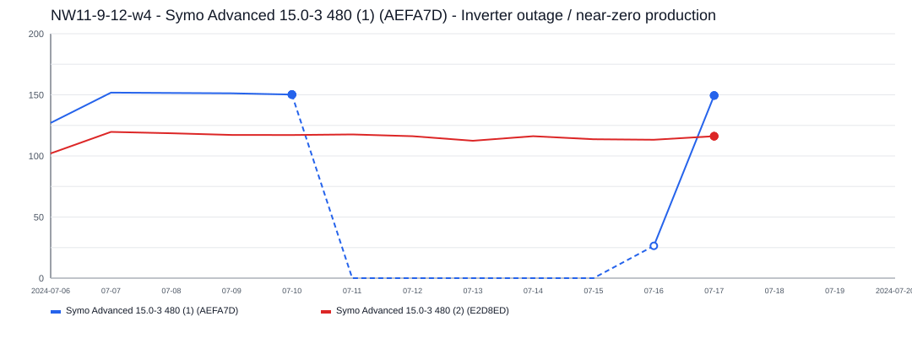
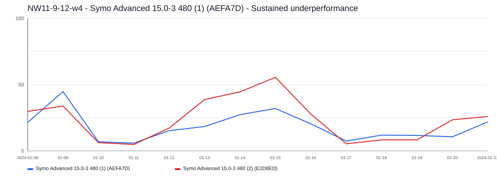

# NW11-9-12-w4 Incident Report

- Site: `786a60d9-1c64-47c8-8cc5-8f09ec762089`
- Total estimated lost production: `375.6 kWh`
- Estimated energy value lost: `$45.11 CAD`
- Estimated missed avoided emissions: `0.21 tCO2e`
- Estimated carbon-credit-equivalent value: `$17.13 CAD`

## Assumptions

- Energy value uses a flat Alberta retail proxy of `0.1201 CAD/kWh`.
- Avoided emissions use `0.57 tCO2e/MWh` as a distributed renewable grid displacement factor proxy.
- Carbon value schedule used for all incidents in this report:
  2024 = `$80/tCO2e`, 2025 = `$95/tCO2e`, 2026 = `$110/tCO2e`.

## Incidents

### 2024-07-11 - 324.6 kWh - Symo Advanced 15.0-3 480 (1) (AEFA7D) - Inverter outage / near-zero production

- Time range: `2024-07-11` to `2024-07-15`
- Affected inverters: Symo Advanced 15.0-3 480 (1) (AEFA7D)
- Confidence: `high` (`94`)
- Estimated lost production: `324.6 kWh`
- Estimated energy value lost: `$38.98 CAD`
- Estimated missed avoided emissions: `0.19 tCO2e`
- Estimated carbon-credit-equivalent value: `$14.80 CAD`

This incident lasted about `5` day(s) and affected `1` inverter(s).
Symo Advanced 15.0-3 480 (1) (AEFA7D) was the main affected inverter, with about `5` day(s) of severe underproduction and up to `66.3 kWh/day` expected output.

### 2024-01-13 - 51.0 kWh - Symo Advanced 15.0-3 480 (1) (AEFA7D) - Sustained underperformance

- Time range: `2024-01-13` to `2024-01-16`
- Affected inverters: Symo Advanced 15.0-3 480 (1) (AEFA7D)
- Confidence: `low` (`41`)
- Estimated lost production: `51.0 kWh`
- Estimated energy value lost: `$6.12 CAD`
- Estimated missed avoided emissions: `0.03 tCO2e`
- Estimated carbon-credit-equivalent value: `$2.33 CAD`

This incident lasted about `4` day(s) and affected `1` inverter(s).
Symo Advanced 15.0-3 480 (1) (AEFA7D) was the main affected inverter, with about `4` day(s) of severe underproduction and up to `49.3 kWh/day` expected output.
