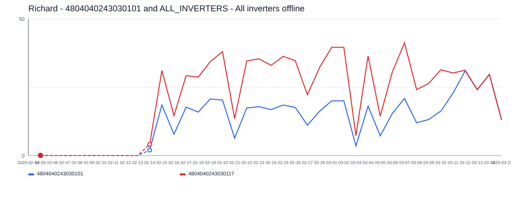
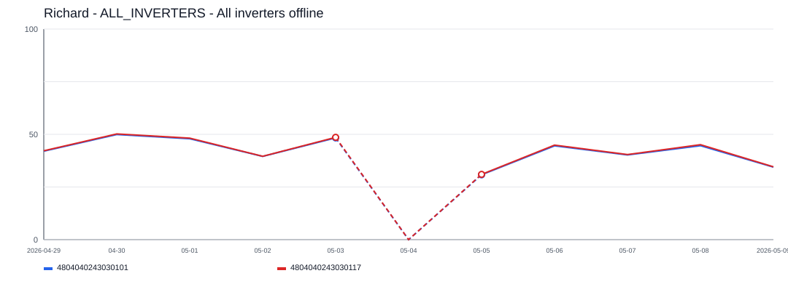
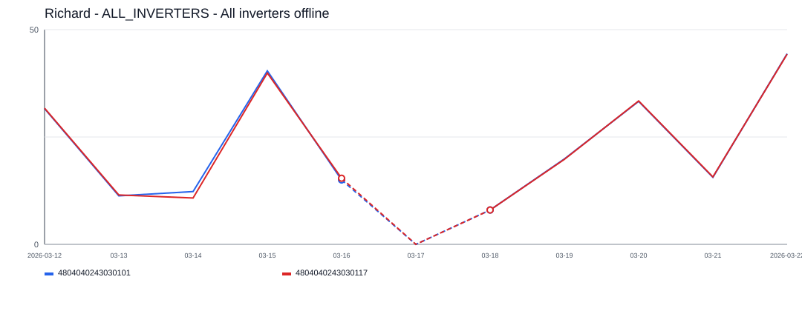
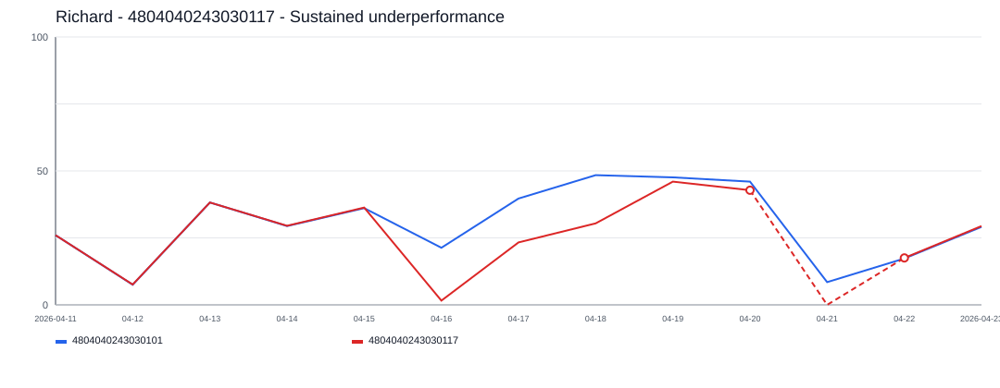
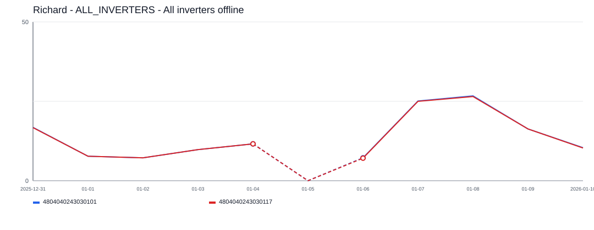

# Richard Incident Report

- Site: `1298491919449848959`
- Total estimated lost production: `515.8 kWh`
- Estimated energy value lost: `$61.95 CAD`
- Estimated missed avoided emissions: `0.29 tCO2e`
- Estimated carbon-credit-equivalent value: `$29.54 CAD`

## Assumptions

- Energy value uses a flat Alberta retail proxy of `0.1201 CAD/kWh`.
- Avoided emissions use `0.57 tCO2e/MWh` as a distributed renewable grid displacement factor proxy.
- Carbon value schedule used for all incidents in this report:
  2024 = `$80/tCO2e`, 2025 = `$95/tCO2e`, 2026 = `$110/tCO2e`.

## Incidents

### 2025-02-09 - 328.2 kWh - 4804040243030101 and ALL_INVERTERS - All inverters offline

- Time range: `2025-02-09` to `2025-03-10`
- Affected inverters: 4804040243030101, ALL_INVERTERS
- Confidence: `high` (`93`)
- Estimated lost production: `328.2 kWh`
- Estimated energy value lost: `$39.41 CAD`
- Estimated missed avoided emissions: `0.19 tCO2e`
- Estimated carbon-credit-equivalent value: `$17.77 CAD`

The site appears to have gone fully offline for about `30` day(s), affecting `2` inverter(s).
Affected inverter summary:
- 4804040243030101: `24` total affected day(s), longest contiguous run `24` day(s), expected up to `31.0 kWh/day`.
- ALL_INVERTERS: `5` total affected day(s), longest contiguous run `5` day(s), expected up to `46.9 kWh/day`.

### 2026-05-04 - 87.0 kWh - ALL_INVERTERS - All inverters offline

- Time range: `2026-05-04` to `2026-05-04`
- Affected inverters: ALL_INVERTERS
- Confidence: `high` (`89`)
- Estimated lost production: `87.0 kWh`
- Estimated energy value lost: `$10.44 CAD`
- Estimated missed avoided emissions: `0.05 tCO2e`
- Estimated carbon-credit-equivalent value: `$5.45 CAD`

The site appears to have gone fully offline for about `1` day(s), affecting `1` inverter(s).
ALL_INVERTERS was the main affected inverter, with about `1` day(s) of severe underproduction and up to `87.0 kWh/day` expected output.

### 2026-03-17 - 51.5 kWh - ALL_INVERTERS - All inverters offline

- Time range: `2026-03-17` to `2026-03-17`
- Affected inverters: ALL_INVERTERS
- Confidence: `high` (`87`)
- Estimated lost production: `51.5 kWh`
- Estimated energy value lost: `$6.19 CAD`
- Estimated missed avoided emissions: `0.03 tCO2e`
- Estimated carbon-credit-equivalent value: `$3.23 CAD`

The site appears to have gone fully offline for about `1` day(s), affecting `1` inverter(s).
ALL_INVERTERS was the main affected inverter, with about `1` day(s) of severe underproduction and up to `51.5 kWh/day` expected output.

### 2026-04-16 - 27.3 kWh - 4804040243030117 - Sustained underperformance

- Time range: `2026-04-16` to `2026-04-18`
- Affected inverters: 4804040243030117
- Confidence: `low` (`41`)
- Estimated lost production: `27.3 kWh`
- Estimated energy value lost: `$3.27 CAD`
- Estimated missed avoided emissions: `0.02 tCO2e`
- Estimated carbon-credit-equivalent value: `$1.71 CAD`

This incident lasted about `3` day(s) and affected `1` inverter(s).
4804040243030117 was the main affected inverter, with about `3` day(s) of severe underproduction and up to `39.5 kWh/day` expected output.

### 2026-01-05 - 22.0 kWh - ALL_INVERTERS - All inverters offline

- Time range: `2026-01-05` to `2026-01-05`
- Affected inverters: ALL_INVERTERS
- Confidence: `high` (`85`)
- Estimated lost production: `22.0 kWh`
- Estimated energy value lost: `$2.64 CAD`
- Estimated missed avoided emissions: `0.01 tCO2e`
- Estimated carbon-credit-equivalent value: `$1.38 CAD`

The site appears to have gone fully offline for about `1` day(s), affecting `1` inverter(s).
ALL_INVERTERS was the main affected inverter, with about `1` day(s) of severe underproduction and up to `22.0 kWh/day` expected output.
