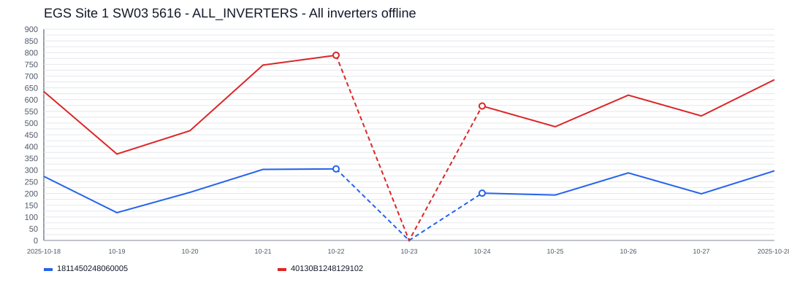
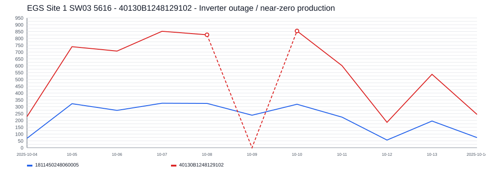

# EGS Site 1 SW03 5616 Incident Report

- Site: `1298491919450216523`
- Total estimated lost production: `924.8 kWh`
- Estimated energy value lost: `$111.07 CAD`
- Estimated missed avoided emissions: `0.53 tCO2e`
- Estimated carbon-credit-equivalent value: `$50.08 CAD`

## Assumptions

- Energy value uses a flat Alberta retail proxy of `0.1201 CAD/kWh`.
- Avoided emissions use `0.57 tCO2e/MWh` as a distributed renewable grid displacement factor proxy.
- Carbon value schedule used for all incidents in this report:
  2024 = `$80/tCO2e`, 2025 = `$95/tCO2e`, 2026 = `$110/tCO2e`.

## Incidents

### 2025-10-23 - 751.4 kWh - ALL_INVERTERS - All inverters offline

- Time range: `2025-10-23` to `2025-10-23`
- Affected inverters: ALL_INVERTERS
- Confidence: `high` (`93`)
- Estimated lost production: `751.4 kWh`
- Estimated energy value lost: `$90.24 CAD`
- Estimated missed avoided emissions: `0.43 tCO2e`
- Estimated carbon-credit-equivalent value: `$40.69 CAD`

The site appears to have gone fully offline for about `1` day(s), affecting `1` inverter(s).
ALL_INVERTERS was the main affected inverter, with about `1` day(s) of severe underproduction and up to `751.4 kWh/day` expected output.

### 2025-10-09 - 173.4 kWh - 40130B1248129102 - Inverter outage / near-zero production

- Time range: `2025-10-09` to `2025-10-09`
- Affected inverters: 40130B1248129102
- Confidence: `high` (`95`)
- Estimated lost production: `173.4 kWh`
- Estimated energy value lost: `$20.82 CAD`
- Estimated missed avoided emissions: `0.10 tCO2e`
- Estimated carbon-credit-equivalent value: `$9.39 CAD`

This incident lasted about `1` day(s) and affected `1` inverter(s).
40130B1248129102 was the main affected inverter, with about `1` day(s) of severe underproduction and up to `173.4 kWh/day` expected output.
