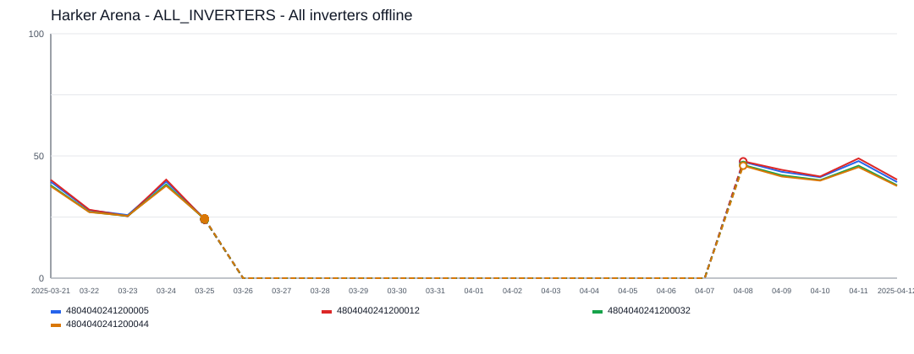
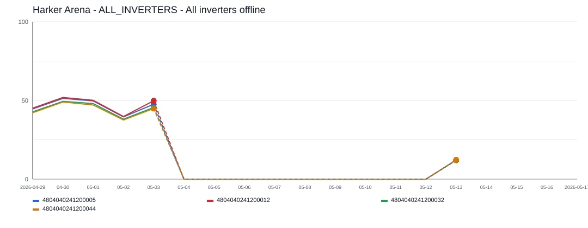
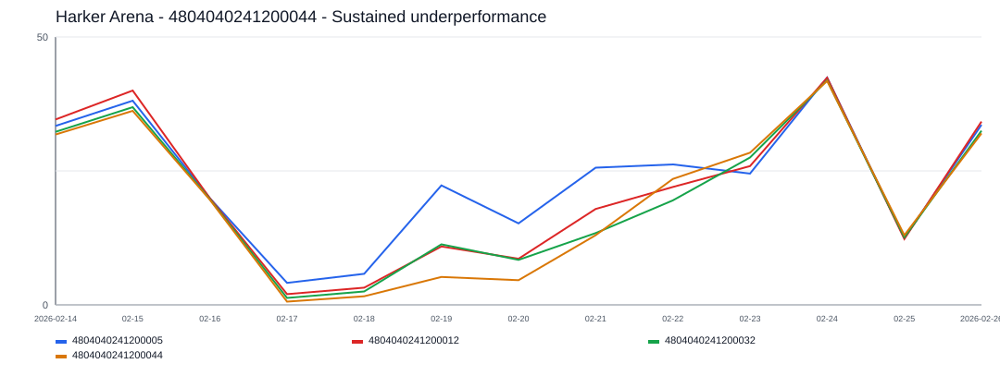
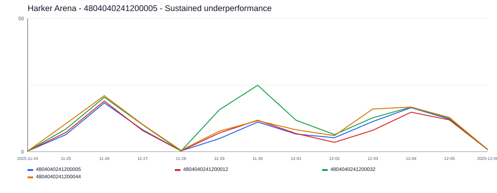

# Harker Arena Incident Report

- Site: `1298491919449775028`
- Total estimated lost production: `3,138.5 kWh`
- Estimated energy value lost: `$376.94 CAD`
- Estimated missed avoided emissions: `1.79 tCO2e`
- Estimated carbon-credit-equivalent value: `$180.94 CAD`

## Assumptions

- Energy value uses a flat Alberta retail proxy of `0.1201 CAD/kWh`.
- Avoided emissions use `0.57 tCO2e/MWh` as a distributed renewable grid displacement factor proxy.
- Carbon value schedule used for all incidents in this report:
  2024 = `$80/tCO2e`, 2025 = `$95/tCO2e`, 2026 = `$110/tCO2e`.

## Incidents

### 2025-03-26 - 1,843.1 kWh - ALL_INVERTERS - All inverters offline

- Time range: `2025-03-26` to `2025-04-07`
- Affected inverters: ALL_INVERTERS
- Confidence: `high` (`100`)
- Estimated lost production: `1,843.1 kWh`
- Estimated energy value lost: `$221.36 CAD`
- Estimated missed avoided emissions: `1.05 tCO2e`
- Estimated carbon-credit-equivalent value: `$99.80 CAD`

The site appears to have gone fully offline for about `13` day(s), affecting `1` inverter(s).
ALL_INVERTERS was the main affected inverter, with about `13` day(s) of severe underproduction and up to `179.6 kWh/day` expected output.

### 2026-05-04 - 1,269.6 kWh - ALL_INVERTERS - All inverters offline

- Time range: `2026-05-04` to `2026-05-12`
- Affected inverters: ALL_INVERTERS
- Confidence: `high` (`100`)
- Estimated lost production: `1,269.6 kWh`
- Estimated energy value lost: `$152.48 CAD`
- Estimated missed avoided emissions: `0.72 tCO2e`
- Estimated carbon-credit-equivalent value: `$79.60 CAD`

The site appears to have gone fully offline for about `9` day(s), affecting `1` inverter(s).
ALL_INVERTERS was the main affected inverter, with about `9` day(s) of severe underproduction and up to `187.8 kWh/day` expected output.

### 2026-02-19 - 16.0 kWh - 4804040241200044 - Sustained underperformance

- Time range: `2026-02-19` to `2026-02-21`
- Affected inverters: 4804040241200044
- Confidence: `low` (`39`)
- Estimated lost production: `16.0 kWh`
- Estimated energy value lost: `$1.93 CAD`
- Estimated missed avoided emissions: `0.01 tCO2e`
- Estimated carbon-credit-equivalent value: `$1.01 CAD`

This incident lasted about `3` day(s) and affected `1` inverter(s).
4804040241200044 was the main affected inverter, with about `3` day(s) of severe underproduction and up to `17.4 kWh/day` expected output.

### 2025-11-29 - 9.8 kWh - 4804040241200005 - Sustained underperformance

- Time range: `2025-11-29` to `2025-12-01`
- Affected inverters: 4804040241200005
- Confidence: `low` (`32`)
- Estimated lost production: `9.8 kWh`
- Estimated energy value lost: `$1.17 CAD`
- Estimated missed avoided emissions: `0.01 tCO2e`
- Estimated carbon-credit-equivalent value: `$0.53 CAD`

This incident lasted about `3` day(s) and affected `1` inverter(s).
4804040241200005 was the main affected inverter, with about `3` day(s) of severe underproduction and up to `15.0 kWh/day` expected output.
