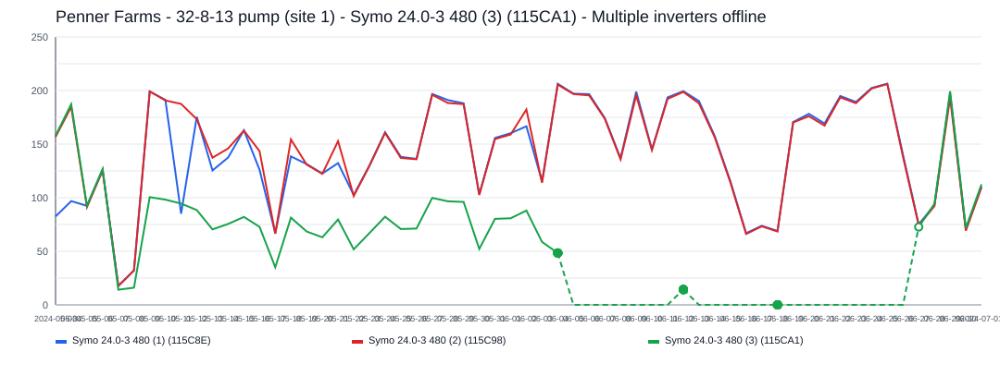
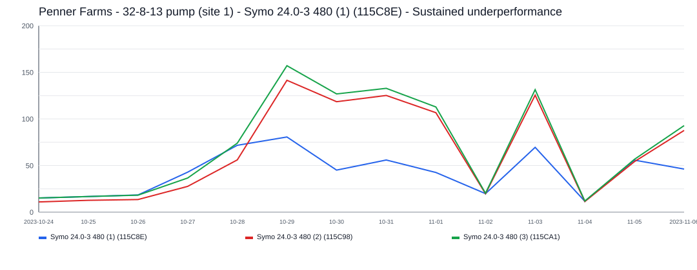
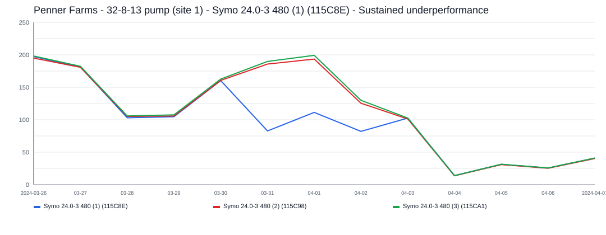
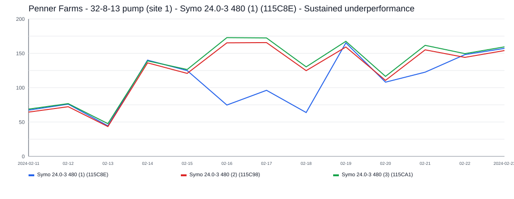
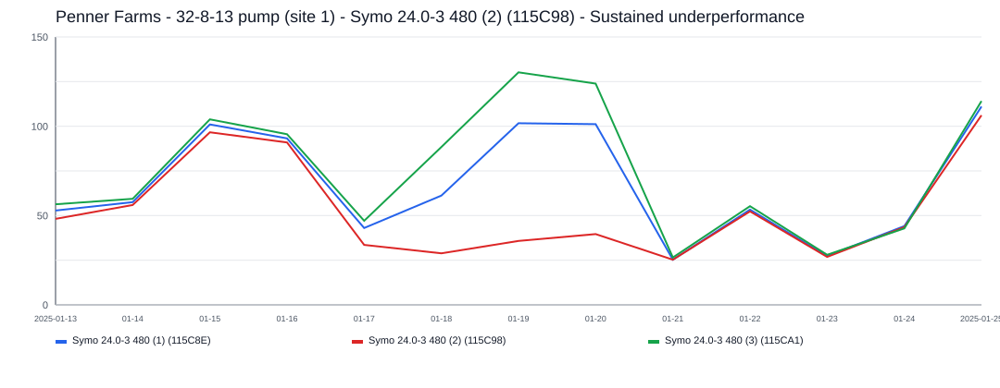
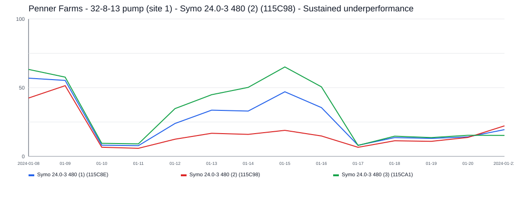
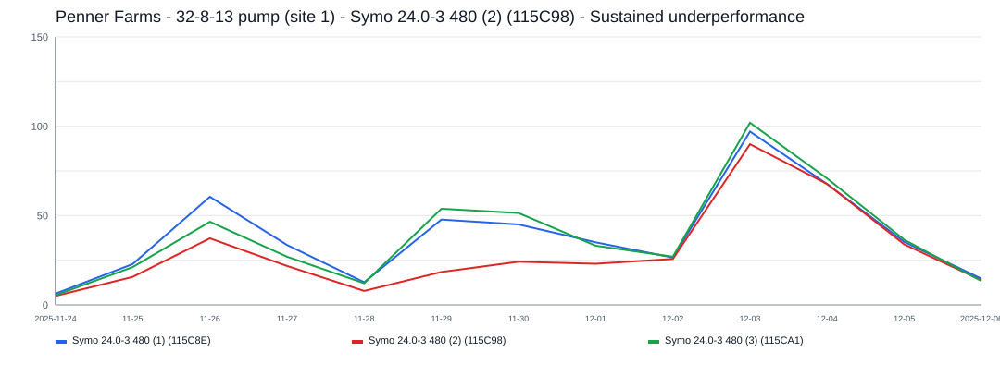

# Penner Farms - 32-8-13 pump (site 1) Incident Report

- Site: `c3c803c9-49a6-4c83-9884-7f28e9244f2b`
- Total estimated lost production: `4,521.5 kWh`
- Estimated energy value lost: `$543.03 CAD`
- Estimated missed avoided emissions: `2.58 tCO2e`
- Estimated carbon-credit-equivalent value: `$210.94 CAD`

## Assumptions

- Energy value uses a flat Alberta retail proxy of `0.1201 CAD/kWh`.
- Avoided emissions use `0.57 tCO2e/MWh` as a distributed renewable grid displacement factor proxy.
- Carbon value schedule used for all incidents in this report:
  2024 = `$80/tCO2e`, 2025 = `$95/tCO2e`, 2026 = `$110/tCO2e`.

## Incidents

### 2024-05-08 - 3,770.7 kWh - Symo 24.0-3 480 (3) (115CA1) - Multiple inverters offline

- Time range: `2024-05-08` to `2024-06-26`
- Affected inverters: Symo 24.0-3 480 (3) (115CA1)
- Confidence: `high` (`99`)
- Estimated lost production: `3,770.7 kWh`
- Estimated energy value lost: `$452.86 CAD`
- Estimated missed avoided emissions: `2.15 tCO2e`
- Estimated carbon-credit-equivalent value: `$171.94 CAD`

Multiple inverters appear to have dropped out during the same incident window lasting about `50` day(s).
Symo 24.0-3 480 (3) (115CA1) was the main affected inverter, with about `50` day(s) of severe underproduction and up to `168.6 kWh/day` expected output.

### 2023-10-29 - 192.0 kWh - Symo  24.0-3 480 (1) (115C8E) - Sustained underperformance

- Time range: `2023-10-29` to `2023-11-01`
- Affected inverters: Symo  24.0-3 480 (1) (115C8E)
- Confidence: `low` (`60`)
- Estimated lost production: `192.0 kWh`
- Estimated energy value lost: `$23.06 CAD`
- Estimated missed avoided emissions: `0.11 tCO2e`
- Estimated carbon-credit-equivalent value: `$12.04 CAD`

This incident lasted about `4` day(s) and affected `1` inverter(s).
Symo  24.0-3 480 (1) (115C8E) was the main affected inverter, with about `4` day(s) of severe underproduction and up to `126.7 kWh/day` expected output.

### 2024-03-31 - 158.2 kWh - Symo  24.0-3 480 (1) (115C8E) - Sustained underperformance

- Time range: `2024-03-31` to `2024-04-02`
- Affected inverters: Symo  24.0-3 480 (1) (115C8E)
- Confidence: `low` (`60`)
- Estimated lost production: `158.2 kWh`
- Estimated energy value lost: `$19.00 CAD`
- Estimated missed avoided emissions: `0.09 tCO2e`
- Estimated carbon-credit-equivalent value: `$7.21 CAD`

This incident lasted about `3` day(s) and affected `1` inverter(s).
Symo  24.0-3 480 (1) (115C8E) was the main affected inverter, with about `3` day(s) of severe underproduction and up to `168.4 kWh/day` expected output.

### 2024-02-16 - 154.9 kWh - Symo  24.0-3 480 (1) (115C8E) - Sustained underperformance

- Time range: `2024-02-16` to `2024-02-18`
- Affected inverters: Symo  24.0-3 480 (1) (115C8E)
- Confidence: `low` (`51`)
- Estimated lost production: `154.9 kWh`
- Estimated energy value lost: `$18.61 CAD`
- Estimated missed avoided emissions: `0.09 tCO2e`
- Estimated carbon-credit-equivalent value: `$7.06 CAD`

This incident lasted about `3` day(s) and affected `1` inverter(s).
Symo  24.0-3 480 (1) (115C8E) was the main affected inverter, with about `3` day(s) of severe underproduction and up to `145.0 kWh/day` expected output.

### 2025-01-18 - 129.0 kWh - Symo  24.0-3 480 (2) (115C98) - Sustained underperformance

- Time range: `2025-01-18` to `2025-01-20`
- Affected inverters: Symo  24.0-3 480 (2) (115C98)
- Confidence: `low` (`52`)
- Estimated lost production: `129.0 kWh`
- Estimated energy value lost: `$15.50 CAD`
- Estimated missed avoided emissions: `0.07 tCO2e`
- Estimated carbon-credit-equivalent value: `$6.99 CAD`

This incident lasted about `3` day(s) and affected `1` inverter(s).
Symo  24.0-3 480 (2) (115C98) was the main affected inverter, with about `3` day(s) of severe underproduction and up to `87.9 kWh/day` expected output.

### 2024-01-13 - 73.4 kWh - Symo  24.0-3 480 (2) (115C98) - Sustained underperformance

- Time range: `2024-01-13` to `2024-01-16`
- Affected inverters: Symo  24.0-3 480 (2) (115C98)
- Confidence: `low` (`48`)
- Estimated lost production: `73.4 kWh`
- Estimated energy value lost: `$8.81 CAD`
- Estimated missed avoided emissions: `0.04 tCO2e`
- Estimated carbon-credit-equivalent value: `$3.35 CAD`

This incident lasted about `4` day(s) and affected `1` inverter(s).
Symo  24.0-3 480 (2) (115C98) was the main affected inverter, with about `4` day(s) of severe underproduction and up to `43.0 kWh/day` expected output.

### 2025-11-29 - 43.3 kWh - Symo  24.0-3 480 (2) (115C98) - Sustained underperformance

- Time range: `2025-11-29` to `2025-12-01`
- Affected inverters: Symo  24.0-3 480 (2) (115C98)
- Confidence: `low` (`36`)
- Estimated lost production: `43.3 kWh`
- Estimated energy value lost: `$5.20 CAD`
- Estimated missed avoided emissions: `0.02 tCO2e`
- Estimated carbon-credit-equivalent value: `$2.34 CAD`

This incident lasted about `3` day(s) and affected `1` inverter(s).
Symo  24.0-3 480 (2) (115C98) was the main affected inverter, with about `3` day(s) of severe underproduction and up to `39.6 kWh/day` expected output.
