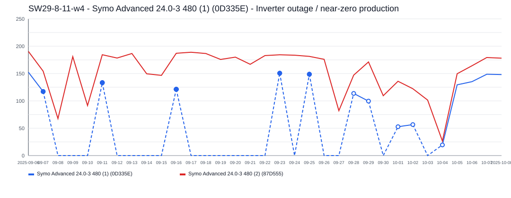
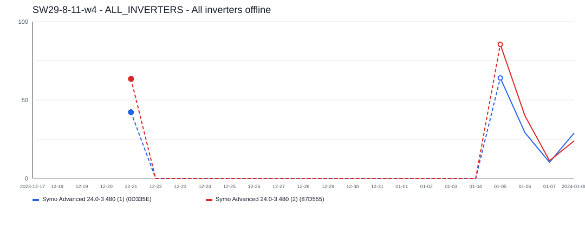
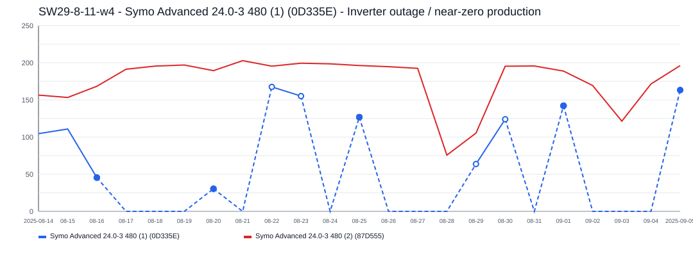
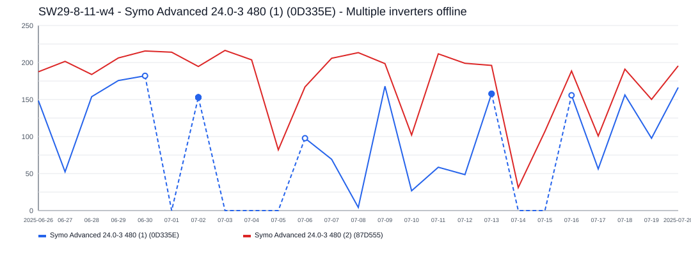
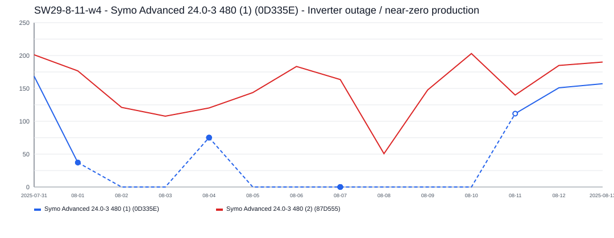
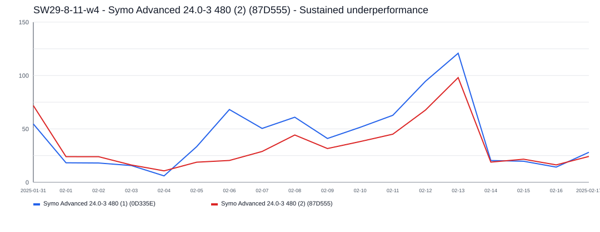
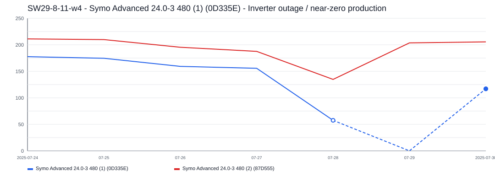
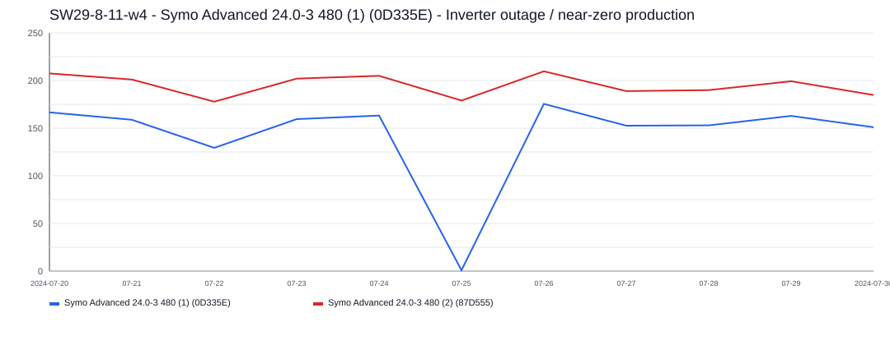
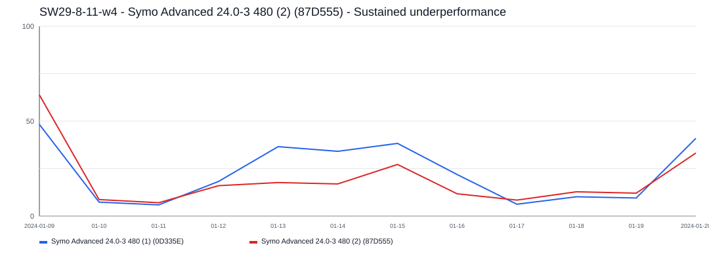

# SW29-8-11-w4 Incident Report

- Site: `ab8e0174-0a82-4a59-ac40-c1483f459dd3`
- Total estimated lost production: `5,242.8 kWh`
- Estimated energy value lost: `$629.66 CAD`
- Estimated missed avoided emissions: `2.99 tCO2e`
- Estimated carbon-credit-equivalent value: `$289.97 CAD`

## Assumptions

- Energy value uses a flat Alberta retail proxy of `0.1201 CAD/kWh`.
- Avoided emissions use `0.57 tCO2e/MWh` as a distributed renewable grid displacement factor proxy.
- Carbon value schedule used for all incidents in this report:
  2024 = `$80/tCO2e`, 2025 = `$95/tCO2e`, 2026 = `$110/tCO2e`.

## Incidents

### 2025-09-08 - 1,336.4 kWh - Symo Advanced 24.0-3 480 (1) (0D335E) - Inverter outage / near-zero production

- Time range: `2025-09-08` to `2025-10-03`
- Affected inverters: Symo Advanced 24.0-3 480 (1) (0D335E)
- Confidence: `high` (`96`)
- Estimated lost production: `1,336.4 kWh`
- Estimated energy value lost: `$160.50 CAD`
- Estimated missed avoided emissions: `0.76 tCO2e`
- Estimated carbon-credit-equivalent value: `$72.37 CAD`

This incident lasted about `26` day(s) and affected `1` inverter(s).
Symo Advanced 24.0-3 480 (1) (0D335E) was the main affected inverter, with about `26` day(s) of severe underproduction and up to `84.9 kWh/day` expected output.

### 2023-12-22 - 1,311.4 kWh - ALL_INVERTERS - All inverters offline

- Time range: `2023-12-22` to `2024-01-04`
- Affected inverters: ALL_INVERTERS
- Confidence: `high` (`100`)
- Estimated lost production: `1,311.4 kWh`
- Estimated energy value lost: `$157.50 CAD`
- Estimated missed avoided emissions: `0.75 tCO2e`
- Estimated carbon-credit-equivalent value: `$78.05 CAD`

The site appears to have gone fully offline for about `14` day(s), affecting `1` inverter(s).
ALL_INVERTERS was the main affected inverter, with about `14` day(s) of severe underproduction and up to `149.6 kWh/day` expected output.

### 2025-08-17 - 1,075.0 kWh - Symo Advanced 24.0-3 480 (1) (0D335E) - Inverter outage / near-zero production

- Time range: `2025-08-17` to `2025-09-04`
- Affected inverters: Symo Advanced 24.0-3 480 (1) (0D335E)
- Confidence: `high` (`96`)
- Estimated lost production: `1,075.0 kWh`
- Estimated energy value lost: `$129.11 CAD`
- Estimated missed avoided emissions: `0.61 tCO2e`
- Estimated carbon-credit-equivalent value: `$58.21 CAD`

This incident lasted about `19` day(s) and affected `1` inverter(s).
Symo Advanced 24.0-3 480 (1) (0D335E) was the main affected inverter, with about `19` day(s) of severe underproduction and up to `91.1 kWh/day` expected output.

### 2025-07-01 - 698.4 kWh - Symo Advanced 24.0-3 480 (1) (0D335E) - Multiple inverters offline

- Time range: `2025-07-01` to `2025-07-15`
- Affected inverters: Symo Advanced 24.0-3 480 (1) (0D335E)
- Confidence: `high` (`96`)
- Estimated lost production: `698.4 kWh`
- Estimated energy value lost: `$83.88 CAD`
- Estimated missed avoided emissions: `0.40 tCO2e`
- Estimated carbon-credit-equivalent value: `$37.82 CAD`

Multiple inverters appear to have dropped out during the same incident window lasting about `15` day(s).
Symo Advanced 24.0-3 480 (1) (0D335E) was the main affected inverter, with about `12` day(s) of severe underproduction and up to `121.4 kWh/day` expected output.

### 2025-08-02 - 493.2 kWh - Symo Advanced 24.0-3 480 (1) (0D335E) - Inverter outage / near-zero production

- Time range: `2025-08-02` to `2025-08-10`
- Affected inverters: Symo Advanced 24.0-3 480 (1) (0D335E)
- Confidence: `high` (`95`)
- Estimated lost production: `493.2 kWh`
- Estimated energy value lost: `$59.24 CAD`
- Estimated missed avoided emissions: `0.28 tCO2e`
- Estimated carbon-credit-equivalent value: `$26.71 CAD`

This incident lasted about `9` day(s) and affected `1` inverter(s).
Symo Advanced 24.0-3 480 (1) (0D335E) was the main affected inverter, with about `9` day(s) of severe underproduction and up to `91.2 kWh/day` expected output.

### 2025-02-05 - 124.2 kWh - Symo Advanced 24.0-3 480 (2) (87D555) - Sustained underperformance

- Time range: `2025-02-05` to `2025-02-12`
- Affected inverters: Symo Advanced 24.0-3 480 (2) (87D555)
- Confidence: `low` (`55`)
- Estimated lost production: `124.2 kWh`
- Estimated energy value lost: `$14.92 CAD`
- Estimated missed avoided emissions: `0.07 tCO2e`
- Estimated carbon-credit-equivalent value: `$6.73 CAD`

This incident lasted about `8` day(s) and affected `1` inverter(s).
Symo Advanced 24.0-3 480 (2) (87D555) was the main affected inverter, with about `8` day(s) of severe underproduction and up to `89.8 kWh/day` expected output.

### 2025-07-29 - 91.5 kWh - Symo Advanced 24.0-3 480 (1) (0D335E) - Inverter outage / near-zero production

- Time range: `2025-07-29` to `2025-07-29`
- Affected inverters: Symo Advanced 24.0-3 480 (1) (0D335E)
- Confidence: `high` (`89`)
- Estimated lost production: `91.5 kWh`
- Estimated energy value lost: `$10.99 CAD`
- Estimated missed avoided emissions: `0.05 tCO2e`
- Estimated carbon-credit-equivalent value: `$4.95 CAD`

This incident lasted about `1` day(s) and affected `1` inverter(s).
Symo Advanced 24.0-3 480 (1) (0D335E) was the main affected inverter, with about `1` day(s) of severe underproduction and up to `91.5 kWh/day` expected output.

### 2024-07-25 - 79.9 kWh - Symo Advanced 24.0-3 480 (1) (0D335E) - Inverter outage / near-zero production

- Time range: `2024-07-25` to `2024-07-25`
- Affected inverters: Symo Advanced 24.0-3 480 (1) (0D335E)
- Confidence: `high` (`88`)
- Estimated lost production: `79.9 kWh`
- Estimated energy value lost: `$9.60 CAD`
- Estimated missed avoided emissions: `0.05 tCO2e`
- Estimated carbon-credit-equivalent value: `$3.64 CAD`

This incident lasted about `1` day(s) and affected `1` inverter(s).
Symo Advanced 24.0-3 480 (1) (0D335E) was the main affected inverter, with about `1` day(s) of severe underproduction and up to `80.8 kWh/day` expected output.

### 2024-01-13 - 32.7 kWh - Symo Advanced 24.0-3 480 (2) (87D555) - Sustained underperformance

- Time range: `2024-01-13` to `2024-01-15`
- Affected inverters: Symo Advanced 24.0-3 480 (2) (87D555)
- Confidence: `low` (`35`)
- Estimated lost production: `32.7 kWh`
- Estimated energy value lost: `$3.92 CAD`
- Estimated missed avoided emissions: `0.02 tCO2e`
- Estimated carbon-credit-equivalent value: `$1.49 CAD`

This incident lasted about `3` day(s) and affected `1` inverter(s).
Symo Advanced 24.0-3 480 (2) (87D555) was the main affected inverter, with about `3` day(s) of severe underproduction and up to `36.2 kWh/day` expected output.
