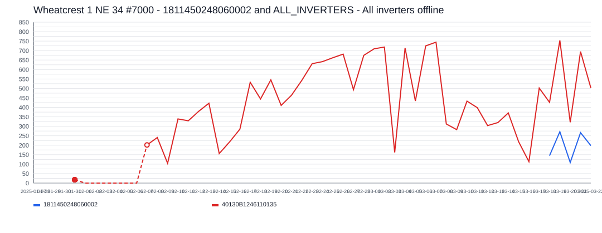

# Wheatcrest 1 NE 34 #7000 Incident Report

- Site: `1298491919449868709`
- Total estimated lost production: `5,573.8 kWh`
- Estimated energy value lost: `$669.41 CAD`
- Estimated missed avoided emissions: `3.18 tCO2e`
- Estimated carbon-credit-equivalent value: `$301.82 CAD`

## Assumptions

- Energy value uses a flat Alberta retail proxy of `0.1201 CAD/kWh`.
- Avoided emissions use `0.57 tCO2e/MWh` as a distributed renewable grid displacement factor proxy.
- Carbon value schedule used for all incidents in this report:
  2024 = `$80/tCO2e`, 2025 = `$95/tCO2e`, 2026 = `$110/tCO2e`.

## Incidents

### 2025-02-01 - 5,573.8 kWh - 1811450248060002 and ALL_INVERTERS - All inverters offline

- Time range: `2025-02-01` to `2025-03-17`
- Affected inverters: 1811450248060002, ALL_INVERTERS
- Confidence: `high` (`100`)
- Estimated lost production: `5,573.8 kWh`
- Estimated energy value lost: `$669.41 CAD`
- Estimated missed avoided emissions: `3.18 tCO2e`
- Estimated carbon-credit-equivalent value: `$301.82 CAD`

The site appears to have gone fully offline for about `45` day(s), affecting `2` inverter(s).
Affected inverter summary:
- 1811450248060002: `39` total affected day(s), longest contiguous run `39` day(s), expected up to `191.1 kWh/day`.
- ALL_INVERTERS: `6` total affected day(s), longest contiguous run `6` day(s), expected up to `284.9 kWh/day`.
