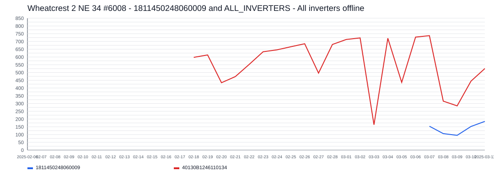

# Wheatcrest 2 NE 34 #6008 Incident Report

- Site: `1298491919449868730`
- Total estimated lost production: `6,634.0 kWh`
- Estimated energy value lost: `$796.74 CAD`
- Estimated missed avoided emissions: `3.78 tCO2e`
- Estimated carbon-credit-equivalent value: `$359.23 CAD`

## Assumptions

- Energy value uses a flat Alberta retail proxy of `0.1201 CAD/kWh`.
- Avoided emissions use `0.57 tCO2e/MWh` as a distributed renewable grid displacement factor proxy.
- Carbon value schedule used for all incidents in this report:
  2024 = `$80/tCO2e`, 2025 = `$95/tCO2e`, 2026 = `$110/tCO2e`.

## Incidents

### 2025-02-11 - 6,634.0 kWh - 1811450248060009 and ALL_INVERTERS - All inverters offline

- Time range: `2025-02-11` to `2025-03-06`
- Affected inverters: 1811450248060009, ALL_INVERTERS
- Confidence: `high` (`100`)
- Estimated lost production: `6,634.0 kWh`
- Estimated energy value lost: `$796.74 CAD`
- Estimated missed avoided emissions: `3.78 tCO2e`
- Estimated carbon-credit-equivalent value: `$359.23 CAD`

The site appears to have gone fully offline for about `24` day(s), affecting `2` inverter(s).
Affected inverter summary:
- 1811450248060009: `17` total affected day(s), longest contiguous run `17` day(s), expected up to `188.1 kWh/day`.
- ALL_INVERTERS: `7` total affected day(s), longest contiguous run `7` day(s), expected up to `605.4 kWh/day`.
