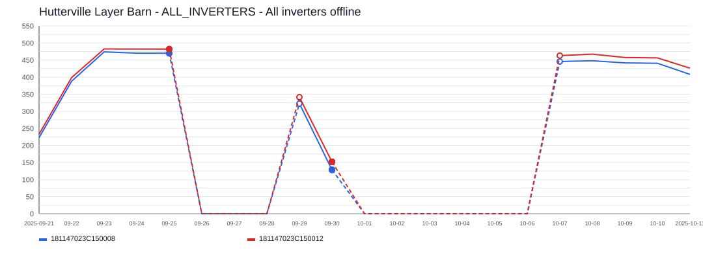
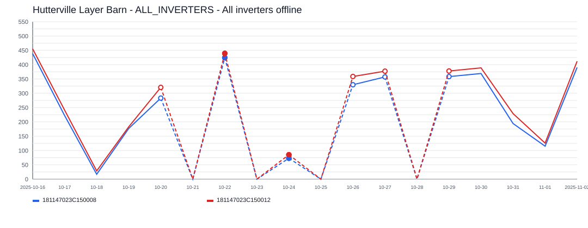
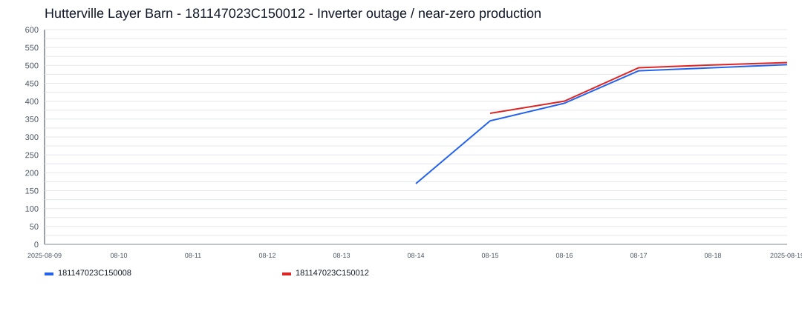

# Hutterville Layer Barn Incident Report

- Site: `1298491919450210825`
- Total estimated lost production: `10,592.0 kWh`
- Estimated energy value lost: `$1,272.10 CAD`
- Estimated missed avoided emissions: `6.04 tCO2e`
- Estimated carbon-credit-equivalent value: `$573.55 CAD`

## Assumptions

- Energy value uses a flat Alberta retail proxy of `0.1201 CAD/kWh`.
- Avoided emissions use `0.57 tCO2e/MWh` as a distributed renewable grid displacement factor proxy.
- Carbon value schedule used for all incidents in this report:
  2024 = `$80/tCO2e`, 2025 = `$95/tCO2e`, 2026 = `$110/tCO2e`.

## Incidents

### 2025-09-26 - 7,887.8 kWh - ALL_INVERTERS - All inverters offline

- Time range: `2025-09-26` to `2025-10-06`
- Affected inverters: ALL_INVERTERS
- Confidence: `high` (`100`)
- Estimated lost production: `7,887.8 kWh`
- Estimated energy value lost: `$947.32 CAD`
- Estimated missed avoided emissions: `4.50 tCO2e`
- Estimated carbon-credit-equivalent value: `$427.12 CAD`

The site appears to have gone fully offline for about `11` day(s), affecting `1` inverter(s).
ALL_INVERTERS was the main affected inverter, with about `11` day(s) of severe underproduction and up to `930.0 kWh/day` expected output.

### 2025-10-21 - 2,616.9 kWh - ALL_INVERTERS - All inverters offline

- Time range: `2025-10-21` to `2025-10-28`
- Affected inverters: ALL_INVERTERS
- Confidence: `high` (`93`)
- Estimated lost production: `2,616.9 kWh`
- Estimated energy value lost: `$314.29 CAD`
- Estimated missed avoided emissions: `1.49 tCO2e`
- Estimated carbon-credit-equivalent value: `$141.71 CAD`

The site appears to have gone fully offline for about `8` day(s), affecting `1` inverter(s).
ALL_INVERTERS was the main affected inverter, with about `8` day(s) of severe underproduction and up to `721.3 kWh/day` expected output.

### 2025-08-14 - 87.3 kWh - 181147023C150012 - Inverter outage / near-zero production

- Time range: `2025-08-14` to `2025-08-14`
- Affected inverters: 181147023C150012
- Confidence: `high` (`89`)
- Estimated lost production: `87.3 kWh`
- Estimated energy value lost: `$10.48 CAD`
- Estimated missed avoided emissions: `0.05 tCO2e`
- Estimated carbon-credit-equivalent value: `$4.73 CAD`

This incident lasted about `1` day(s) and affected `1` inverter(s).
181147023C150012 was the main affected inverter, with about `1` day(s) of severe underproduction and up to `87.3 kWh/day` expected output.
