# Penner Farms - SE 27-8-13 (site 2) Incident Report

- Site: `d95b5e9d-f2d5-4950-85a9-909e52f727ba`
- Total estimated lost production: `12,700.2 kWh`
- Estimated energy value lost: `$1,525.30 CAD`
- Estimated missed avoided emissions: `7.24 tCO2e`
- Estimated carbon-credit-equivalent value: `$720.10 CAD`

## Assumptions

- Energy value uses a flat Alberta retail proxy of `0.1201 CAD/kWh`.
- Avoided emissions use `0.57 tCO2e/MWh` as a distributed renewable grid displacement factor proxy.
- Carbon value schedule used for all incidents in this report:
  2024 = `$80/tCO2e`, 2025 = `$95/tCO2e`, 2026 = `$110/tCO2e`.

## Incidents

### 2025-07-13 - 4,145.0 kWh - ALL_INVERTERS - All inverters offline

- Time range: `2025-07-13` to `2025-07-19`
- Affected inverters: ALL_INVERTERS
- Confidence: `high` (`100`)
- Estimated lost production: `4,145.0 kWh`
- Estimated energy value lost: `$497.82 CAD`
- Estimated missed avoided emissions: `2.36 tCO2e`
- Estimated carbon-credit-equivalent value: `$224.45 CAD`

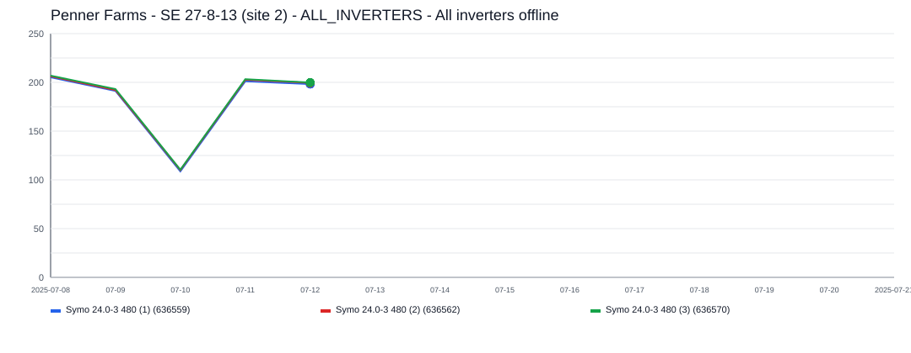

The site appears to have gone fully offline for about `7` day(s), affecting `1` inverter(s).
ALL_INVERTERS was the main affected inverter, with about `7` day(s) of severe underproduction and up to `602.2 kWh/day` expected output.

### 2025-07-24 - 2,081.6 kWh - ALL_INVERTERS - All inverters offline

- Time range: `2025-07-24` to `2025-07-29`
- Affected inverters: ALL_INVERTERS
- Confidence: `high` (`100`)
- Estimated lost production: `2,081.6 kWh`
- Estimated energy value lost: `$250.00 CAD`
- Estimated missed avoided emissions: `1.19 tCO2e`
- Estimated carbon-credit-equivalent value: `$112.72 CAD`

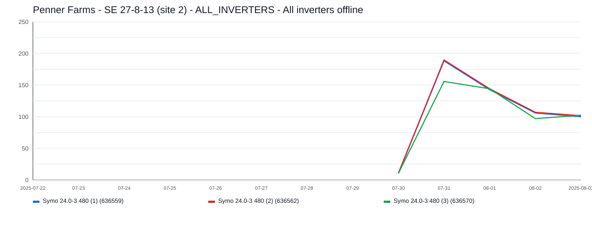

The site appears to have gone fully offline for about `6` day(s), affecting `1` inverter(s).
ALL_INVERTERS was the main affected inverter, with about `6` day(s) of severe underproduction and up to `430.9 kWh/day` expected output.

### 2026-05-09 - 1,118.1 kWh - ALL_INVERTERS - All inverters offline

- Time range: `2026-05-09` to `2026-05-10`
- Affected inverters: ALL_INVERTERS
- Confidence: `high` (`97`)
- Estimated lost production: `1,118.1 kWh`
- Estimated energy value lost: `$134.28 CAD`
- Estimated missed avoided emissions: `0.64 tCO2e`
- Estimated carbon-credit-equivalent value: `$70.10 CAD`

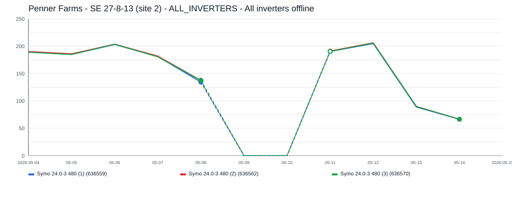

The site appears to have gone fully offline for about `2` day(s), affecting `1` inverter(s).
ALL_INVERTERS was the main affected inverter, with about `2` day(s) of severe underproduction and up to `562.2 kWh/day` expected output.

### 2025-04-13 - 947.1 kWh - ALL_INVERTERS - All inverters offline

- Time range: `2025-04-13` to `2025-04-14`
- Affected inverters: ALL_INVERTERS
- Confidence: `high` (`97`)
- Estimated lost production: `947.1 kWh`
- Estimated energy value lost: `$113.75 CAD`
- Estimated missed avoided emissions: `0.54 tCO2e`
- Estimated carbon-credit-equivalent value: `$51.28 CAD`

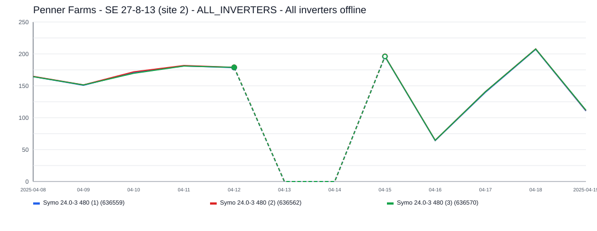

The site appears to have gone fully offline for about `2` day(s), affecting `1` inverter(s).
ALL_INVERTERS was the main affected inverter, with about `2` day(s) of severe underproduction and up to `493.5 kWh/day` expected output.

### 2022-10-24 - 872.8 kWh - ALL_INVERTERS - All inverters offline

- Time range: `2022-10-24` to `2022-10-31`
- Affected inverters: ALL_INVERTERS
- Confidence: `high` (`100`)
- Estimated lost production: `872.8 kWh`
- Estimated energy value lost: `$104.83 CAD`
- Estimated missed avoided emissions: `0.50 tCO2e`
- Estimated carbon-credit-equivalent value: `$54.73 CAD`

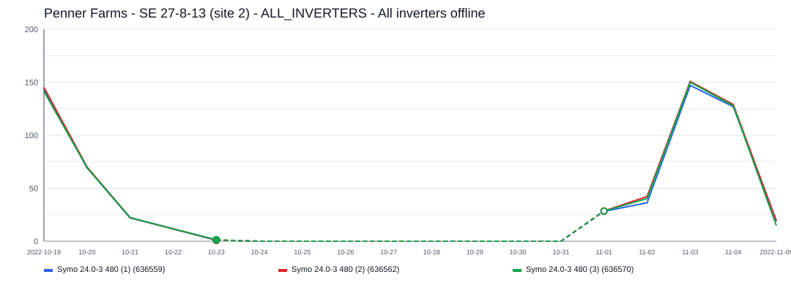

The site appears to have gone fully offline for about `8` day(s), affecting `1` inverter(s).
ALL_INVERTERS was the main affected inverter, with about `8` day(s) of severe underproduction and up to `208.9 kWh/day` expected output.

### 2025-06-20 - 603.0 kWh - ALL_INVERTERS - All inverters offline

- Time range: `2025-06-20` to `2025-06-20`
- Affected inverters: ALL_INVERTERS
- Confidence: `high` (`93`)
- Estimated lost production: `603.0 kWh`
- Estimated energy value lost: `$72.42 CAD`
- Estimated missed avoided emissions: `0.34 tCO2e`
- Estimated carbon-credit-equivalent value: `$32.65 CAD`

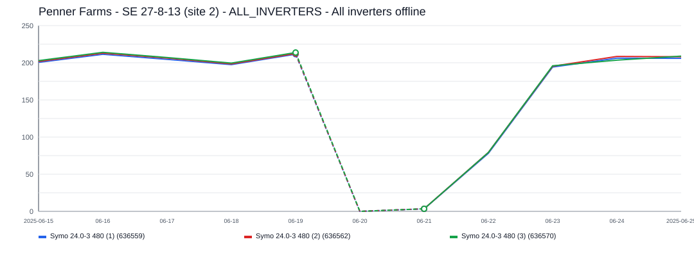

The site appears to have gone fully offline for about `1` day(s), affecting `1` inverter(s).
ALL_INVERTERS was the main affected inverter, with about `1` day(s) of severe underproduction and up to `603.0 kWh/day` expected output.

### 2022-08-11 - 589.1 kWh - ALL_INVERTERS - All inverters offline

- Time range: `2022-08-11` to `2022-08-11`
- Affected inverters: ALL_INVERTERS
- Confidence: `high` (`93`)
- Estimated lost production: `589.1 kWh`
- Estimated energy value lost: `$70.75 CAD`
- Estimated missed avoided emissions: `0.34 tCO2e`
- Estimated carbon-credit-equivalent value: `$36.94 CAD`

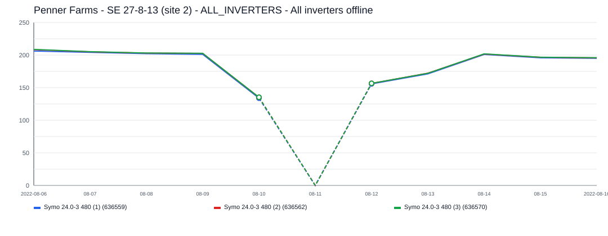

The site appears to have gone fully offline for about `1` day(s), affecting `1` inverter(s).
ALL_INVERTERS was the main affected inverter, with about `1` day(s) of severe underproduction and up to `589.1 kWh/day` expected output.

### 2023-06-29 - 586.6 kWh - ALL_INVERTERS - All inverters offline

- Time range: `2023-06-29` to `2023-06-29`
- Affected inverters: ALL_INVERTERS
- Confidence: `high` (`93`)
- Estimated lost production: `586.6 kWh`
- Estimated energy value lost: `$70.46 CAD`
- Estimated missed avoided emissions: `0.33 tCO2e`
- Estimated carbon-credit-equivalent value: `$36.78 CAD`

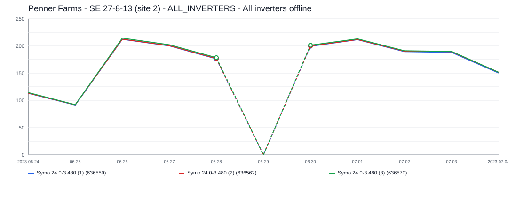

The site appears to have gone fully offline for about `1` day(s), affecting `1` inverter(s).
ALL_INVERTERS was the main affected inverter, with about `1` day(s) of severe underproduction and up to `586.6 kWh/day` expected output.

### 2023-12-08 - 551.1 kWh - ALL_INVERTERS - All inverters offline

- Time range: `2023-12-08` to `2023-12-10`
- Affected inverters: ALL_INVERTERS
- Confidence: `high` (`100`)
- Estimated lost production: `551.1 kWh`
- Estimated energy value lost: `$66.18 CAD`
- Estimated missed avoided emissions: `0.31 tCO2e`
- Estimated carbon-credit-equivalent value: `$34.55 CAD`

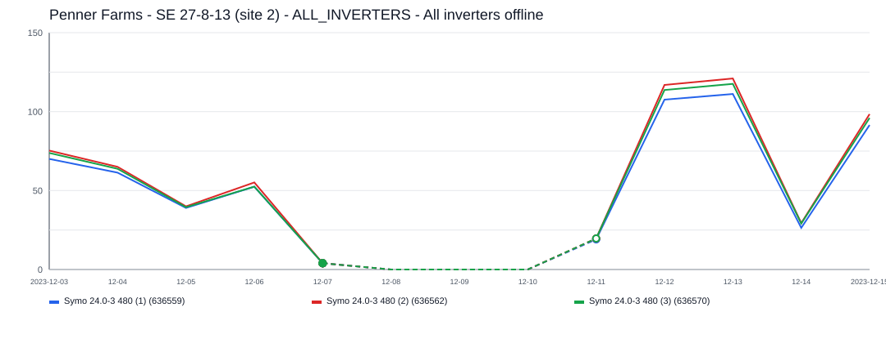

The site appears to have gone fully offline for about `3` day(s), affecting `1` inverter(s).
ALL_INVERTERS was the main affected inverter, with about `3` day(s) of severe underproduction and up to `200.8 kWh/day` expected output.

### 2023-06-10 - 537.0 kWh - ALL_INVERTERS - All inverters offline

- Time range: `2023-06-10` to `2023-06-10`
- Affected inverters: ALL_INVERTERS
- Confidence: `high` (`93`)
- Estimated lost production: `537.0 kWh`
- Estimated energy value lost: `$64.49 CAD`
- Estimated missed avoided emissions: `0.31 tCO2e`
- Estimated carbon-credit-equivalent value: `$33.67 CAD`

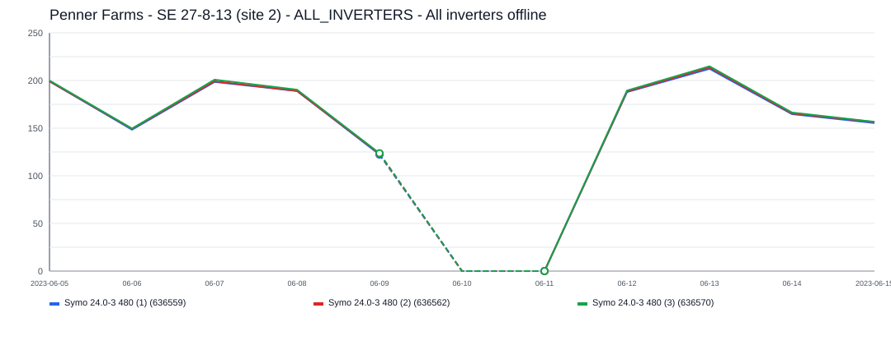

The site appears to have gone fully offline for about `1` day(s), affecting `1` inverter(s).
ALL_INVERTERS was the main affected inverter, with about `1` day(s) of severe underproduction and up to `537.0 kWh/day` expected output.

### 2024-05-17 - 467.6 kWh - ALL_INVERTERS - All inverters offline

- Time range: `2024-05-17` to `2024-05-17`
- Affected inverters: ALL_INVERTERS
- Confidence: `high` (`93`)
- Estimated lost production: `467.6 kWh`
- Estimated energy value lost: `$56.16 CAD`
- Estimated missed avoided emissions: `0.27 tCO2e`
- Estimated carbon-credit-equivalent value: `$21.32 CAD`

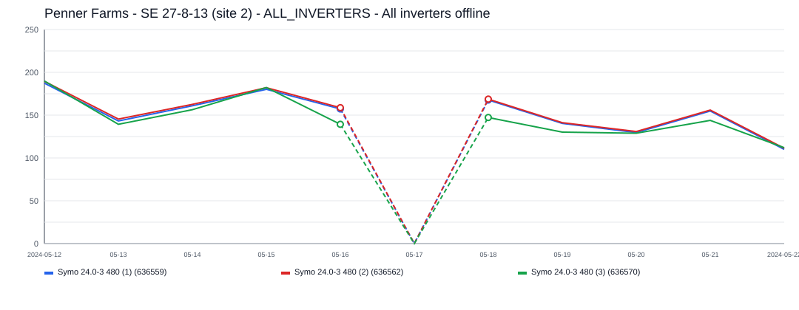

The site appears to have gone fully offline for about `1` day(s), affecting `1` inverter(s).
ALL_INVERTERS was the main affected inverter, with about `1` day(s) of severe underproduction and up to `467.6 kWh/day` expected output.

### 2025-12-16 - 81.1 kWh - ALL_INVERTERS - All inverters offline

- Time range: `2025-12-16` to `2025-12-16`
- Affected inverters: ALL_INVERTERS
- Confidence: `high` (`89`)
- Estimated lost production: `81.1 kWh`
- Estimated energy value lost: `$9.74 CAD`
- Estimated missed avoided emissions: `0.05 tCO2e`
- Estimated carbon-credit-equivalent value: `$4.39 CAD`

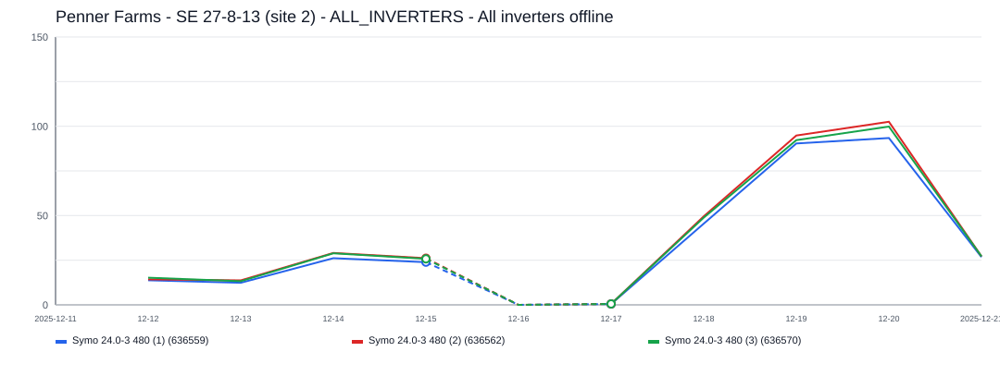

The site appears to have gone fully offline for about `1` day(s), affecting `1` inverter(s).
ALL_INVERTERS was the main affected inverter, with about `1` day(s) of severe underproduction and up to `81.1 kWh/day` expected output.

### 2025-02-10 - 66.7 kWh - Symo 24.0-3 480 (3) (636570) - Sustained underperformance

- Time range: `2025-02-10` to `2025-02-12`
- Affected inverters: Symo 24.0-3 480 (3) (636570)
- Confidence: `low` (`44`)
- Estimated lost production: `66.7 kWh`
- Estimated energy value lost: `$8.02 CAD`
- Estimated missed avoided emissions: `0.04 tCO2e`
- Estimated carbon-credit-equivalent value: `$3.61 CAD`

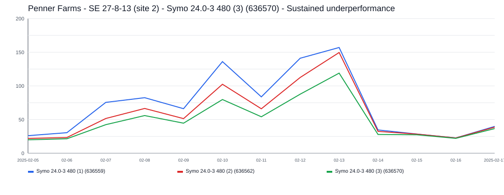

This incident lasted about `3` day(s) and affected `1` inverter(s).
Symo 24.0-3 480 (3) (636570) was the main affected inverter, with about `3` day(s) of severe underproduction and up to `114.0 kWh/day` expected output.

### 2025-01-04 - 53.6 kWh - Symo 24.0-3 480 (1) (636559) - Sustained underperformance

- Time range: `2025-01-04` to `2025-01-06`
- Affected inverters: Symo 24.0-3 480 (1) (636559)
- Confidence: `low` (`39`)
- Estimated lost production: `53.6 kWh`
- Estimated energy value lost: `$6.43 CAD`
- Estimated missed avoided emissions: `0.03 tCO2e`
- Estimated carbon-credit-equivalent value: `$2.90 CAD`

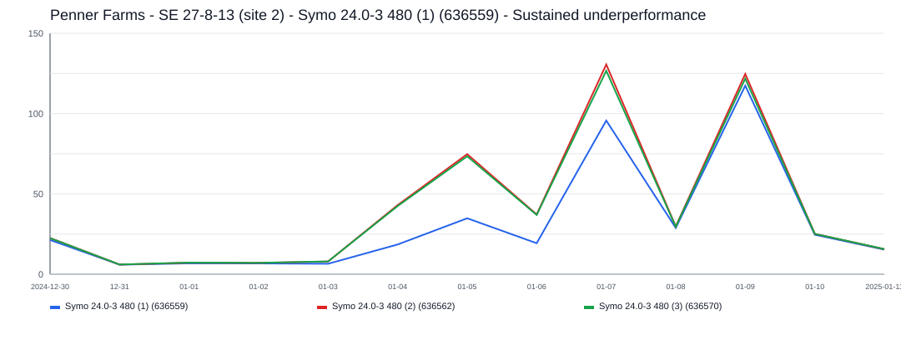

This incident lasted about `3` day(s) and affected `1` inverter(s).
Symo 24.0-3 480 (1) (636559) was the main affected inverter, with about `3` day(s) of severe underproduction and up to `60.7 kWh/day` expected output.
