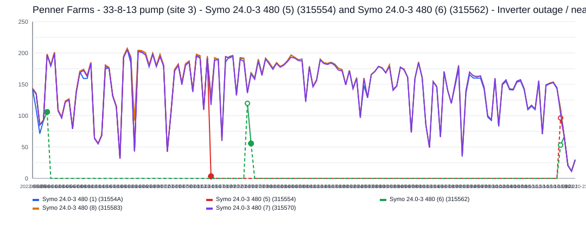
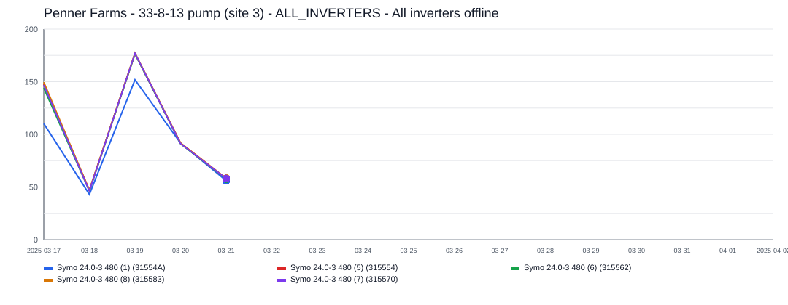
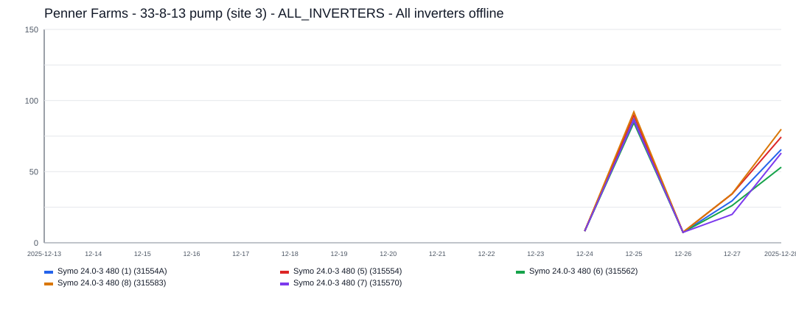
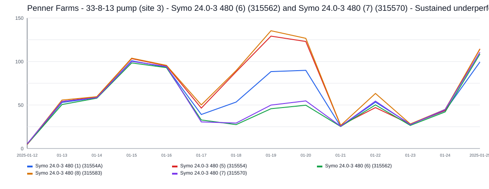
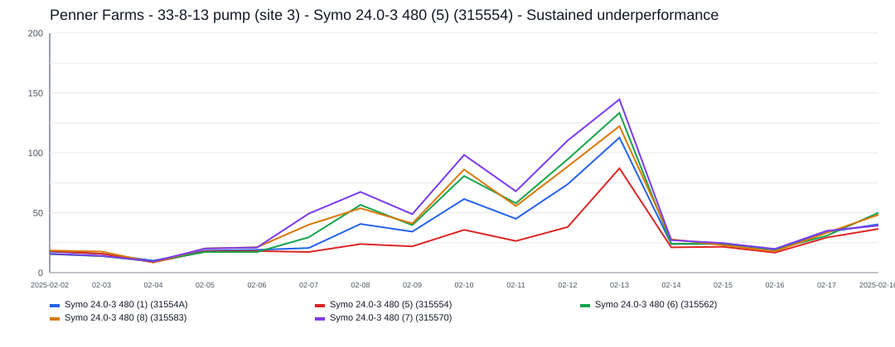
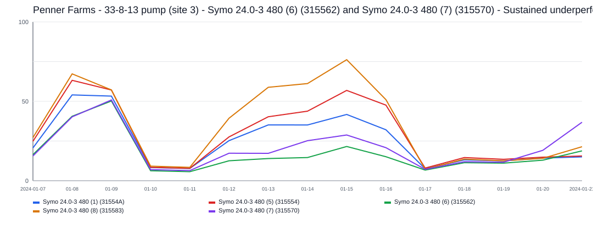
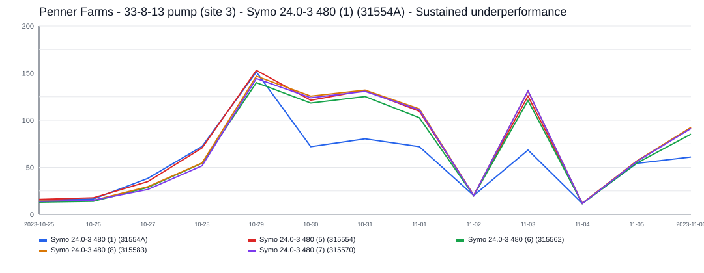
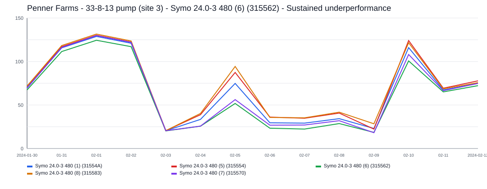

# Penner Farms - 33-8-13 pump (site 3) Incident Report

- Site: `a93e4e65-6f50-4a8f-a7e3-99abdfcf11e9`
- Total estimated lost production: `26,851.4 kWh`
- Estimated energy value lost: `$3,224.85 CAD`
- Estimated missed avoided emissions: `15.31 tCO2e`
- Estimated carbon-credit-equivalent value: `$1,647.54 CAD`

## Assumptions

- Energy value uses a flat Alberta retail proxy of `0.1201 CAD/kWh`.
- Avoided emissions use `0.57 tCO2e/MWh` as a distributed renewable grid displacement factor proxy.
- Carbon value schedule used for all incidents in this report:
  2024 = `$80/tCO2e`, 2025 = `$95/tCO2e`, 2026 = `$110/tCO2e`.

## Incidents

### 2022-06-01 - 22,723.8 kWh - Symo  24.0-3 480 (5) (315554) and Symo  24.0-3 480 (6) (315562) - Inverter outage / near-zero production

- Time range: `2022-06-01` to `2022-10-18`
- Affected inverters: Symo  24.0-3 480 (5) (315554), Symo  24.0-3 480 (6) (315562)
- Confidence: `high` (`100`)
- Estimated lost production: `22,723.8 kWh`
- Estimated energy value lost: `$2,729.13 CAD`
- Estimated missed avoided emissions: `12.95 tCO2e`
- Estimated carbon-credit-equivalent value: `$1,424.79 CAD`

This incident lasted about `140` day(s) and affected `2` inverter(s).
Affected inverter summary:
- Symo  24.0-3 480 (5) (315554): `95` total affected day(s), longest contiguous run `69` day(s), expected up to `119.0 kWh/day`.
- Symo  24.0-3 480 (6) (315562): `137` total affected day(s), longest contiguous run `57` day(s), expected up to `163.7 kWh/day`.

### 2025-03-22 - 2,608.5 kWh - ALL_INVERTERS - All inverters offline

- Time range: `2025-03-22` to `2025-03-28`
- Affected inverters: ALL_INVERTERS
- Confidence: `high` (`100`)
- Estimated lost production: `2,608.5 kWh`
- Estimated energy value lost: `$313.29 CAD`
- Estimated missed avoided emissions: `1.49 tCO2e`
- Estimated carbon-credit-equivalent value: `$141.25 CAD`

The site appears to have gone fully offline for about `7` day(s), affecting `1` inverter(s).
ALL_INVERTERS was the main affected inverter, with about `7` day(s) of severe underproduction and up to `457.3 kWh/day` expected output.

### 2025-12-18 - 793.2 kWh - ALL_INVERTERS - All inverters offline

- Time range: `2025-12-18` to `2025-12-23`
- Affected inverters: ALL_INVERTERS
- Confidence: `high` (`100`)
- Estimated lost production: `793.2 kWh`
- Estimated energy value lost: `$95.27 CAD`
- Estimated missed avoided emissions: `0.45 tCO2e`
- Estimated carbon-credit-equivalent value: `$42.95 CAD`

The site appears to have gone fully offline for about `6` day(s), affecting `1` inverter(s).
ALL_INVERTERS was the main affected inverter, with about `6` day(s) of severe underproduction and up to `240.0 kWh/day` expected output.

### 2025-01-17 - 223.7 kWh - Symo  24.0-3 480 (6) (315562) and Symo 24.0-3 480 (7) (315570) - Sustained underperformance

- Time range: `2025-01-17` to `2025-01-20`
- Affected inverters: Symo  24.0-3 480 (6) (315562), Symo 24.0-3 480 (7) (315570)
- Confidence: `low` (`59`)
- Estimated lost production: `223.7 kWh`
- Estimated energy value lost: `$26.86 CAD`
- Estimated missed avoided emissions: `0.13 tCO2e`
- Estimated carbon-credit-equivalent value: `$12.11 CAD`

This incident lasted about `4` day(s) and affected `2` inverter(s).
Affected inverter summary:
- Symo  24.0-3 480 (6) (315562): `3` total affected day(s), longest contiguous run `3` day(s), expected up to `89.0 kWh/day`.
- Symo 24.0-3 480 (7) (315570): `4` total affected day(s), longest contiguous run `4` day(s), expected up to `90.0 kWh/day`.

### 2025-02-07 - 196.4 kWh - Symo  24.0-3 480 (5) (315554) - Sustained underperformance

- Time range: `2025-02-07` to `2025-02-13`
- Affected inverters: Symo  24.0-3 480 (5) (315554)
- Confidence: `medium` (`69`)
- Estimated lost production: `196.4 kWh`
- Estimated energy value lost: `$23.59 CAD`
- Estimated missed avoided emissions: `0.11 tCO2e`
- Estimated carbon-credit-equivalent value: `$10.64 CAD`

This incident lasted about `7` day(s) and affected `1` inverter(s).
Symo  24.0-3 480 (5) (315554) was the main affected inverter, with about `7` day(s) of severe underproduction and up to `121.6 kWh/day` expected output.

### 2024-01-12 - 155.7 kWh - Symo  24.0-3 480 (6) (315562) and Symo 24.0-3 480 (7) (315570) - Sustained underperformance

- Time range: `2024-01-12` to `2024-01-16`
- Affected inverters: Symo  24.0-3 480 (6) (315562), Symo 24.0-3 480 (7) (315570)
- Confidence: `low` (`54`)
- Estimated lost production: `155.7 kWh`
- Estimated energy value lost: `$18.70 CAD`
- Estimated missed avoided emissions: `0.09 tCO2e`
- Estimated carbon-credit-equivalent value: `$7.10 CAD`

This incident lasted about `5` day(s) and affected `2` inverter(s).
Affected inverter summary:
- Symo  24.0-3 480 (6) (315562): `5` total affected day(s), longest contiguous run `5` day(s), expected up to `44.7 kWh/day`.
- Symo 24.0-3 480 (7) (315570): `5` total affected day(s), longest contiguous run `5` day(s), expected up to `45.2 kWh/day`.

### 2023-10-30 - 108.7 kWh - Symo  24.0-3 480 (1) (31554A) - Sustained underperformance

- Time range: `2023-10-30` to `2023-11-01`
- Affected inverters: Symo  24.0-3 480 (1) (31554A)
- Confidence: `low` (`51`)
- Estimated lost production: `108.7 kWh`
- Estimated energy value lost: `$13.06 CAD`
- Estimated missed avoided emissions: `0.06 tCO2e`
- Estimated carbon-credit-equivalent value: `$6.82 CAD`

This incident lasted about `3` day(s) and affected `1` inverter(s).
Symo  24.0-3 480 (1) (31554A) was the main affected inverter, with about `3` day(s) of severe underproduction and up to `119.7 kWh/day` expected output.

### 2024-02-04 - 41.2 kWh - Symo  24.0-3 480 (6) (315562) - Sustained underperformance

- Time range: `2024-02-04` to `2024-02-07`
- Affected inverters: Symo  24.0-3 480 (6) (315562)
- Confidence: `low` (`44`)
- Estimated lost production: `41.2 kWh`
- Estimated energy value lost: `$4.95 CAD`
- Estimated missed avoided emissions: `0.02 tCO2e`
- Estimated carbon-credit-equivalent value: `$1.88 CAD`

This incident lasted about `4` day(s) and affected `1` inverter(s).
Symo  24.0-3 480 (6) (315562) was the main affected inverter, with about `4` day(s) of severe underproduction and up to `72.3 kWh/day` expected output.
