# NE19-8-11 Incident Report

- Site: `35d57c96-ce57-4d21-8268-a171098cd93d`
- Total estimated lost production: `34,029.4 kWh`
- Estimated energy value lost: `$4,086.94 CAD`
- Estimated missed avoided emissions: `19.40 tCO2e`
- Estimated carbon-credit-equivalent value: `$1,698.71 CAD`

## Assumptions

- Energy value uses a flat Alberta retail proxy of `0.1201 CAD/kWh`.
- Avoided emissions use `0.57 tCO2e/MWh` as a distributed renewable grid displacement factor proxy.
- Carbon value schedule used for all incidents in this report:
  2024 = `$80/tCO2e`, 2025 = `$95/tCO2e`, 2026 = `$110/tCO2e`.

## Incidents

### 2024-05-29 - 17,326.3 kWh - Symo Advanced 24.0-3 480 (1) (0FEDFF) and Symo Advanced 24.0-3 480 (4) (9F82F9) - Inverter outage / near-zero production

- Time range: `2024-05-29` to `2024-10-16`
- Affected inverters: Symo Advanced 24.0-3 480 (1) (0FEDFF), Symo Advanced 24.0-3 480 (4) (9F82F9)
- Confidence: `high` (`100`)
- Estimated lost production: `17,326.3 kWh`
- Estimated energy value lost: `$2,080.89 CAD`
- Estimated missed avoided emissions: `9.88 tCO2e`
- Estimated carbon-credit-equivalent value: `$790.08 CAD`

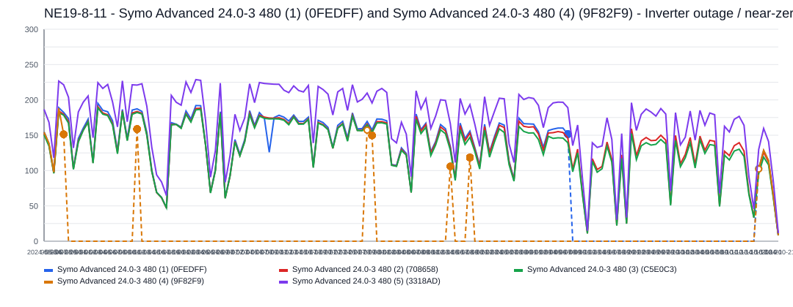

This incident lasted about `141` day(s) and affected `2` inverter(s).
Affected inverter summary:
- Symo Advanced 24.0-3 480 (1) (0FEDFF): `36` total affected day(s), longest contiguous run `26` day(s), expected up to `97.7 kWh/day`.
- Symo Advanced 24.0-3 480 (4) (9F82F9): `138` total affected day(s), longest contiguous run `106` day(s), expected up to `155.9 kWh/day`.

### 2025-09-06 - 5,397.0 kWh - Symo Advanced 24.0-3 480 (1) (0FEDFF) and Symo Advanced 24.0-3 480 (3) (C5E0C3) - Inverter outage / near-zero production

- Time range: `2025-09-06` to `2025-11-06`
- Affected inverters: Symo Advanced 24.0-3 480 (1) (0FEDFF), Symo Advanced 24.0-3 480 (3) (C5E0C3)
- Confidence: `high` (`98`)
- Estimated lost production: `5,397.0 kWh`
- Estimated energy value lost: `$648.18 CAD`
- Estimated missed avoided emissions: `3.08 tCO2e`
- Estimated carbon-credit-equivalent value: `$292.25 CAD`

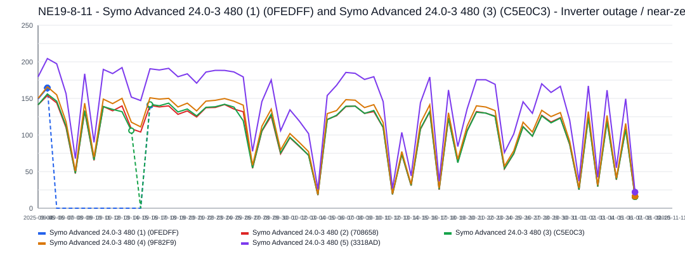

This incident lasted about `62` day(s) and affected `2` inverter(s).
Affected inverter summary:
- Symo Advanced 24.0-3 480 (1) (0FEDFF): `61` total affected day(s), longest contiguous run `51` day(s), expected up to `123.6 kWh/day`.
- Symo Advanced 24.0-3 480 (3) (C5E0C3): `1` total affected day(s), longest contiguous run `1` day(s), expected up to `68.9 kWh/day`.

### 2023-12-21 - 3,465.2 kWh - 5 inverters - All inverters offline

- Time range: `2023-12-21` to `2024-01-04`
- Affected inverters: ALL_INVERTERS, Symo Advanced 24.0-3 480 (2) (708658), Symo Advanced 24.0-3 480 (3) (C5E0C3), Symo Advanced 24.0-3 480 (4) (9F82F9), Symo Advanced 24.0-3 480 (5) (3318AD)
- Confidence: `high` (`100`)
- Estimated lost production: `3,465.2 kWh`
- Estimated energy value lost: `$416.17 CAD`
- Estimated missed avoided emissions: `1.98 tCO2e`
- Estimated carbon-credit-equivalent value: `$201.97 CAD`

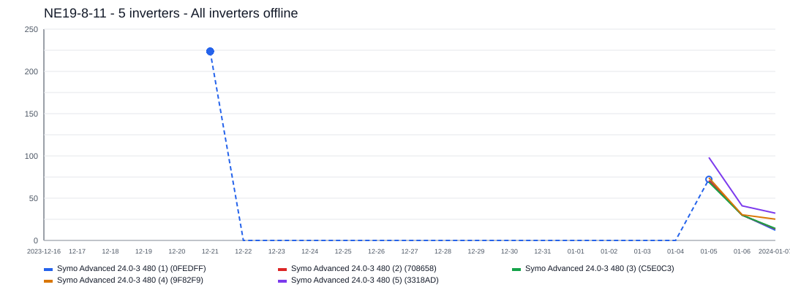

The site appears to have gone fully offline for about `15` day(s), affecting `5` inverter(s).
Affected inverter summary:
- ALL_INVERTERS: `14` total affected day(s), longest contiguous run `14` day(s), expected up to `384.6 kWh/day`.
- Symo Advanced 24.0-3 480 (2) (708658): `1` total affected day(s), longest contiguous run `1` day(s), expected up to `42.7 kWh/day`.
- Symo Advanced 24.0-3 480 (3) (C5E0C3): `1` total affected day(s), longest contiguous run `1` day(s), expected up to `42.5 kWh/day`.
- Symo Advanced 24.0-3 480 (4) (9F82F9): `1` total affected day(s), longest contiguous run `1` day(s), expected up to `43.7 kWh/day`.
- Symo Advanced 24.0-3 480 (5) (3318AD): `1` total affected day(s), longest contiguous run `1` day(s), expected up to `57.1 kWh/day`.

### 2025-07-22 - 2,310.1 kWh - Symo Advanced 24.0-3 480 (1) (0FEDFF) - Inverter outage / near-zero production

- Time range: `2025-07-22` to `2025-08-12`
- Affected inverters: Symo Advanced 24.0-3 480 (1) (0FEDFF)
- Confidence: `high` (`100`)
- Estimated lost production: `2,310.1 kWh`
- Estimated energy value lost: `$277.45 CAD`
- Estimated missed avoided emissions: `1.32 tCO2e`
- Estimated carbon-credit-equivalent value: `$125.09 CAD`

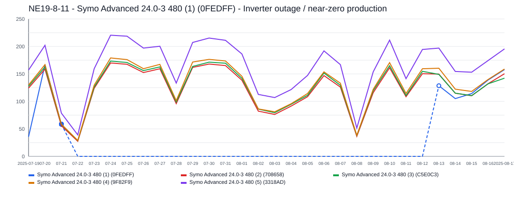

This incident lasted about `22` day(s) and affected `1` inverter(s).
Symo Advanced 24.0-3 480 (1) (0FEDFF) was the main affected inverter, with about `22` day(s) of severe underproduction and up to `142.9 kWh/day` expected output.

### 2025-07-04 - 1,384.9 kWh - Symo Advanced 24.0-3 480 (1) (0FEDFF) - Inverter outage / near-zero production

- Time range: `2025-07-04` to `2025-07-16`
- Affected inverters: Symo Advanced 24.0-3 480 (1) (0FEDFF)
- Confidence: `high` (`100`)
- Estimated lost production: `1,384.9 kWh`
- Estimated energy value lost: `$166.33 CAD`
- Estimated missed avoided emissions: `0.79 tCO2e`
- Estimated carbon-credit-equivalent value: `$74.99 CAD`

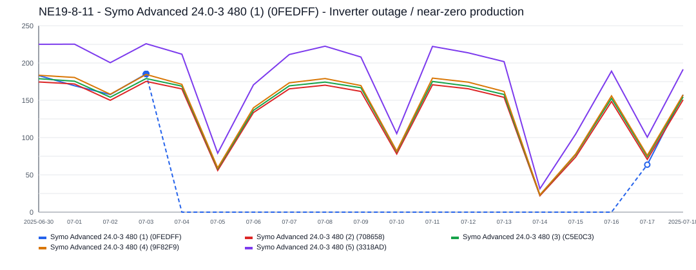

This incident lasted about `13` day(s) and affected `1` inverter(s).
Symo Advanced 24.0-3 480 (1) (0FEDFF) was the main affected inverter, with about `13` day(s) of severe underproduction and up to `144.0 kWh/day` expected output.

### 2025-08-26 - 809.8 kWh - Symo Advanced 24.0-3 480 (1) (0FEDFF) - Inverter outage / near-zero production

- Time range: `2025-08-26` to `2025-09-02`
- Affected inverters: Symo Advanced 24.0-3 480 (1) (0FEDFF)
- Confidence: `high` (`99`)
- Estimated lost production: `809.8 kWh`
- Estimated energy value lost: `$97.25 CAD`
- Estimated missed avoided emissions: `0.46 tCO2e`
- Estimated carbon-credit-equivalent value: `$43.85 CAD`

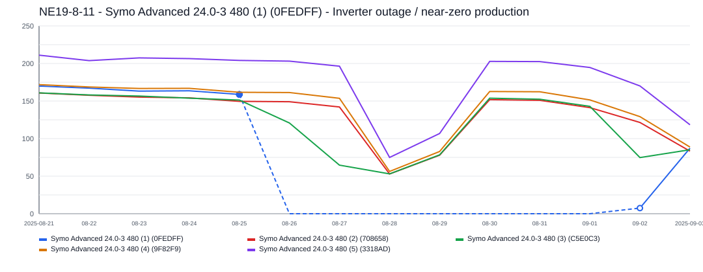

This incident lasted about `8` day(s) and affected `1` inverter(s).
Symo Advanced 24.0-3 480 (1) (0FEDFF) was the main affected inverter, with about `8` day(s) of severe underproduction and up to `129.2 kWh/day` expected output.

### 2025-06-19 - 777.8 kWh - Symo Advanced 24.0-3 480 (1) (0FEDFF) - Inverter outage / near-zero production

- Time range: `2025-06-19` to `2025-06-26`
- Affected inverters: Symo Advanced 24.0-3 480 (1) (0FEDFF)
- Confidence: `high` (`100`)
- Estimated lost production: `777.8 kWh`
- Estimated energy value lost: `$93.42 CAD`
- Estimated missed avoided emissions: `0.44 tCO2e`
- Estimated carbon-credit-equivalent value: `$42.12 CAD`

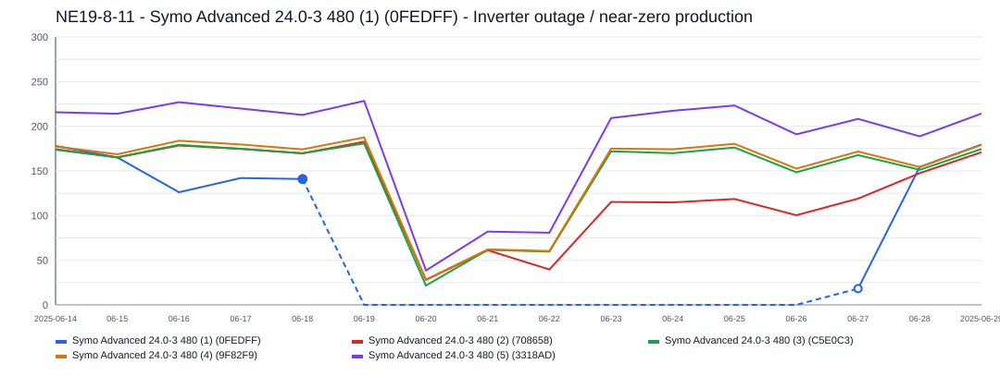

This incident lasted about `8` day(s) and affected `1` inverter(s).
Symo Advanced 24.0-3 480 (1) (0FEDFF) was the main affected inverter, with about `8` day(s) of severe underproduction and up to `150.0 kWh/day` expected output.

### 2025-05-25 - 720.8 kWh - Symo Advanced 24.0-3 480 (4) (9F82F9) and Symo Advanced 24.0-3 480 (5) (3318AD) - Inverter outage / near-zero production

- Time range: `2025-05-25` to `2025-05-27`
- Affected inverters: Symo Advanced 24.0-3 480 (4) (9F82F9), Symo Advanced 24.0-3 480 (5) (3318AD)
- Confidence: `high` (`99`)
- Estimated lost production: `720.8 kWh`
- Estimated energy value lost: `$86.57 CAD`
- Estimated missed avoided emissions: `0.41 tCO2e`
- Estimated carbon-credit-equivalent value: `$39.03 CAD`

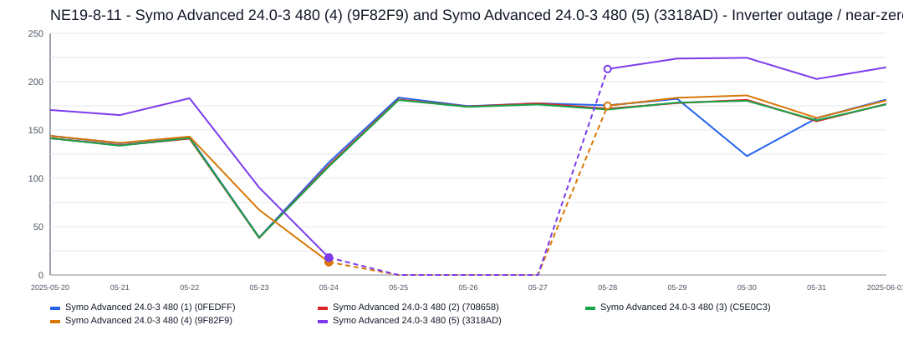

This incident lasted about `3` day(s) and affected `2` inverter(s).
Affected inverter summary:
- Symo Advanced 24.0-3 480 (4) (9F82F9): `3` total affected day(s), longest contiguous run `3` day(s), expected up to `106.6 kWh/day`.
- Symo Advanced 24.0-3 480 (5) (3318AD): `3` total affected day(s), longest contiguous run `3` day(s), expected up to `139.4 kWh/day`.

### 2024-05-10 - 536.2 kWh - Symo Advanced 24.0-3 480 (1) (0FEDFF) and Symo Advanced 24.0-3 480 (4) (9F82F9) - Inverter outage / near-zero production

- Time range: `2024-05-10` to `2024-05-13`
- Affected inverters: Symo Advanced 24.0-3 480 (1) (0FEDFF), Symo Advanced 24.0-3 480 (4) (9F82F9)
- Confidence: `high` (`100`)
- Estimated lost production: `536.2 kWh`
- Estimated energy value lost: `$64.40 CAD`
- Estimated missed avoided emissions: `0.31 tCO2e`
- Estimated carbon-credit-equivalent value: `$24.45 CAD`

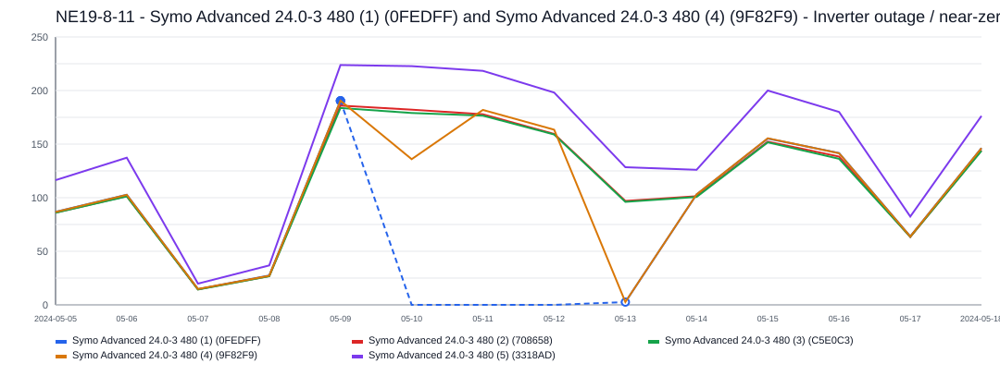

This incident lasted about `4` day(s) and affected `2` inverter(s).
Affected inverter summary:
- Symo Advanced 24.0-3 480 (1) (0FEDFF): `4` total affected day(s), longest contiguous run `4` day(s), expected up to `145.2 kWh/day`.
- Symo Advanced 24.0-3 480 (4) (9F82F9): `1` total affected day(s), longest contiguous run `1` day(s), expected up to `63.8 kWh/day`.

### 2024-01-12 - 508.5 kWh - 3 inverters - Sustained underperformance

- Time range: `2024-01-12` to `2024-01-23`
- Affected inverters: Symo Advanced 24.0-3 480 (1) (0FEDFF), Symo Advanced 24.0-3 480 (2) (708658), Symo Advanced 24.0-3 480 (3) (C5E0C3)
- Confidence: `medium` (`66`)
- Estimated lost production: `508.5 kWh`
- Estimated energy value lost: `$61.07 CAD`
- Estimated missed avoided emissions: `0.29 tCO2e`
- Estimated carbon-credit-equivalent value: `$23.19 CAD`

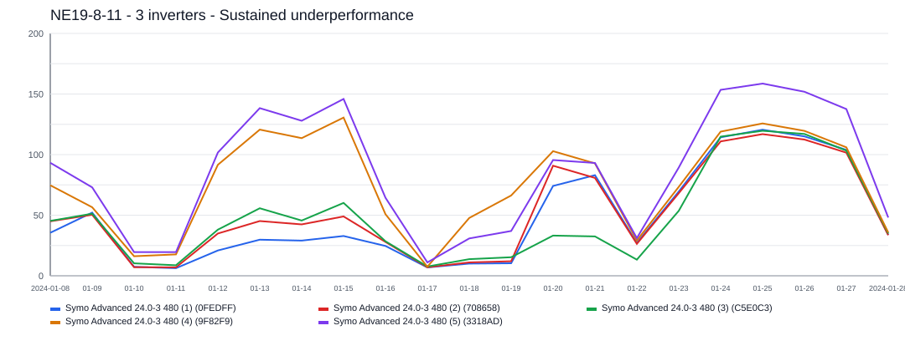

This incident lasted about `12` day(s) and affected `3` inverter(s).
Affected inverter summary:
- Symo Advanced 24.0-3 480 (1) (0FEDFF): `5` total affected day(s), longest contiguous run `5` day(s), expected up to `80.5 kWh/day`.
- Symo Advanced 24.0-3 480 (2) (708658): `5` total affected day(s), longest contiguous run `5` day(s), expected up to `79.9 kWh/day`.
- Symo Advanced 24.0-3 480 (3) (C5E0C3): `12` total affected day(s), longest contiguous run `12` day(s), expected up to `79.6 kWh/day`.

### 2025-02-08 - 419.0 kWh - Symo Advanced 24.0-3 480 (3) (C5E0C3) and Symo Advanced 24.0-3 480 (5) (3318AD) - Sustained underperformance

- Time range: `2025-02-08` to `2025-02-20`
- Affected inverters: Symo Advanced 24.0-3 480 (3) (C5E0C3), Symo Advanced 24.0-3 480 (5) (3318AD)
- Confidence: `medium` (`69`)
- Estimated lost production: `419.0 kWh`
- Estimated energy value lost: `$50.32 CAD`
- Estimated missed avoided emissions: `0.24 tCO2e`
- Estimated carbon-credit-equivalent value: `$22.69 CAD`

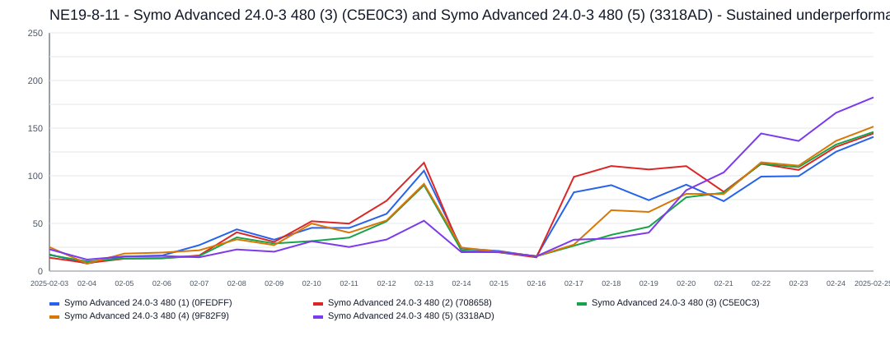

This incident lasted about `13` day(s) and affected `2` inverter(s).
Affected inverter summary:
- Symo Advanced 24.0-3 480 (3) (C5E0C3): `3` total affected day(s), longest contiguous run `3` day(s), expected up to `64.0 kWh/day`.
- Symo Advanced 24.0-3 480 (5) (3318AD): `11` total affected day(s), longest contiguous run `7` day(s), expected up to `115.8 kWh/day`.

### 2025-01-17 - 228.5 kWh - 3 inverters - Sustained underperformance

- Time range: `2025-01-17` to `2025-01-20`
- Affected inverters: Symo Advanced 24.0-3 480 (1) (0FEDFF), Symo Advanced 24.0-3 480 (2) (708658), Symo Advanced 24.0-3 480 (3) (C5E0C3)
- Confidence: `low` (`50`)
- Estimated lost production: `228.5 kWh`
- Estimated energy value lost: `$27.44 CAD`
- Estimated missed avoided emissions: `0.13 tCO2e`
- Estimated carbon-credit-equivalent value: `$12.37 CAD`

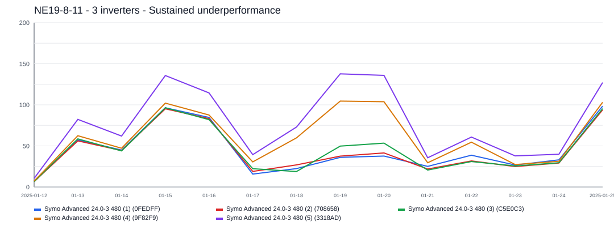

This incident lasted about `4` day(s) and affected `3` inverter(s).
Affected inverter summary:
- Symo Advanced 24.0-3 480 (1) (0FEDFF): `4` total affected day(s), longest contiguous run `4` day(s), expected up to `71.6 kWh/day`.
- Symo Advanced 24.0-3 480 (2) (708658): `4` total affected day(s), longest contiguous run `4` day(s), expected up to `71.1 kWh/day`.
- Symo Advanced 24.0-3 480 (3) (C5E0C3): `3` total affected day(s), longest contiguous run `3` day(s), expected up to `70.8 kWh/day`.

### 2024-11-26 - 101.7 kWh - Symo Advanced 24.0-3 480 (1) (0FEDFF) - Sustained underperformance

- Time range: `2024-11-26` to `2024-12-02`
- Affected inverters: Symo Advanced 24.0-3 480 (1) (0FEDFF)
- Confidence: `low` (`51`)
- Estimated lost production: `101.7 kWh`
- Estimated energy value lost: `$12.21 CAD`
- Estimated missed avoided emissions: `0.06 tCO2e`
- Estimated carbon-credit-equivalent value: `$4.64 CAD`

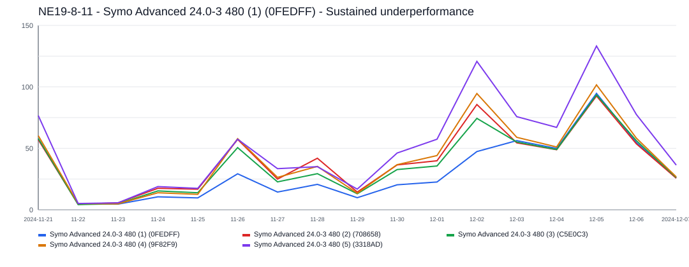

This incident lasted about `7` day(s) and affected `1` inverter(s).
Symo Advanced 24.0-3 480 (1) (0FEDFF) was the main affected inverter, with about `7` day(s) of severe underproduction and up to `81.4 kWh/day` expected output.

### 2024-02-05 - 43.5 kWh - Symo Advanced 24.0-3 480 (2) (708658) - Sustained underperformance

- Time range: `2024-02-05` to `2024-02-09`
- Affected inverters: Symo Advanced 24.0-3 480 (2) (708658)
- Confidence: `low` (`45`)
- Estimated lost production: `43.5 kWh`
- Estimated energy value lost: `$5.22 CAD`
- Estimated missed avoided emissions: `0.02 tCO2e`
- Estimated carbon-credit-equivalent value: `$1.98 CAD`

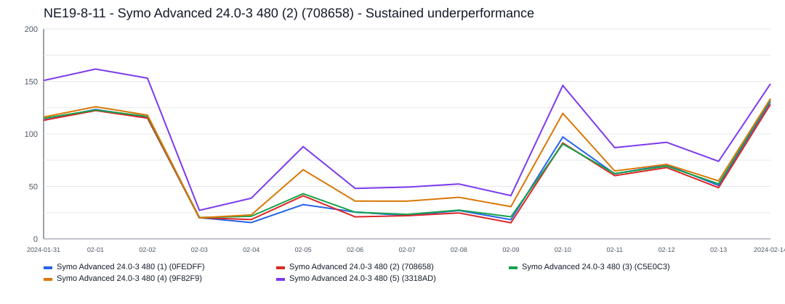

This incident lasted about `5` day(s) and affected `1` inverter(s).
Symo Advanced 24.0-3 480 (2) (708658) was the main affected inverter, with about `5` day(s) of severe underproduction and up to `51.7 kWh/day` expected output.
