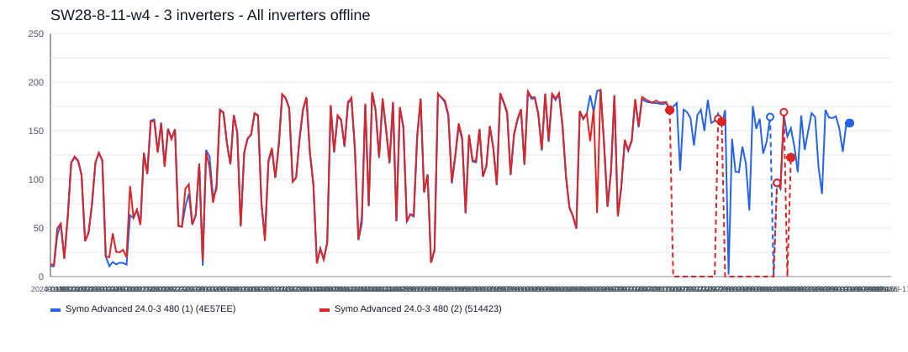
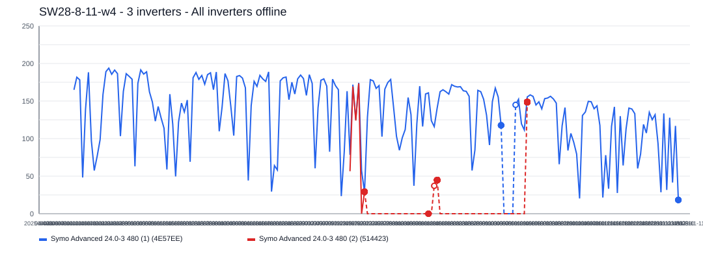
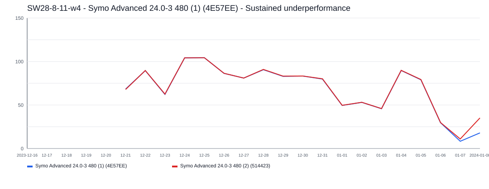
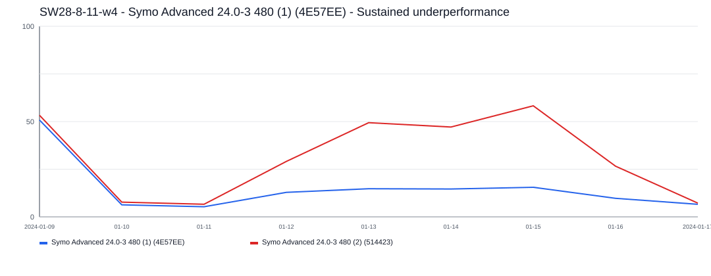

# SW28-8-11-w4 Incident Report

- Site: `541a9f8e-ab20-4397-85a9-435882a5739c`
- Total estimated lost production: `43,648.7 kWh`
- Estimated energy value lost: `$5,242.21 CAD`
- Estimated missed avoided emissions: `24.88 tCO2e`
- Estimated carbon-credit-equivalent value: `$2,140.61 CAD`

## Assumptions

- Energy value uses a flat Alberta retail proxy of `0.1201 CAD/kWh`.
- Avoided emissions use `0.57 tCO2e/MWh` as a distributed renewable grid displacement factor proxy.
- Carbon value schedule used for all incidents in this report:
  2024 = `$80/tCO2e`, 2025 = `$95/tCO2e`, 2026 = `$110/tCO2e`.

## Incidents

### 2024-01-20 - 26,453.2 kWh - 3 inverters - All inverters offline

- Time range: `2024-01-20` to `2024-09-12`
- Affected inverters: ALL_INVERTERS, Symo Advanced 24.0-3 480 (1) (4E57EE), Symo Advanced 24.0-3 480 (2) (514423)
- Confidence: `high` (`100`)
- Estimated lost production: `26,453.2 kWh`
- Estimated energy value lost: `$3,177.03 CAD`
- Estimated missed avoided emissions: `15.08 tCO2e`
- Estimated carbon-credit-equivalent value: `$1,206.27 CAD`

The site appears to have gone fully offline for about `237` day(s), affecting `3` inverter(s).
Affected inverter summary:
- ALL_INVERTERS: `8` total affected day(s), longest contiguous run `7` day(s), expected up to `157.8 kWh/day`.
- Symo Advanced 24.0-3 480 (1) (4E57EE): `181` total affected day(s), longest contiguous run `178` day(s), expected up to `384.8 kWh/day`.
- Symo Advanced 24.0-3 480 (2) (514423): `48` total affected day(s), longest contiguous run `29` day(s), expected up to `91.1 kWh/day`.

### 2025-04-06 - 15,703.9 kWh - 3 inverters - All inverters offline

- Time range: `2025-04-06` to `2025-11-06`
- Affected inverters: ALL_INVERTERS, Symo Advanced 24.0-3 480 (1) (4E57EE), Symo Advanced 24.0-3 480 (2) (514423)
- Confidence: `high` (`100`)
- Estimated lost production: `15,703.9 kWh`
- Estimated energy value lost: `$1,886.04 CAD`
- Estimated missed avoided emissions: `8.95 tCO2e`
- Estimated carbon-credit-equivalent value: `$850.37 CAD`

The site appears to have gone fully offline for about `215` day(s), affecting `3` inverter(s).
Affected inverter summary:
- ALL_INVERTERS: `11` total affected day(s), longest contiguous run `7` day(s), expected up to `178.2 kWh/day`.
- Symo Advanced 24.0-3 480 (1) (4E57EE): `4` total affected day(s), longest contiguous run `4` day(s), expected up to `347.5 kWh/day`.
- Symo Advanced 24.0-3 480 (2) (514423): `200` total affected day(s), longest contiguous run `95` day(s), expected up to `97.1 kWh/day`.

### 2023-12-21 - 1,281.1 kWh - Symo Advanced 24.0-3 480 (1) (4E57EE) - Sustained underperformance

- Time range: `2023-12-21` to `2024-01-06`
- Affected inverters: Symo Advanced 24.0-3 480 (1) (4E57EE)
- Confidence: `medium` (`67`)
- Estimated lost production: `1,281.1 kWh`
- Estimated energy value lost: `$153.86 CAD`
- Estimated missed avoided emissions: `0.73 tCO2e`
- Estimated carbon-credit-equivalent value: `$74.38 CAD`

This incident lasted about `17` day(s) and affected `1` inverter(s).
Symo Advanced 24.0-3 480 (1) (4E57EE) was the main affected inverter, with about `17` day(s) of severe underproduction and up to `208.7 kWh/day` expected output.

### 2024-01-12 - 210.5 kWh - Symo Advanced 24.0-3 480 (1) (4E57EE) - Sustained underperformance

- Time range: `2024-01-12` to `2024-01-16`
- Affected inverters: Symo Advanced 24.0-3 480 (1) (4E57EE)
- Confidence: `low` (`57`)
- Estimated lost production: `210.5 kWh`
- Estimated energy value lost: `$25.28 CAD`
- Estimated missed avoided emissions: `0.12 tCO2e`
- Estimated carbon-credit-equivalent value: `$9.60 CAD`

This incident lasted about `5` day(s) and affected `1` inverter(s).
Symo Advanced 24.0-3 480 (1) (4E57EE) was the main affected inverter, with about `5` day(s) of severe underproduction and up to `73.8 kWh/day` expected output.
