# G and C farms south meter Incident Report

- Site: `e5d4623c-5a06-4b45-b2f0-fea3ad9136f1`
- Total estimated lost production: `123,472.2 kWh`
- Estimated energy value lost: `$14,829.01 CAD`
- Estimated missed avoided emissions: `70.38 tCO2e`
- Estimated carbon-credit-equivalent value: `$7,418.50 CAD`

## Assumptions

- Energy value uses a flat Alberta retail proxy of `0.1201 CAD/kWh`.
- Avoided emissions use `0.57 tCO2e/MWh` as a distributed renewable grid displacement factor proxy.
- Carbon value schedule used for all incidents in this report:
  2024 = `$80/tCO2e`, 2025 = `$95/tCO2e`, 2026 = `$110/tCO2e`.

## Incidents

### 2022-07-02 - 43,125.1 kWh - 4 inverters - All inverters offline

- Time range: `2022-07-02` to `2022-12-16`
- Affected inverters: ALL_INVERTERS, Symo 24.0-3 480 (1) (ECDEE1), Symo Advanced 24.0-3 480 (2) (2344D2), Symo Advanced 24.0-3 480 (3) (2344DB)
- Confidence: `high` (`100`)
- Estimated lost production: `43,125.1 kWh`
- Estimated energy value lost: `$5,179.32 CAD`
- Estimated missed avoided emissions: `24.58 tCO2e`
- Estimated carbon-credit-equivalent value: `$2,703.94 CAD`

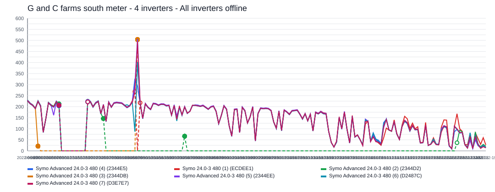

The site appears to have gone fully offline for about `168` day(s), affecting `4` inverter(s).
Affected inverter summary:
- ALL_INVERTERS: `10` total affected day(s), longest contiguous run `10` day(s), expected up to `1,335.1 kWh/day`.
- Symo 24.0-3 480 (1) (ECDEE1): `1` total affected day(s), longest contiguous run `1` day(s), expected up to `324.7 kWh/day`.
- Symo Advanced 24.0-3 480 (2) (2344D2): `122` total affected day(s), longest contiguous run `62` day(s), expected up to `317.5 kWh/day`.
- Symo Advanced 24.0-3 480 (3) (2344DB): `144` total affected day(s), longest contiguous run `73` day(s), expected up to `195.0 kWh/day`.

### 2023-01-18 - 21,796.2 kWh - 5 inverters - All inverters offline

- Time range: `2023-01-18` to `2023-05-01`
- Affected inverters: ALL_INVERTERS, Symo  Advanced 24.0-3 480 (4) (2344E5), Symo Advanced 24.0-3 480 (2) (2344D2), Symo Advanced 24.0-3 480 (3) (2344DB), Symo Advanced 24.0-3 480 (5) (2344EE)
- Confidence: `high` (`100`)
- Estimated lost production: `21,796.2 kWh`
- Estimated energy value lost: `$2,617.73 CAD`
- Estimated missed avoided emissions: `12.42 tCO2e`
- Estimated carbon-credit-equivalent value: `$1,366.62 CAD`

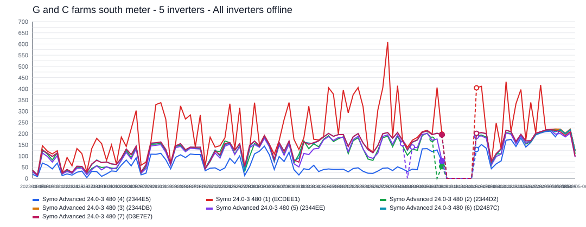

The site appears to have gone fully offline for about `104` day(s), affecting `5` inverter(s).
Affected inverter summary:
- ALL_INVERTERS: `6` total affected day(s), longest contiguous run `6` day(s), expected up to `1,111.0 kWh/day`.
- Symo  Advanced 24.0-3 480 (4) (2344E5): `57` total affected day(s), longest contiguous run `30` day(s), expected up to `205.6 kWh/day`.
- Symo Advanced 24.0-3 480 (2) (2344D2): `1` total affected day(s), longest contiguous run `1` day(s), expected up to `160.4 kWh/day`.
- Symo Advanced 24.0-3 480 (3) (2344DB): `97` total affected day(s), longest contiguous run `72` day(s), expected up to `210.4 kWh/day`.
- Symo Advanced 24.0-3 480 (5) (2344EE): `1` total affected day(s), longest contiguous run `1` day(s), expected up to `74.3 kWh/day`.

### 2025-09-15 - 17,955.3 kWh - ALL_INVERTERS and Symo  Advanced 24.0-3 480 (4) (2344E5) - All inverters offline

- Time range: `2025-09-15` to `2025-12-04`
- Affected inverters: ALL_INVERTERS, Symo  Advanced 24.0-3 480 (4) (2344E5)
- Confidence: `high` (`100`)
- Estimated lost production: `17,955.3 kWh`
- Estimated energy value lost: `$2,156.43 CAD`
- Estimated missed avoided emissions: `10.23 tCO2e`
- Estimated carbon-credit-equivalent value: `$972.28 CAD`

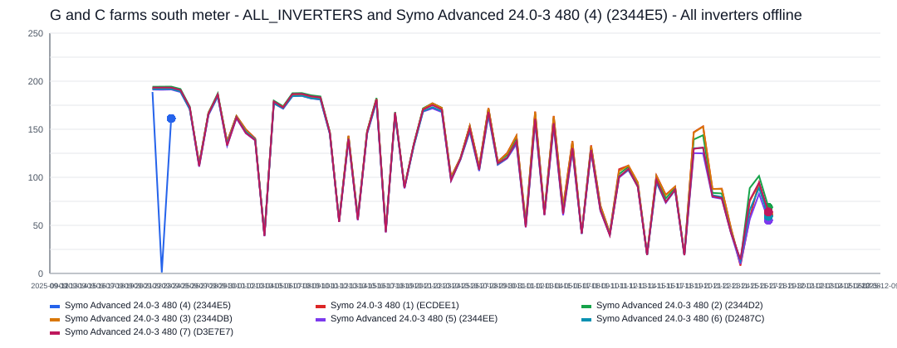

The site appears to have gone fully offline for about `81` day(s), affecting `2` inverter(s).
Affected inverter summary:
- ALL_INVERTERS: `14` total affected day(s), longest contiguous run `7` day(s), expected up to `1,344.4 kWh/day`.
- Symo  Advanced 24.0-3 480 (4) (2344E5): `66` total affected day(s), longest contiguous run `66` day(s), expected up to `164.4 kWh/day`.

### 2025-12-31 - 10,946.7 kWh - ALL_INVERTERS and Symo  Advanced 24.0-3 480 (4) (2344E5) - All inverters offline

- Time range: `2025-12-31` to `2026-04-14`
- Affected inverters: ALL_INVERTERS, Symo  Advanced 24.0-3 480 (4) (2344E5)
- Confidence: `high` (`100`)
- Estimated lost production: `10,946.7 kWh`
- Estimated energy value lost: `$1,314.70 CAD`
- Estimated missed avoided emissions: `6.24 tCO2e`
- Estimated carbon-credit-equivalent value: `$684.50 CAD`

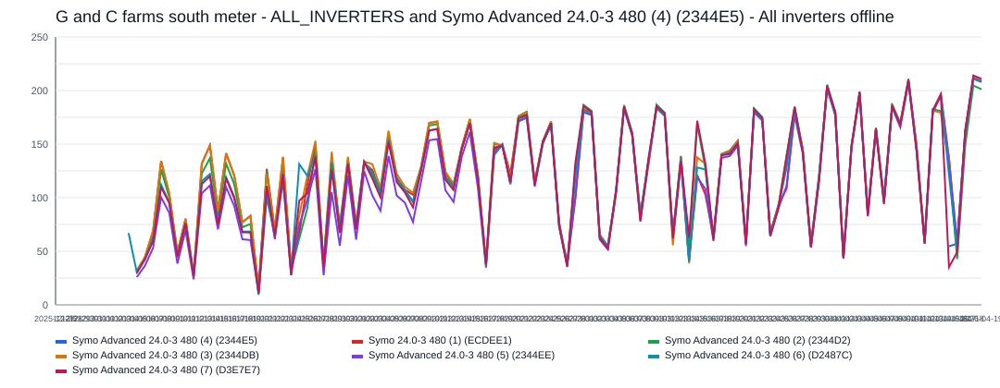

The site appears to have gone fully offline for about `105` day(s), affecting `2` inverter(s).
Affected inverter summary:
- ALL_INVERTERS: `4` total affected day(s), longest contiguous run `4` day(s), expected up to `315.3 kWh/day`.
- Symo  Advanced 24.0-3 480 (4) (2344E5): `99` total affected day(s), longest contiguous run `99` day(s), expected up to `178.2 kWh/day`.

### 2025-09-01 - 9,704.3 kWh - ALL_INVERTERS - All inverters offline

- Time range: `2025-09-01` to `2025-09-07`
- Affected inverters: ALL_INVERTERS
- Confidence: `high` (`100`)
- Estimated lost production: `9,704.3 kWh`
- Estimated energy value lost: `$1,165.49 CAD`
- Estimated missed avoided emissions: `5.53 tCO2e`
- Estimated carbon-credit-equivalent value: `$525.49 CAD`

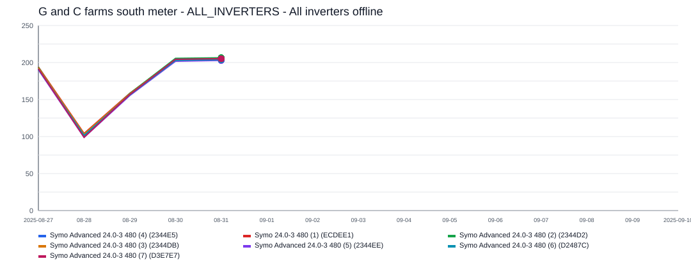

The site appears to have gone fully offline for about `7` day(s), affecting `1` inverter(s).
ALL_INVERTERS was the main affected inverter, with about `7` day(s) of severe underproduction and up to `1,432.0 kWh/day` expected output.

### 2025-02-21 - 9,192.0 kWh - ALL_INVERTERS and Symo Advanced 24.0-3 480 (5) (2344EE) - All inverters offline

- Time range: `2025-02-21` to `2025-03-07`
- Affected inverters: ALL_INVERTERS, Symo Advanced 24.0-3 480 (5) (2344EE)
- Confidence: `high` (`100`)
- Estimated lost production: `9,192.0 kWh`
- Estimated energy value lost: `$1,103.95 CAD`
- Estimated missed avoided emissions: `5.24 tCO2e`
- Estimated carbon-credit-equivalent value: `$497.74 CAD`

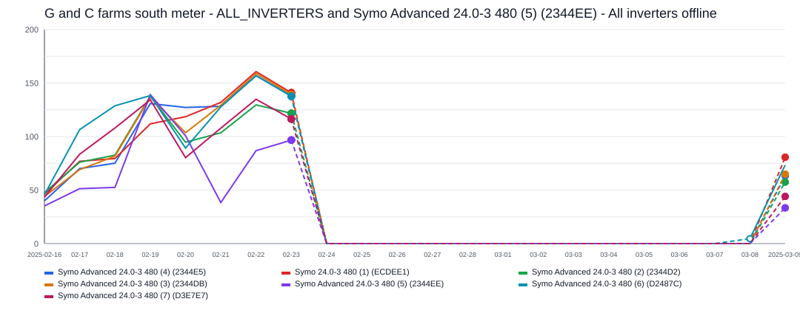

The site appears to have gone fully offline for about `15` day(s), affecting `2` inverter(s).
Affected inverter summary:
- ALL_INVERTERS: `12` total affected day(s), longest contiguous run `12` day(s), expected up to `890.7 kWh/day`.
- Symo Advanced 24.0-3 480 (5) (2344EE): `3` total affected day(s), longest contiguous run `3` day(s), expected up to `139.3 kWh/day`.

### 2023-07-29 - 8,390.5 kWh - Symo 24.0-3 480 (1) (ECDEE1) - Inverter outage / near-zero production

- Time range: `2023-07-29` to `2023-09-18`
- Affected inverters: Symo 24.0-3 480 (1) (ECDEE1)
- Confidence: `high` (`100`)
- Estimated lost production: `8,390.5 kWh`
- Estimated energy value lost: `$1,007.70 CAD`
- Estimated missed avoided emissions: `4.78 tCO2e`
- Estimated carbon-credit-equivalent value: `$526.09 CAD`

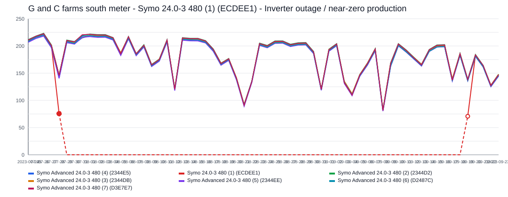

This incident lasted about `52` day(s) and affected `1` inverter(s).
Symo 24.0-3 480 (1) (ECDEE1) was the main affected inverter, with about `52` day(s) of severe underproduction and up to `194.6 kWh/day` expected output.

### 2022-12-24 - 1,767.8 kWh - Symo  Advanced 24.0-3 480 (4) (2344E5) and Symo Advanced 24.0-3 480 (3) (2344DB) - Multiple inverters offline

- Time range: `2022-12-24` to `2023-01-14`
- Affected inverters: Symo  Advanced 24.0-3 480 (4) (2344E5), Symo Advanced 24.0-3 480 (3) (2344DB)
- Confidence: `high` (`97`)
- Estimated lost production: `1,767.8 kWh`
- Estimated energy value lost: `$212.31 CAD`
- Estimated missed avoided emissions: `1.01 tCO2e`
- Estimated carbon-credit-equivalent value: `$110.84 CAD`

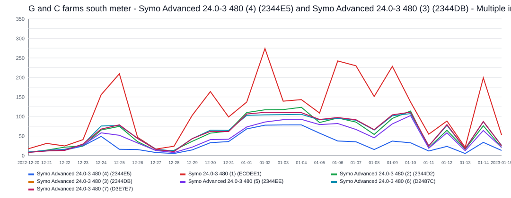

Multiple inverters appear to have dropped out during the same incident window lasting about `22` day(s).
Affected inverter summary:
- Symo  Advanced 24.0-3 480 (4) (2344E5): `12` total affected day(s), longest contiguous run `6` day(s), expected up to `92.4 kWh/day`.
- Symo Advanced 24.0-3 480 (3) (2344DB): `19` total affected day(s), longest contiguous run `13` day(s), expected up to `111.6 kWh/day`.

### 2025-03-12 - 220.7 kWh - Symo Advanced 24.0-3 480 (5) (2344EE) - Sustained underperformance

- Time range: `2025-03-12` to `2025-03-18`
- Affected inverters: Symo Advanced 24.0-3 480 (5) (2344EE)
- Confidence: `medium` (`80`)
- Estimated lost production: `220.7 kWh`
- Estimated energy value lost: `$26.51 CAD`
- Estimated missed avoided emissions: `0.13 tCO2e`
- Estimated carbon-credit-equivalent value: `$11.95 CAD`

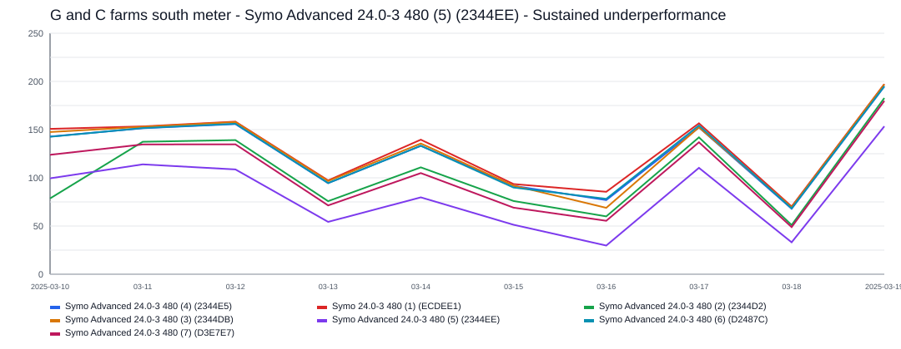

This incident lasted about `7` day(s) and affected `1` inverter(s).
Symo Advanced 24.0-3 480 (5) (2344EE) was the main affected inverter, with about `7` day(s) of severe underproduction and up to `143.0 kWh/day` expected output.

### 2025-03-22 - 123.2 kWh - Symo Advanced 24.0-3 480 (5) (2344EE) - Sustained underperformance

- Time range: `2025-03-22` to `2025-03-25`
- Affected inverters: Symo Advanced 24.0-3 480 (5) (2344EE)
- Confidence: `medium` (`71`)
- Estimated lost production: `123.2 kWh`
- Estimated energy value lost: `$14.80 CAD`
- Estimated missed avoided emissions: `0.07 tCO2e`
- Estimated carbon-credit-equivalent value: `$6.67 CAD`

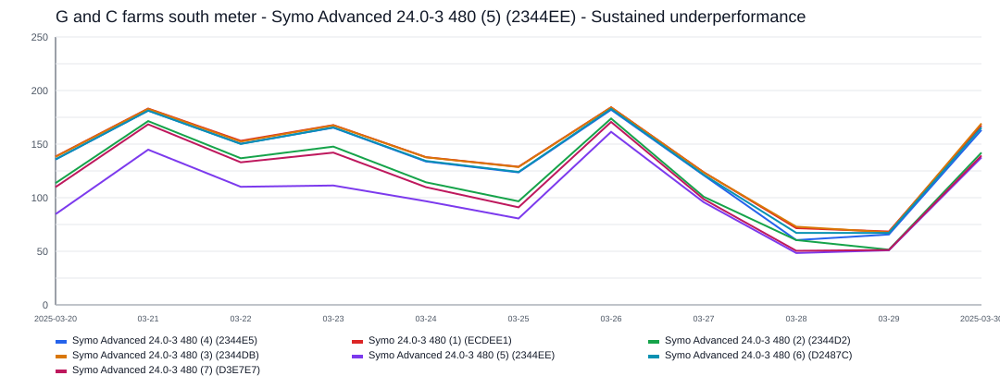

This incident lasted about `4` day(s) and affected `1` inverter(s).
Symo Advanced 24.0-3 480 (5) (2344EE) was the main affected inverter, with about `4` day(s) of severe underproduction and up to `151.0 kWh/day` expected output.

### 2025-01-17 - 111.2 kWh - Symo Advanced 24.0-3 480 (5) (2344EE) and Symo Advanced 24.0-3 480 (6) (D2487C) - Sustained underperformance

- Time range: `2025-01-17` to `2025-01-20`
- Affected inverters: Symo Advanced 24.0-3 480 (5) (2344EE), Symo Advanced 24.0-3 480 (6) (D2487C)
- Confidence: `low` (`50`)
- Estimated lost production: `111.2 kWh`
- Estimated energy value lost: `$13.35 CAD`
- Estimated missed avoided emissions: `0.06 tCO2e`
- Estimated carbon-credit-equivalent value: `$6.02 CAD`

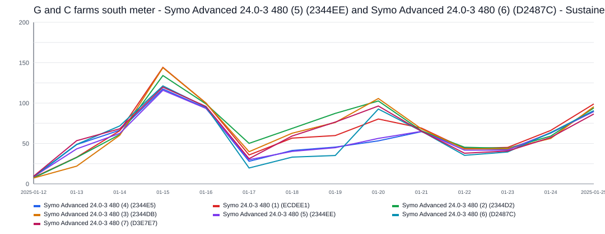

This incident lasted about `4` day(s) and affected `2` inverter(s).
Affected inverter summary:
- Symo Advanced 24.0-3 480 (5) (2344EE): `3` total affected day(s), longest contiguous run `3` day(s), expected up to `83.0 kWh/day`.
- Symo Advanced 24.0-3 480 (6) (D2487C): `3` total affected day(s), longest contiguous run `3` day(s), expected up to `60.7 kWh/day`.

### 2024-11-30 - 88.8 kWh - Symo  Advanced 24.0-3 480 (4) (2344E5) and Symo Advanced 24.0-3 480 (5) (2344EE) - Sustained underperformance

- Time range: `2024-11-30` to `2024-12-02`
- Affected inverters: Symo  Advanced 24.0-3 480 (4) (2344E5), Symo Advanced 24.0-3 480 (5) (2344EE)
- Confidence: `low` (`44`)
- Estimated lost production: `88.8 kWh`
- Estimated energy value lost: `$10.66 CAD`
- Estimated missed avoided emissions: `0.05 tCO2e`
- Estimated carbon-credit-equivalent value: `$4.05 CAD`

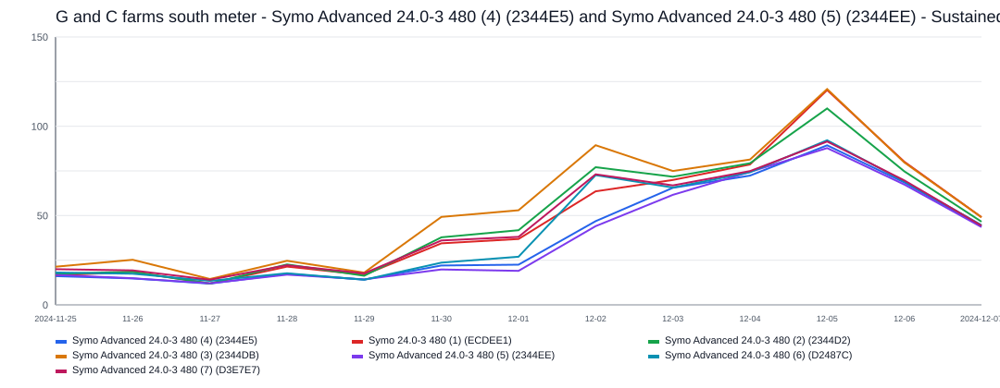

This incident lasted about `3` day(s) and affected `2` inverter(s).
Affected inverter summary:
- Symo  Advanced 24.0-3 480 (4) (2344E5): `3` total affected day(s), longest contiguous run `3` day(s), expected up to `66.3 kWh/day`.
- Symo Advanced 24.0-3 480 (5) (2344EE): `3` total affected day(s), longest contiguous run `3` day(s), expected up to `66.0 kWh/day`.

### 2024-02-05 - 50.3 kWh - Symo Advanced 24.0-3 480 (3) (2344DB) - Sustained underperformance

- Time range: `2024-02-05` to `2024-02-09`
- Affected inverters: Symo Advanced 24.0-3 480 (3) (2344DB)
- Confidence: `low` (`50`)
- Estimated lost production: `50.3 kWh`
- Estimated energy value lost: `$6.04 CAD`
- Estimated missed avoided emissions: `0.03 tCO2e`
- Estimated carbon-credit-equivalent value: `$2.29 CAD`

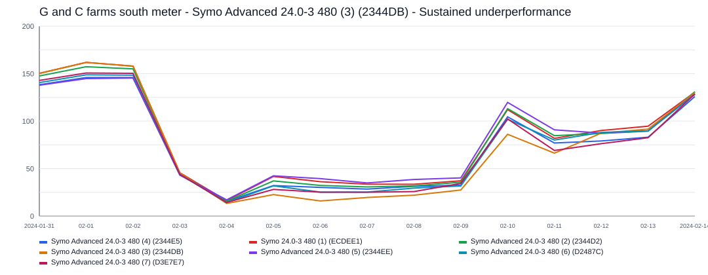

This incident lasted about `5` day(s) and affected `1` inverter(s).
Symo Advanced 24.0-3 480 (3) (2344DB) was the main affected inverter, with about `5` day(s) of severe underproduction and up to `34.7 kWh/day` expected output.
