# Penner Farms - W 1/2 4-9-13 (site 4) Incident Report

- Site: `f9342ead-59a2-4c58-b54c-0ae4ab16c9da`
- Total estimated lost production: `179,808.3 kWh`
- Estimated energy value lost: `$21,594.97 CAD`
- Estimated missed avoided emissions: `102.49 tCO2e`
- Estimated carbon-credit-equivalent value: `$10,159.66 CAD`

## Assumptions

- Energy value uses a flat Alberta retail proxy of `0.1201 CAD/kWh`.
- Avoided emissions use `0.57 tCO2e/MWh` as a distributed renewable grid displacement factor proxy.
- Carbon value schedule used for all incidents in this report:
  2024 = `$80/tCO2e`, 2025 = `$95/tCO2e`, 2026 = `$110/tCO2e`.

## Incidents

### 2022-10-24 - 47,178.0 kWh - 3 inverters - All inverters offline

- Time range: `2022-10-24` to `2023-10-21`
- Affected inverters: ALL_INVERTERS, Symo 24.0-3 480 (3) (62927E), Symo Advanced 24.0-3 480 (2) (EF27F3)
- Confidence: `high` (`100`)
- Estimated lost production: `47,178.0 kWh`
- Estimated energy value lost: `$5,666.08 CAD`
- Estimated missed avoided emissions: `26.89 tCO2e`
- Estimated carbon-credit-equivalent value: `$2,958.06 CAD`

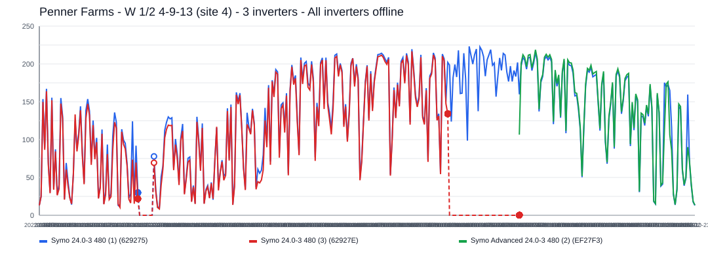

The site appears to have gone fully offline for about `363` day(s), affecting `3` inverter(s).
Affected inverter summary:
- ALL_INVERTERS: `8` total affected day(s), longest contiguous run `8` day(s), expected up to `90.9 kWh/day`.
- Symo 24.0-3 480 (3) (62927E): `136` total affected day(s), longest contiguous run `136` day(s), expected up to `214.7 kWh/day`.
- Symo Advanced 24.0-3 480 (2) (EF27F3): `258` total affected day(s), longest contiguous run `204` day(s), expected up to `220.6 kWh/day`.

### 2024-01-23 - 45,364.1 kWh - ALL_INVERTERS and Symo 24.0-3 480 (3) (62927E) - All inverters offline

- Time range: `2024-01-23` to `2024-11-21`
- Affected inverters: ALL_INVERTERS, Symo 24.0-3 480 (3) (62927E)
- Confidence: `high` (`100`)
- Estimated lost production: `45,364.1 kWh`
- Estimated energy value lost: `$5,448.22 CAD`
- Estimated missed avoided emissions: `25.86 tCO2e`
- Estimated carbon-credit-equivalent value: `$2,068.60 CAD`

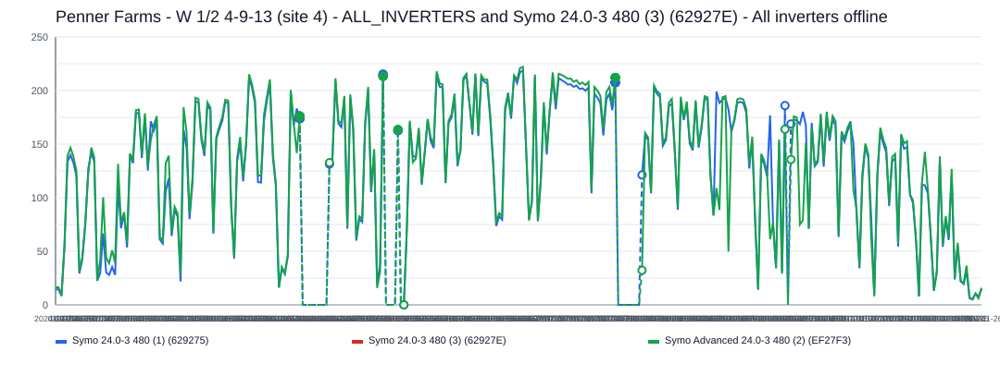

The site appears to have gone fully offline for about `304` day(s), affecting `2` inverter(s).
Affected inverter summary:
- ALL_INVERTERS: `23` total affected day(s), longest contiguous run `9` day(s), expected up to `390.4 kWh/day`.
- Symo 24.0-3 480 (3) (62927E): `280` total affected day(s), longest contiguous run `80` day(s), expected up to `217.9 kWh/day`.

### 2022-05-01 - 28,633.6 kWh - Symo Advanced 24.0-3 480 (2) (EF27F3) - Inverter outage / near-zero production

- Time range: `2022-05-01` to `2022-10-20`
- Affected inverters: Symo Advanced 24.0-3 480 (2) (EF27F3)
- Confidence: `high` (`100`)
- Estimated lost production: `28,633.6 kWh`
- Estimated energy value lost: `$3,438.90 CAD`
- Estimated missed avoided emissions: `16.32 tCO2e`
- Estimated carbon-credit-equivalent value: `$1,795.33 CAD`

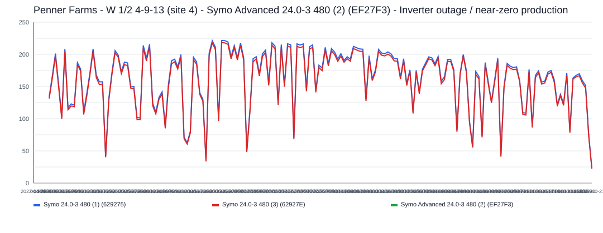

This incident lasted about `173` day(s) and affected `1` inverter(s).
Symo Advanced 24.0-3 480 (2) (EF27F3) was the main affected inverter, with about `173` day(s) of severe underproduction and up to `222.6 kWh/day` expected output.

### 2025-12-16 - 16,995.1 kWh - ALL_INVERTERS and Symo 24.0-3 480 (3) (62927E) - All inverters offline

- Time range: `2025-12-16` to `2026-05-14`
- Affected inverters: ALL_INVERTERS, Symo 24.0-3 480 (3) (62927E)
- Confidence: `high` (`100`)
- Estimated lost production: `16,995.1 kWh`
- Estimated energy value lost: `$2,041.11 CAD`
- Estimated missed avoided emissions: `9.69 tCO2e`
- Estimated carbon-credit-equivalent value: `$1,058.74 CAD`

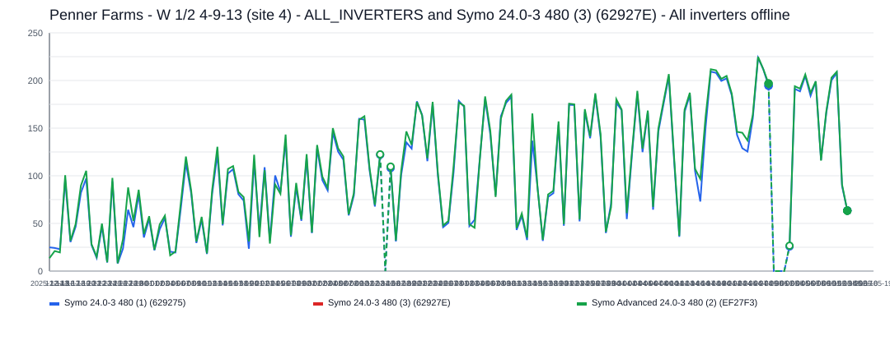

The site appears to have gone fully offline for about `150` day(s), affecting `2` inverter(s).
Affected inverter summary:
- ALL_INVERTERS: `4` total affected day(s), longest contiguous run `3` day(s), expected up to `382.6 kWh/day`.
- Symo 24.0-3 480 (3) (62927E): `146` total affected day(s), longest contiguous run `73` day(s), expected up to `221.8 kWh/day`.

### 2025-07-22 - 15,380.9 kWh - ALL_INVERTERS and Symo 24.0-3 480 (3) (62927E) - All inverters offline

- Time range: `2025-07-22` to `2025-10-10`
- Affected inverters: ALL_INVERTERS, Symo 24.0-3 480 (3) (62927E)
- Confidence: `high` (`100`)
- Estimated lost production: `15,380.9 kWh`
- Estimated energy value lost: `$1,847.24 CAD`
- Estimated missed avoided emissions: `8.77 tCO2e`
- Estimated carbon-credit-equivalent value: `$832.87 CAD`

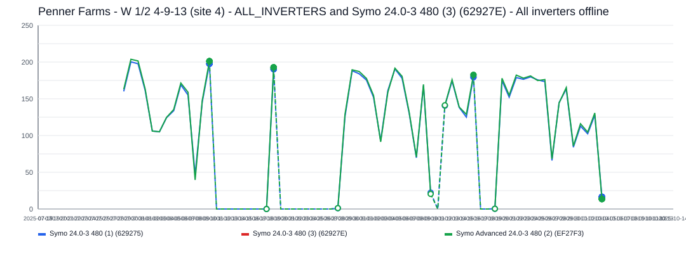

The site appears to have gone fully offline for about `81` day(s), affecting `2` inverter(s).
Affected inverter summary:
- ALL_INVERTERS: `31` total affected day(s), longest contiguous run `8` day(s), expected up to `399.3 kWh/day`.
- Symo 24.0-3 480 (3) (62927E): `45` total affected day(s), longest contiguous run `14` day(s), expected up to `199.8 kWh/day`.

### 2025-02-06 - 12,372.2 kWh - ALL_INVERTERS and Symo 24.0-3 480 (3) (62927E) - All inverters offline

- Time range: `2025-02-06` to `2025-05-06`
- Affected inverters: ALL_INVERTERS, Symo 24.0-3 480 (3) (62927E)
- Confidence: `high` (`100`)
- Estimated lost production: `12,372.2 kWh`
- Estimated energy value lost: `$1,485.90 CAD`
- Estimated missed avoided emissions: `7.05 tCO2e`
- Estimated carbon-credit-equivalent value: `$669.96 CAD`

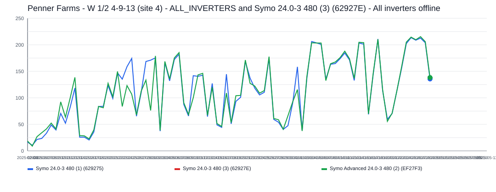

The site appears to have gone fully offline for about `90` day(s), affecting `2` inverter(s).
Affected inverter summary:
- ALL_INVERTERS: `7` total affected day(s), longest contiguous run `7` day(s), expected up to `418.3 kWh/day`.
- Symo 24.0-3 480 (3) (62927E): `83` total affected day(s), longest contiguous run `83` day(s), expected up to `211.6 kWh/day`.

### 2025-10-19 - 5,048.9 kWh - 3 inverters - All inverters offline

- Time range: `2025-10-19` to `2025-12-09`
- Affected inverters: ALL_INVERTERS, Symo  24.0-3 480 (1) (629275), Symo 24.0-3 480 (3) (62927E)
- Confidence: `high` (`100`)
- Estimated lost production: `5,048.9 kWh`
- Estimated energy value lost: `$606.38 CAD`
- Estimated missed avoided emissions: `2.88 tCO2e`
- Estimated carbon-credit-equivalent value: `$273.40 CAD`

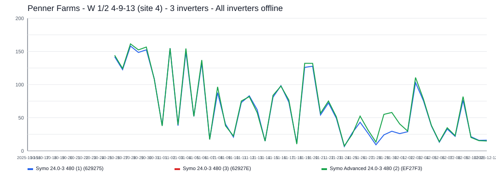

The site appears to have gone fully offline for about `52` day(s), affecting `3` inverter(s).
Affected inverter summary:
- ALL_INVERTERS: `7` total affected day(s), longest contiguous run `7` day(s), expected up to `300.9 kWh/day`.
- Symo  24.0-3 480 (1) (629275): `3` total affected day(s), longest contiguous run `3` day(s), expected up to `43.5 kWh/day`.
- Symo 24.0-3 480 (3) (62927E): `44` total affected day(s), longest contiguous run `33` day(s), expected up to `158.0 kWh/day`.

### 2023-12-10 - 2,392.9 kWh - Symo 24.0-3 480 (3) (62927E) - Inverter outage / near-zero production

- Time range: `2023-12-10` to `2024-01-16`
- Affected inverters: Symo 24.0-3 480 (3) (62927E)
- Confidence: `high` (`98`)
- Estimated lost production: `2,392.9 kWh`
- Estimated energy value lost: `$287.38 CAD`
- Estimated missed avoided emissions: `1.36 tCO2e`
- Estimated carbon-credit-equivalent value: `$138.87 CAD`

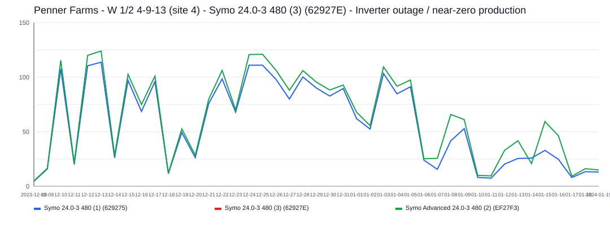

This incident lasted about `38` day(s) and affected `1` inverter(s).
Symo 24.0-3 480 (3) (62927E) was the main affected inverter, with about `38` day(s) of severe underproduction and up to `117.5 kWh/day` expected output.

### 2023-10-27 - 2,223.5 kWh - Symo 24.0-3 480 (3) (62927E) - Inverter outage / near-zero production

- Time range: `2023-10-27` to `2023-11-20`
- Affected inverters: Symo 24.0-3 480 (3) (62927E)
- Confidence: `high` (`100`)
- Estimated lost production: `2,223.5 kWh`
- Estimated energy value lost: `$267.04 CAD`
- Estimated missed avoided emissions: `1.27 tCO2e`
- Estimated carbon-credit-equivalent value: `$139.41 CAD`

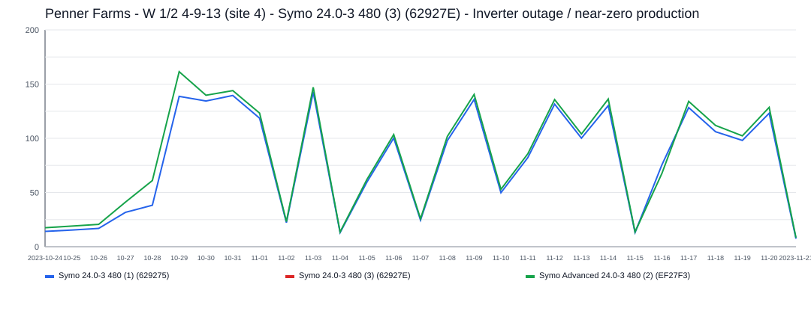

This incident lasted about `25` day(s) and affected `1` inverter(s).
Symo 24.0-3 480 (3) (62927E) was the main affected inverter, with about `25` day(s) of severe underproduction and up to `148.4 kWh/day` expected output.

### 2025-01-13 - 1,547.2 kWh - Symo 24.0-3 480 (3) (62927E) - Inverter outage / near-zero production

- Time range: `2025-01-13` to `2025-01-31`
- Affected inverters: Symo 24.0-3 480 (3) (62927E)
- Confidence: `high` (`100`)
- Estimated lost production: `1,547.2 kWh`
- Estimated energy value lost: `$185.82 CAD`
- Estimated missed avoided emissions: `0.88 tCO2e`
- Estimated carbon-credit-equivalent value: `$83.78 CAD`

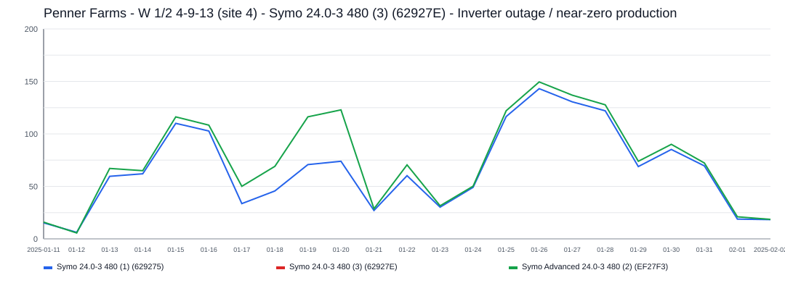

This incident lasted about `19` day(s) and affected `1` inverter(s).
Symo 24.0-3 480 (3) (62927E) was the main affected inverter, with about `19` day(s) of severe underproduction and up to `144.7 kWh/day` expected output.

### 2023-11-24 - 884.2 kWh - Symo 24.0-3 480 (3) (62927E) - Inverter outage / near-zero production

- Time range: `2023-11-24` to `2023-12-06`
- Affected inverters: Symo 24.0-3 480 (3) (62927E)
- Confidence: `high` (`99`)
- Estimated lost production: `884.2 kWh`
- Estimated energy value lost: `$106.19 CAD`
- Estimated missed avoided emissions: `0.50 tCO2e`
- Estimated carbon-credit-equivalent value: `$55.44 CAD`

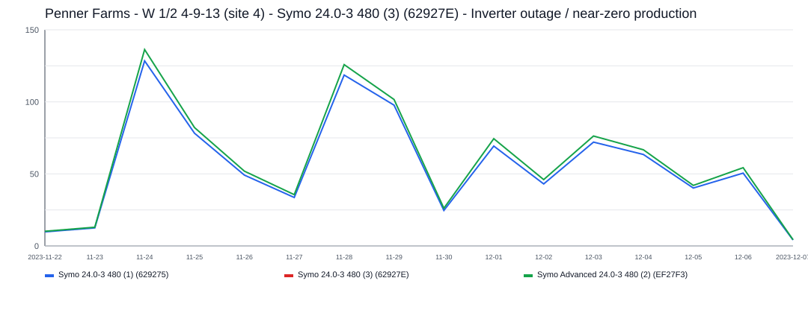

This incident lasted about `13` day(s) and affected `1` inverter(s).
Symo 24.0-3 480 (3) (62927E) was the main affected inverter, with about `13` day(s) of severe underproduction and up to `130.9 kWh/day` expected output.

### 2024-12-19 - 686.1 kWh - Symo 24.0-3 480 (3) (62927E) - Inverter outage / near-zero production

- Time range: `2024-12-19` to `2024-12-30`
- Affected inverters: Symo 24.0-3 480 (3) (62927E)
- Confidence: `high` (`97`)
- Estimated lost production: `686.1 kWh`
- Estimated energy value lost: `$82.40 CAD`
- Estimated missed avoided emissions: `0.39 tCO2e`
- Estimated carbon-credit-equivalent value: `$31.28 CAD`

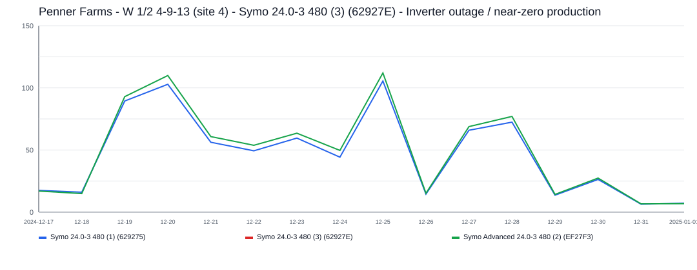

This incident lasted about `12` day(s) and affected `1` inverter(s).
Symo 24.0-3 480 (3) (62927E) was the main affected inverter, with about `12` day(s) of severe underproduction and up to `107.5 kWh/day` expected output.

### 2024-12-02 - 671.8 kWh - Symo 24.0-3 480 (3) (62927E) - Inverter outage / near-zero production

- Time range: `2024-12-02` to `2024-12-15`
- Affected inverters: Symo 24.0-3 480 (3) (62927E)
- Confidence: `high` (`97`)
- Estimated lost production: `671.8 kWh`
- Estimated energy value lost: `$80.69 CAD`
- Estimated missed avoided emissions: `0.38 tCO2e`
- Estimated carbon-credit-equivalent value: `$30.64 CAD`

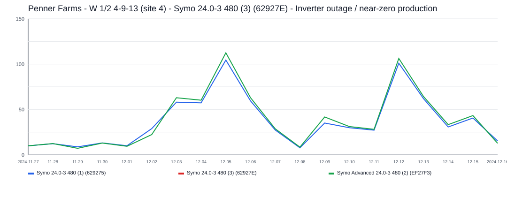

This incident lasted about `14` day(s) and affected `1` inverter(s).
Symo 24.0-3 480 (3) (62927E) was the main affected inverter, with about `14` day(s) of severe underproduction and up to `107.2 kWh/day` expected output.

### 2025-01-04 - 429.8 kWh - Symo 24.0-3 480 (3) (62927E) - Inverter outage / near-zero production

- Time range: `2025-01-04` to `2025-01-09`
- Affected inverters: Symo 24.0-3 480 (3) (62927E)
- Confidence: `high` (`98`)
- Estimated lost production: `429.8 kWh`
- Estimated energy value lost: `$51.62 CAD`
- Estimated missed avoided emissions: `0.25 tCO2e`
- Estimated carbon-credit-equivalent value: `$23.28 CAD`

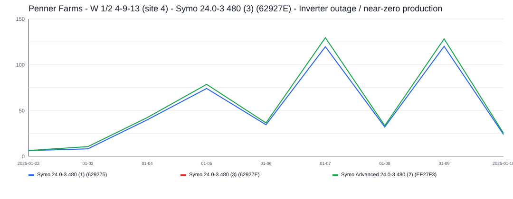

This incident lasted about `6` day(s) and affected `1` inverter(s).
Symo 24.0-3 480 (3) (62927E) was the main affected inverter, with about `6` day(s) of severe underproduction and up to `123.3 kWh/day` expected output.
