# G and C farms north meter Incident Report

- Site: `c79e1935-cfe2-4d86-b2ef-cbcf33b7e6d4`
- Total estimated lost production: `197,866.7 kWh`
- Estimated energy value lost: `$23,763.78 CAD`
- Estimated missed avoided emissions: `112.78 tCO2e`
- Estimated carbon-credit-equivalent value: `$11,621.84 CAD`

## Assumptions

- Energy value uses a flat Alberta retail proxy of `0.1201 CAD/kWh`.
- Avoided emissions use `0.57 tCO2e/MWh` as a distributed renewable grid displacement factor proxy.
- Carbon value schedule used for all incidents in this report:
  2024 = `$80/tCO2e`, 2025 = `$95/tCO2e`, 2026 = `$110/tCO2e`.

## Incidents

### 2023-01-25 - 41,586.0 kWh - 4 inverters - Inverter outage / near-zero production

- Time range: `2023-01-25` to `2023-06-27`
- Affected inverters: Symo  24.0-3 480 (1) (61C069), Symo 24.0-3 480 (5) (61C085), Symo 24.0-3 480 (6) (61C08F), Symo Advanced 24.0-3 480 (2) (B030EC)
- Confidence: `high` (`100`)
- Estimated lost production: `41,586.0 kWh`
- Estimated energy value lost: `$4,994.48 CAD`
- Estimated missed avoided emissions: `23.70 tCO2e`
- Estimated carbon-credit-equivalent value: `$2,607.44 CAD`

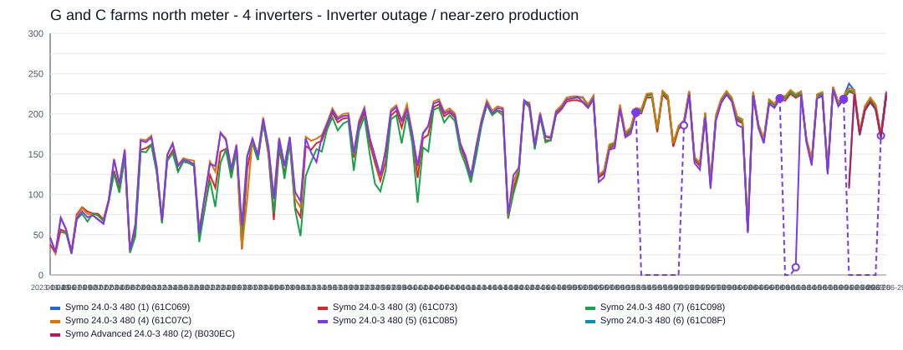

This incident lasted about `154` day(s) and affected `4` inverter(s).
Affected inverter summary:
- Symo  24.0-3 480 (1) (61C069): `94` total affected day(s), longest contiguous run `62` day(s), expected up to `146.6 kWh/day`.
- Symo 24.0-3 480 (5) (61C085): `17` total affected day(s), longest contiguous run `8` day(s), expected up to `227.2 kWh/day`.
- Symo 24.0-3 480 (6) (61C08F): `145` total affected day(s), longest contiguous run `113` day(s), expected up to `164.2 kWh/day`.
- Symo Advanced 24.0-3 480 (2) (B030EC): `145` total affected day(s), longest contiguous run `113` day(s), expected up to `165.2 kWh/day`.

### 2025-08-22 - 32,977.2 kWh - 3 inverters - All inverters offline

- Time range: `2025-08-22` to `2025-12-10`
- Affected inverters: ALL_INVERTERS, Symo 24.0-3 480 (6) (61C08F), Symo Advanced 24.0-3 480 (2) (B030EC)
- Confidence: `high` (`100`)
- Estimated lost production: `32,977.2 kWh`
- Estimated energy value lost: `$3,960.56 CAD`
- Estimated missed avoided emissions: `18.80 tCO2e`
- Estimated carbon-credit-equivalent value: `$1,785.72 CAD`

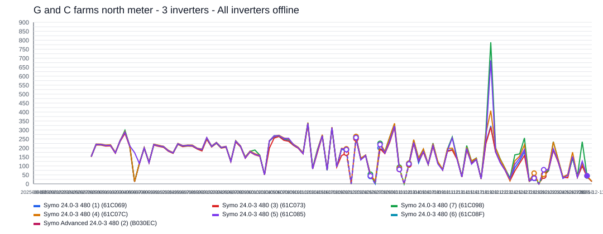

The site appears to have gone fully offline for about `111` day(s), affecting `3` inverter(s).
Affected inverter summary:
- ALL_INVERTERS: `9` total affected day(s), longest contiguous run `7` day(s), expected up to `1,096.2 kWh/day`.
- Symo 24.0-3 480 (6) (61C08F): `96` total affected day(s), longest contiguous run `54` day(s), expected up to `357.6 kWh/day`.
- Symo Advanced 24.0-3 480 (2) (B030EC): `96` total affected day(s), longest contiguous run `54` day(s), expected up to `359.8 kWh/day`.

### 2026-02-22 - 25,503.7 kWh - 7 inverters - All inverters offline

- Time range: `2026-02-22` to `2026-04-13`
- Affected inverters: ALL_INVERTERS, Symo  24.0-3 480 (1) (61C069), Symo  24.0-3 480 (3) (61C073), Symo  24.0-3 480 (7) (61C098), Symo 24.0-3 480 (4) (61C07C), Symo 24.0-3 480 (6) (61C08F), Symo Advanced 24.0-3 480 (2) (B030EC)
- Confidence: `high` (`100`)
- Estimated lost production: `25,503.7 kWh`
- Estimated energy value lost: `$3,063.00 CAD`
- Estimated missed avoided emissions: `14.54 tCO2e`
- Estimated carbon-credit-equivalent value: `$1,599.08 CAD`

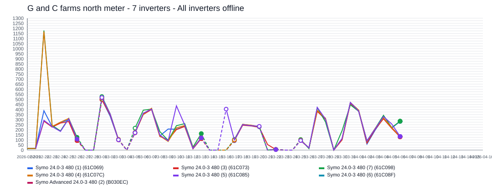

The site appears to have gone fully offline for about `51` day(s), affecting `7` inverter(s).
Affected inverter summary:
- ALL_INVERTERS: `14` total affected day(s), longest contiguous run `7` day(s), expected up to `1,348.6 kWh/day`.
- Symo  24.0-3 480 (1) (61C069): `1` total affected day(s), longest contiguous run `1` day(s), expected up to `67.5 kWh/day`.
- Symo  24.0-3 480 (3) (61C073): `1` total affected day(s), longest contiguous run `1` day(s), expected up to `66.6 kWh/day`.
- Symo  24.0-3 480 (7) (61C098): `1` total affected day(s), longest contiguous run `1` day(s), expected up to `67.7 kWh/day`.
- Symo 24.0-3 480 (4) (61C07C): `1` total affected day(s), longest contiguous run `1` day(s), expected up to `68.5 kWh/day`.
- Symo 24.0-3 480 (6) (61C08F): `32` total affected day(s), longest contiguous run `8` day(s), expected up to `469.7 kWh/day`.
- Symo Advanced 24.0-3 480 (2) (B030EC): `32` total affected day(s), longest contiguous run `8` day(s), expected up to `472.7 kWh/day`.

### 2025-12-14 - 16,730.1 kWh - 4 inverters - All inverters offline

- Time range: `2025-12-14` to `2026-02-18`
- Affected inverters: ALL_INVERTERS, Symo  24.0-3 480 (7) (61C098), Symo 24.0-3 480 (6) (61C08F), Symo Advanced 24.0-3 480 (2) (B030EC)
- Confidence: `high` (`100`)
- Estimated lost production: `16,730.1 kWh`
- Estimated energy value lost: `$2,009.28 CAD`
- Estimated missed avoided emissions: `9.54 tCO2e`
- Estimated carbon-credit-equivalent value: `$1,025.39 CAD`

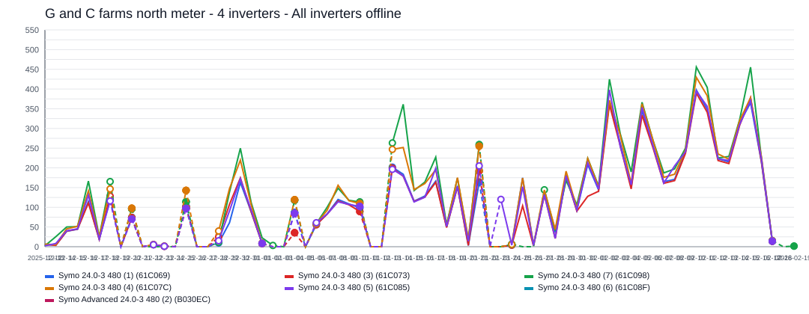

The site appears to have gone fully offline for about `67` day(s), affecting `4` inverter(s).
Affected inverter summary:
- ALL_INVERTERS: `13` total affected day(s), longest contiguous run `4` day(s), expected up to `1,144.7 kWh/day`.
- Symo  24.0-3 480 (7) (61C098): `1` total affected day(s), longest contiguous run `1` day(s), expected up to `101.4 kWh/day`.
- Symo 24.0-3 480 (6) (61C08F): `44` total affected day(s), longest contiguous run `19` day(s), expected up to `293.1 kWh/day`.
- Symo Advanced 24.0-3 480 (2) (B030EC): `44` total affected day(s), longest contiguous run `19` day(s), expected up to `294.9 kWh/day`.

### 2022-07-12 - 14,853.0 kWh - 3 inverters - All inverters offline

- Time range: `2022-07-12` to `2022-09-02`
- Affected inverters: ALL_INVERTERS, Symo  24.0-3 480 (7) (61C098), Symo Advanced 24.0-3 480 (2) (B030EC)
- Confidence: `high` (`100`)
- Estimated lost production: `14,853.0 kWh`
- Estimated energy value lost: `$1,783.85 CAD`
- Estimated missed avoided emissions: `8.47 tCO2e`
- Estimated carbon-credit-equivalent value: `$931.28 CAD`

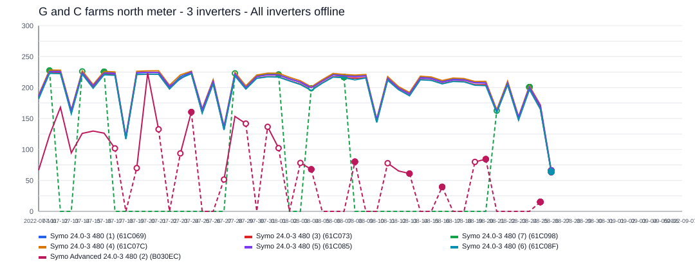

The site appears to have gone fully offline for about `53` day(s), affecting `3` inverter(s).
Affected inverter summary:
- ALL_INVERTERS: `7` total affected day(s), longest contiguous run `7` day(s), expected up to `970.4 kWh/day`.
- Symo  24.0-3 480 (7) (61C098): `30` total affected day(s), longest contiguous run `13` day(s), expected up to `225.0 kWh/day`.
- Symo Advanced 24.0-3 480 (2) (B030EC): `38` total affected day(s), longest contiguous run `11` day(s), expected up to `211.6 kWh/day`.

### 2026-04-20 - 9,679.2 kWh - ALL_INVERTERS and Symo 24.0-3 480 (6) (61C08F) - All inverters offline

- Time range: `2026-04-20` to `2026-05-06`
- Affected inverters: ALL_INVERTERS, Symo 24.0-3 480 (6) (61C08F)
- Confidence: `high` (`100`)
- Estimated lost production: `9,679.2 kWh`
- Estimated energy value lost: `$1,162.48 CAD`
- Estimated missed avoided emissions: `5.52 tCO2e`
- Estimated carbon-credit-equivalent value: `$606.89 CAD`

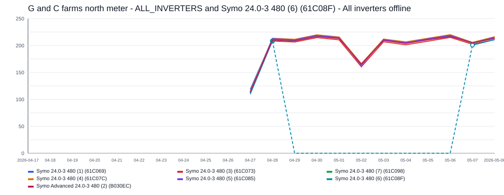

The site appears to have gone fully offline for about `17` day(s), affecting `2` inverter(s).
Affected inverter summary:
- ALL_INVERTERS: `7` total affected day(s), longest contiguous run `7` day(s), expected up to `1,282.0 kWh/day`.
- Symo 24.0-3 480 (6) (61C08F): `8` total affected day(s), longest contiguous run `8` day(s), expected up to `185.4 kWh/day`.

### 2023-07-20 - 7,304.0 kWh - Symo 24.0-3 480 (5) (61C085) and Symo 24.0-3 480 (6) (61C08F) - Inverter outage / near-zero production

- Time range: `2023-07-20` to `2023-08-26`
- Affected inverters: Symo 24.0-3 480 (5) (61C085), Symo 24.0-3 480 (6) (61C08F)
- Confidence: `high` (`100`)
- Estimated lost production: `7,304.0 kWh`
- Estimated energy value lost: `$877.21 CAD`
- Estimated missed avoided emissions: `4.16 tCO2e`
- Estimated carbon-credit-equivalent value: `$457.96 CAD`

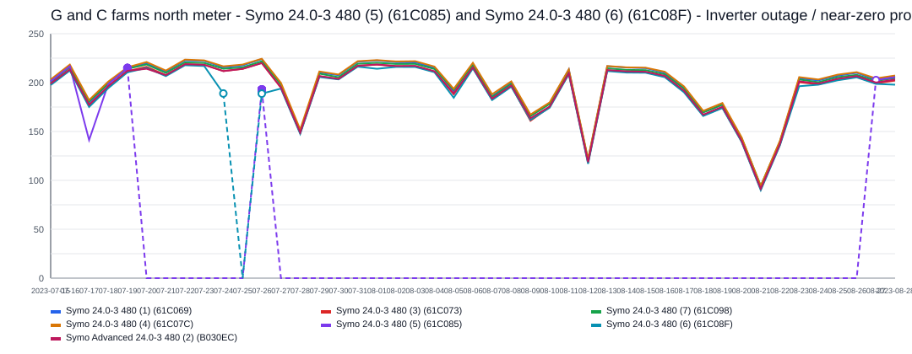

This incident lasted about `38` day(s) and affected `2` inverter(s).
Affected inverter summary:
- Symo 24.0-3 480 (5) (61C085): `37` total affected day(s), longest contiguous run `31` day(s), expected up to `220.8 kWh/day`.
- Symo 24.0-3 480 (6) (61C08F): `1` total affected day(s), longest contiguous run `1` day(s), expected up to `153.1 kWh/day`.

### 2024-07-24 - 6,577.9 kWh - Symo 24.0-3 480 (5) (61C085) - Inverter outage / near-zero production

- Time range: `2024-07-24` to `2024-08-26`
- Affected inverters: Symo 24.0-3 480 (5) (61C085)
- Confidence: `high` (`100`)
- Estimated lost production: `6,577.9 kWh`
- Estimated energy value lost: `$790.00 CAD`
- Estimated missed avoided emissions: `3.75 tCO2e`
- Estimated carbon-credit-equivalent value: `$299.95 CAD`

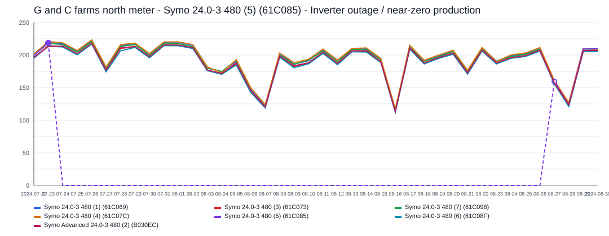

This incident lasted about `34` day(s) and affected `1` inverter(s).
Symo 24.0-3 480 (5) (61C085) was the main affected inverter, with about `34` day(s) of severe underproduction and up to `220.2 kWh/day` expected output.

### 2024-05-05 - 5,937.6 kWh - Symo 24.0-3 480 (5) (61C085) - Inverter outage / near-zero production

- Time range: `2024-05-05` to `2024-06-07`
- Affected inverters: Symo 24.0-3 480 (5) (61C085)
- Confidence: `high` (`100`)
- Estimated lost production: `5,937.6 kWh`
- Estimated energy value lost: `$713.10 CAD`
- Estimated missed avoided emissions: `3.38 tCO2e`
- Estimated carbon-credit-equivalent value: `$270.75 CAD`

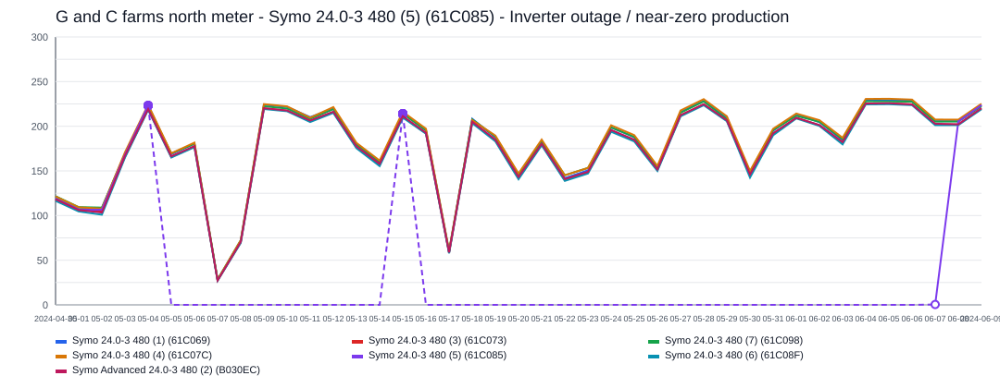

This incident lasted about `34` day(s) and affected `1` inverter(s).
Symo 24.0-3 480 (5) (61C085) was the main affected inverter, with about `34` day(s) of severe underproduction and up to `227.7 kWh/day` expected output.

### 2022-05-01 - 5,307.5 kWh - Symo  24.0-3 480 (7) (61C098) and Symo Advanced 24.0-3 480 (2) (B030EC) - Multiple inverters offline

- Time range: `2022-05-01` to `2022-06-15`
- Affected inverters: Symo  24.0-3 480 (7) (61C098), Symo Advanced 24.0-3 480 (2) (B030EC)
- Confidence: `high` (`100`)
- Estimated lost production: `5,307.5 kWh`
- Estimated energy value lost: `$637.43 CAD`
- Estimated missed avoided emissions: `3.03 tCO2e`
- Estimated carbon-credit-equivalent value: `$332.78 CAD`

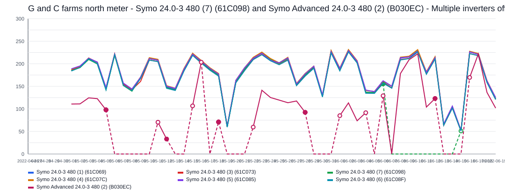

Multiple inverters appear to have dropped out during the same incident window lasting about `46` day(s).
Affected inverter summary:
- Symo  24.0-3 480 (7) (61C098): `8` total affected day(s), longest contiguous run `8` day(s), expected up to `228.2 kWh/day`.
- Symo Advanced 24.0-3 480 (2) (B030EC): `41` total affected day(s), longest contiguous run `16` day(s), expected up to `212.3 kWh/day`.

### 2025-01-17 - 4,878.9 kWh - 5 inverters - All inverters offline

- Time range: `2025-01-17` to `2025-02-07`
- Affected inverters: ALL_INVERTERS, Symo  24.0-3 480 (1) (61C069), Symo 24.0-3 480 (5) (61C085), Symo 24.0-3 480 (6) (61C08F), Symo Advanced 24.0-3 480 (2) (B030EC)
- Confidence: `high` (`100`)
- Estimated lost production: `4,878.9 kWh`
- Estimated energy value lost: `$585.96 CAD`
- Estimated missed avoided emissions: `2.78 tCO2e`
- Estimated carbon-credit-equivalent value: `$264.19 CAD`

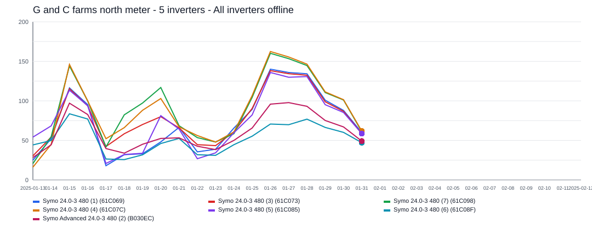

The site appears to have gone fully offline for about `22` day(s), affecting `5` inverter(s).
Affected inverter summary:
- ALL_INVERTERS: `7` total affected day(s), longest contiguous run `7` day(s), expected up to `758.5 kWh/day`.
- Symo  24.0-3 480 (1) (61C069): `4` total affected day(s), longest contiguous run `4` day(s), expected up to `88.2 kWh/day`.
- Symo 24.0-3 480 (5) (61C085): `3` total affected day(s), longest contiguous run `3` day(s), expected up to `66.6 kWh/day`.
- Symo 24.0-3 480 (6) (61C08F): `13` total affected day(s), longest contiguous run `9` day(s), expected up to `128.0 kWh/day`.
- Symo Advanced 24.0-3 480 (2) (B030EC): `7` total affected day(s), longest contiguous run `4` day(s), expected up to `128.9 kWh/day`.

### 2024-06-13 - 3,187.1 kWh - Symo 24.0-3 480 (5) (61C085) and Symo 24.0-3 480 (6) (61C08F) - Inverter outage / near-zero production

- Time range: `2024-06-13` to `2024-06-26`
- Affected inverters: Symo 24.0-3 480 (5) (61C085), Symo 24.0-3 480 (6) (61C08F)
- Confidence: `high` (`100`)
- Estimated lost production: `3,187.1 kWh`
- Estimated energy value lost: `$382.77 CAD`
- Estimated missed avoided emissions: `1.82 tCO2e`
- Estimated carbon-credit-equivalent value: `$145.33 CAD`

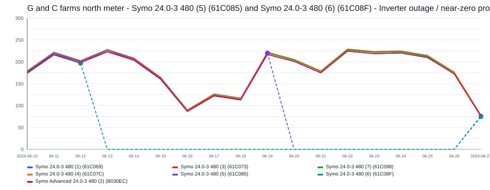

This incident lasted about `14` day(s) and affected `2` inverter(s).
Affected inverter summary:
- Symo 24.0-3 480 (5) (61C085): `7` total affected day(s), longest contiguous run `7` day(s), expected up to `189.3 kWh/day`.
- Symo 24.0-3 480 (6) (61C08F): `14` total affected day(s), longest contiguous run `14` day(s), expected up to `191.5 kWh/day`.

### 2024-07-07 - 3,088.8 kWh - Symo 24.0-3 480 (5) (61C085) and Symo 24.0-3 480 (6) (61C08F) - Inverter outage / near-zero production

- Time range: `2024-07-07` to `2024-07-20`
- Affected inverters: Symo 24.0-3 480 (5) (61C085), Symo 24.0-3 480 (6) (61C08F)
- Confidence: `high` (`100`)
- Estimated lost production: `3,088.8 kWh`
- Estimated energy value lost: `$370.97 CAD`
- Estimated missed avoided emissions: `1.76 tCO2e`
- Estimated carbon-credit-equivalent value: `$140.85 CAD`

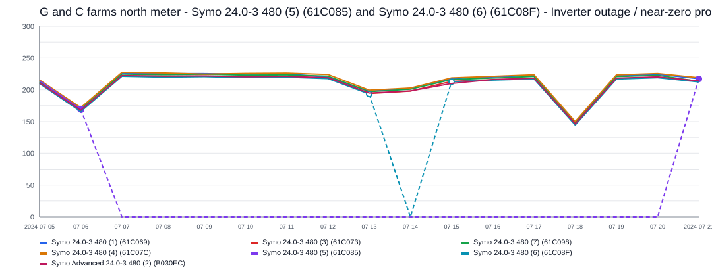

This incident lasted about `14` day(s) and affected `2` inverter(s).
Affected inverter summary:
- Symo 24.0-3 480 (5) (61C085): `14` total affected day(s), longest contiguous run `14` day(s), expected up to `224.6 kWh/day`.
- Symo 24.0-3 480 (6) (61C08F): `1` total affected day(s), longest contiguous run `1` day(s), expected up to `142.1 kWh/day`.

### 2022-12-30 - 2,709.0 kWh - 4 inverters - Inverter outage / near-zero production

- Time range: `2022-12-30` to `2023-01-14`
- Affected inverters: Symo  24.0-3 480 (1) (61C069), Symo  24.0-3 480 (7) (61C098), Symo 24.0-3 480 (6) (61C08F), Symo Advanced 24.0-3 480 (2) (B030EC)
- Confidence: `high` (`94`)
- Estimated lost production: `2,709.0 kWh`
- Estimated energy value lost: `$325.35 CAD`
- Estimated missed avoided emissions: `1.54 tCO2e`
- Estimated carbon-credit-equivalent value: `$169.85 CAD`

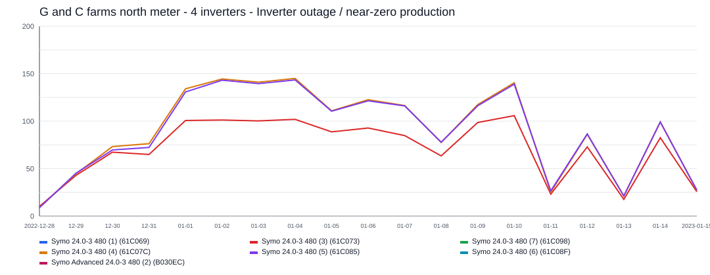

This incident lasted about `16` day(s) and affected `4` inverter(s).
Affected inverter summary:
- Symo  24.0-3 480 (1) (61C069): `14` total affected day(s), longest contiguous run `12` day(s), expected up to `65.2 kWh/day`.
- Symo  24.0-3 480 (7) (61C098): `14` total affected day(s), longest contiguous run `12` day(s), expected up to `65.4 kWh/day`.
- Symo 24.0-3 480 (6) (61C08F): `14` total affected day(s), longest contiguous run `12` day(s), expected up to `55.3 kWh/day`.
- Symo Advanced 24.0-3 480 (2) (B030EC): `14` total affected day(s), longest contiguous run `12` day(s), expected up to `55.7 kWh/day`.

### 2024-09-05 - 2,107.1 kWh - Symo 24.0-3 480 (5) (61C085) - Inverter outage / near-zero production

- Time range: `2024-09-05` to `2024-09-19`
- Affected inverters: Symo 24.0-3 480 (5) (61C085)
- Confidence: `high` (`100`)
- Estimated lost production: `2,107.1 kWh`
- Estimated energy value lost: `$253.06 CAD`
- Estimated missed avoided emissions: `1.20 tCO2e`
- Estimated carbon-credit-equivalent value: `$96.08 CAD`

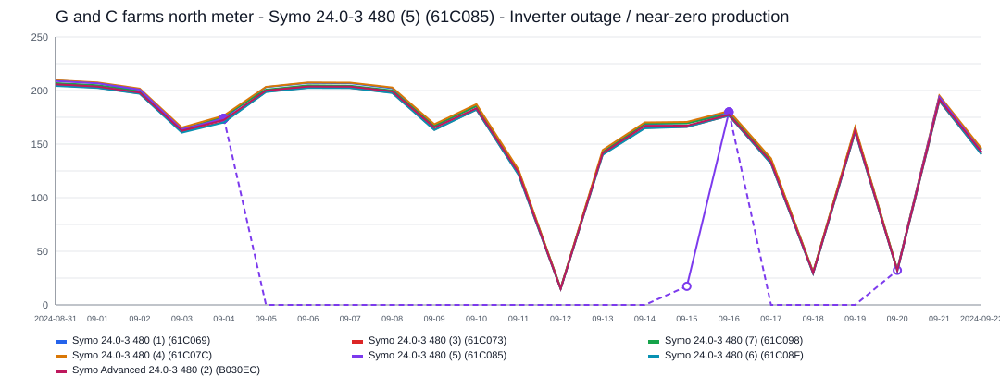

This incident lasted about `15` day(s) and affected `1` inverter(s).
Symo 24.0-3 480 (5) (61C085) was the main affected inverter, with about `15` day(s) of severe underproduction and up to `205.1 kWh/day` expected output.

### 2022-06-24 - 2,066.0 kWh - Symo  24.0-3 480 (7) (61C098) and Symo Advanced 24.0-3 480 (2) (B030EC) - Multiple inverters offline

- Time range: `2022-06-24` to `2022-07-08`
- Affected inverters: Symo  24.0-3 480 (7) (61C098), Symo Advanced 24.0-3 480 (2) (B030EC)
- Confidence: `high` (`100`)
- Estimated lost production: `2,066.0 kWh`
- Estimated energy value lost: `$248.12 CAD`
- Estimated missed avoided emissions: `1.18 tCO2e`
- Estimated carbon-credit-equivalent value: `$129.54 CAD`

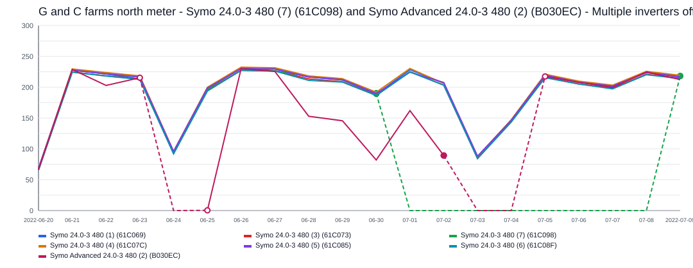

Multiple inverters appear to have dropped out during the same incident window lasting about `15` day(s).
Affected inverter summary:
- Symo  24.0-3 480 (7) (61C098): `8` total affected day(s), longest contiguous run `8` day(s), expected up to `224.5 kWh/day`.
- Symo Advanced 24.0-3 480 (2) (B030EC): `7` total affected day(s), longest contiguous run `3` day(s), expected up to `206.3 kWh/day`.

### 2023-09-27 - 1,579.0 kWh - Symo 24.0-3 480 (5) (61C085) - Inverter outage / near-zero production

- Time range: `2023-09-27` to `2023-10-08`
- Affected inverters: Symo 24.0-3 480 (5) (61C085)
- Confidence: `high` (`100`)
- Estimated lost production: `1,579.0 kWh`
- Estimated energy value lost: `$189.64 CAD`
- Estimated missed avoided emissions: `0.90 tCO2e`
- Estimated carbon-credit-equivalent value: `$99.00 CAD`

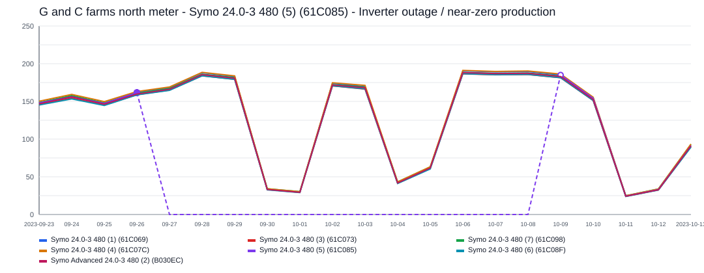

This incident lasted about `12` day(s) and affected `1` inverter(s).
Symo 24.0-3 480 (5) (61C085) was the main affected inverter, with about `12` day(s) of severe underproduction and up to `188.9 kWh/day` expected output.

### 2024-03-17 - 1,570.1 kWh - Symo 24.0-3 480 (6) (61C08F) - Inverter outage / near-zero production

- Time range: `2024-03-17` to `2024-03-27`
- Affected inverters: Symo 24.0-3 480 (6) (61C08F)
- Confidence: `high` (`100`)
- Estimated lost production: `1,570.1 kWh`
- Estimated energy value lost: `$188.57 CAD`
- Estimated missed avoided emissions: `0.89 tCO2e`
- Estimated carbon-credit-equivalent value: `$71.60 CAD`

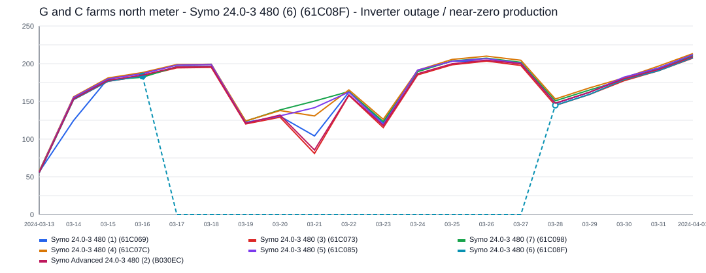

This incident lasted about `11` day(s) and affected `1` inverter(s).
Symo 24.0-3 480 (6) (61C08F) was the main affected inverter, with about `11` day(s) of severe underproduction and up to `175.2 kWh/day` expected output.

### 2023-12-12 - 1,343.9 kWh - 3 inverters - Sustained underperformance

- Time range: `2023-12-12` to `2024-01-03`
- Affected inverters: Symo  24.0-3 480 (1) (61C069), Symo  24.0-3 480 (3) (61C073), Symo 24.0-3 480 (5) (61C085)
- Confidence: `medium` (`66`)
- Estimated lost production: `1,343.9 kWh`
- Estimated energy value lost: `$161.41 CAD`
- Estimated missed avoided emissions: `0.77 tCO2e`
- Estimated carbon-credit-equivalent value: `$83.41 CAD`

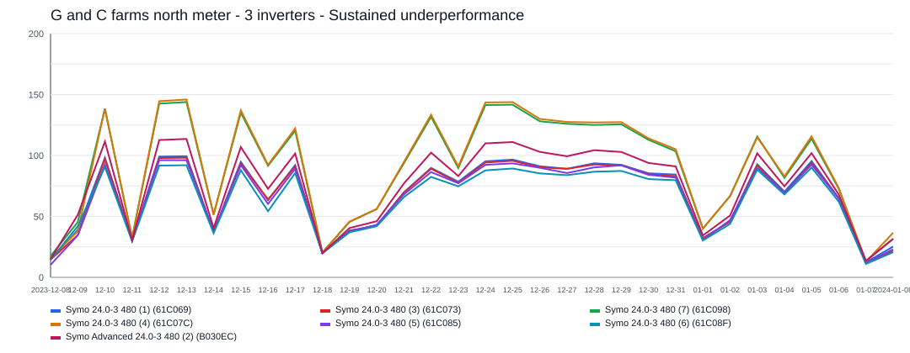

This incident lasted about `23` day(s) and affected `3` inverter(s).
Affected inverter summary:
- Symo  24.0-3 480 (1) (61C069): `16` total affected day(s), longest contiguous run `7` day(s), expected up to `131.9 kWh/day`.
- Symo  24.0-3 480 (3) (61C073): `16` total affected day(s), longest contiguous run `7` day(s), expected up to `130.1 kWh/day`.
- Symo 24.0-3 480 (5) (61C085): `22` total affected day(s), longest contiguous run `11` day(s), expected up to `131.8 kWh/day`.

### 2023-08-31 - 1,263.3 kWh - Symo 24.0-3 480 (5) (61C085) - Inverter outage / near-zero production

- Time range: `2023-08-31` to `2023-09-07`
- Affected inverters: Symo 24.0-3 480 (5) (61C085)
- Confidence: `high` (`100`)
- Estimated lost production: `1,263.3 kWh`
- Estimated energy value lost: `$151.72 CAD`
- Estimated missed avoided emissions: `0.72 tCO2e`
- Estimated carbon-credit-equivalent value: `$79.21 CAD`

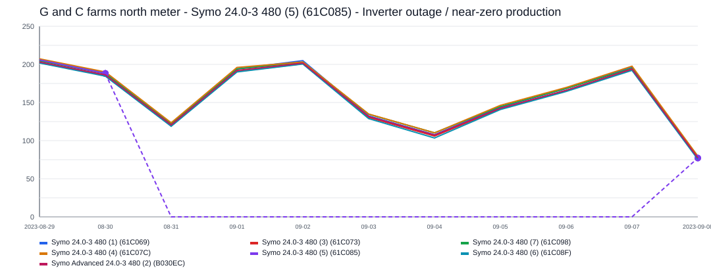

This incident lasted about `8` day(s) and affected `1` inverter(s).
Symo 24.0-3 480 (5) (61C085) was the main affected inverter, with about `8` day(s) of severe underproduction and up to `202.7 kWh/day` expected output.

### 2023-09-11 - 1,129.4 kWh - Symo 24.0-3 480 (5) (61C085) - Inverter outage / near-zero production

- Time range: `2023-09-11` to `2023-09-18`
- Affected inverters: Symo 24.0-3 480 (5) (61C085)
- Confidence: `high` (`100`)
- Estimated lost production: `1,129.4 kWh`
- Estimated energy value lost: `$135.64 CAD`
- Estimated missed avoided emissions: `0.64 tCO2e`
- Estimated carbon-credit-equivalent value: `$70.81 CAD`

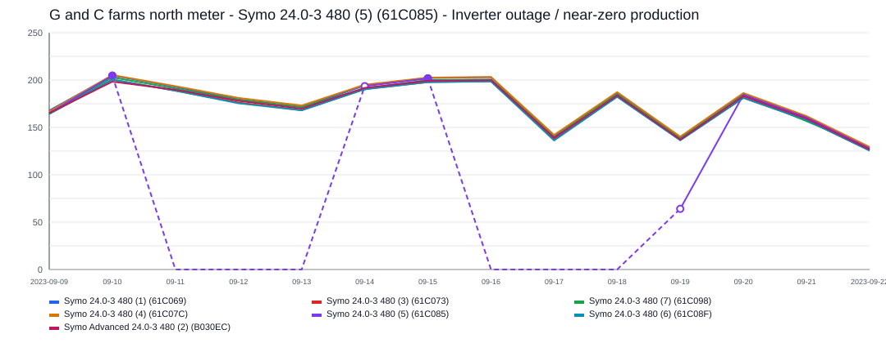

This incident lasted about `8` day(s) and affected `1` inverter(s).
Symo 24.0-3 480 (5) (61C085) was the main affected inverter, with about `8` day(s) of severe underproduction and up to `201.0 kWh/day` expected output.

### 2023-01-18 - 893.2 kWh - 4 inverters - Inverter outage / near-zero production

- Time range: `2023-01-18` to `2023-01-21`
- Affected inverters: Symo  24.0-3 480 (1) (61C069), Symo  24.0-3 480 (7) (61C098), Symo 24.0-3 480 (6) (61C08F), Symo Advanced 24.0-3 480 (2) (B030EC)
- Confidence: `high` (`95`)
- Estimated lost production: `893.2 kWh`
- Estimated energy value lost: `$107.28 CAD`
- Estimated missed avoided emissions: `0.51 tCO2e`
- Estimated carbon-credit-equivalent value: `$56.01 CAD`

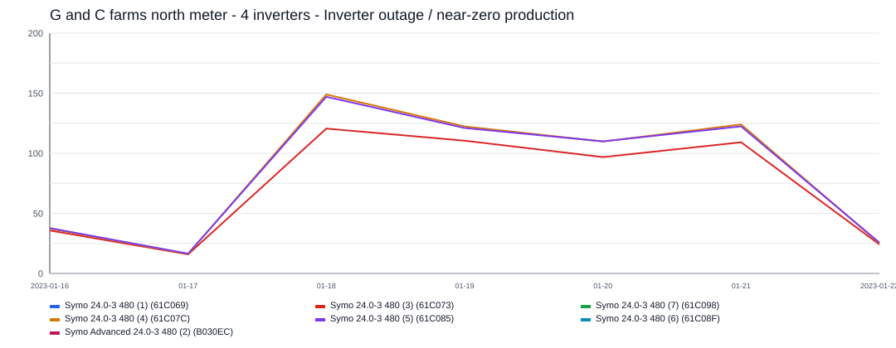

This incident lasted about `4` day(s) and affected `4` inverter(s).
Affected inverter summary:
- Symo  24.0-3 480 (1) (61C069): `4` total affected day(s), longest contiguous run `4` day(s), expected up to `69.6 kWh/day`.
- Symo  24.0-3 480 (7) (61C098): `4` total affected day(s), longest contiguous run `4` day(s), expected up to `69.8 kWh/day`.
- Symo 24.0-3 480 (6) (61C08F): `4` total affected day(s), longest contiguous run `4` day(s), expected up to `59.1 kWh/day`.
- Symo Advanced 24.0-3 480 (2) (B030EC): `4` total affected day(s), longest contiguous run `4` day(s), expected up to `59.4 kWh/day`.

### 2023-07-03 - 832.4 kWh - Symo 24.0-3 480 (5) (61C085) - Inverter outage / near-zero production

- Time range: `2023-07-03` to `2023-07-08`
- Affected inverters: Symo 24.0-3 480 (5) (61C085)
- Confidence: `high` (`97`)
- Estimated lost production: `832.4 kWh`
- Estimated energy value lost: `$99.97 CAD`
- Estimated missed avoided emissions: `0.47 tCO2e`
- Estimated carbon-credit-equivalent value: `$52.19 CAD`

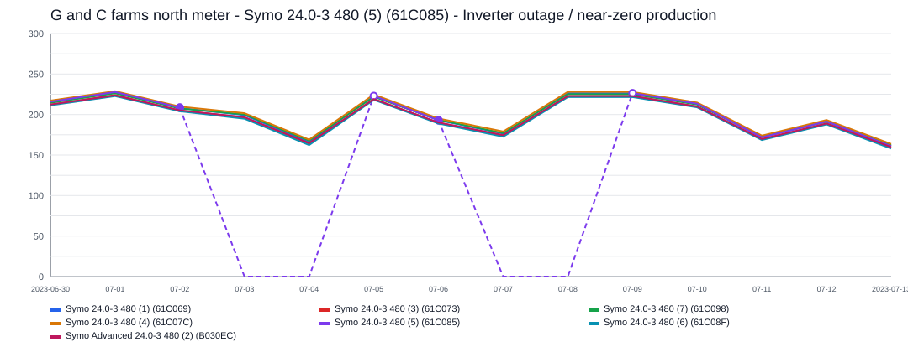

This incident lasted about `6` day(s) and affected `1` inverter(s).
Symo 24.0-3 480 (5) (61C085) was the main affected inverter, with about `6` day(s) of severe underproduction and up to `224.9 kWh/day` expected output.

### 2024-09-27 - 797.0 kWh - Symo 24.0-3 480 (5) (61C085) - Inverter outage / near-zero production

- Time range: `2024-09-27` to `2024-10-01`
- Affected inverters: Symo 24.0-3 480 (5) (61C085)
- Confidence: `high` (`100`)
- Estimated lost production: `797.0 kWh`
- Estimated energy value lost: `$95.72 CAD`
- Estimated missed avoided emissions: `0.45 tCO2e`
- Estimated carbon-credit-equivalent value: `$36.34 CAD`

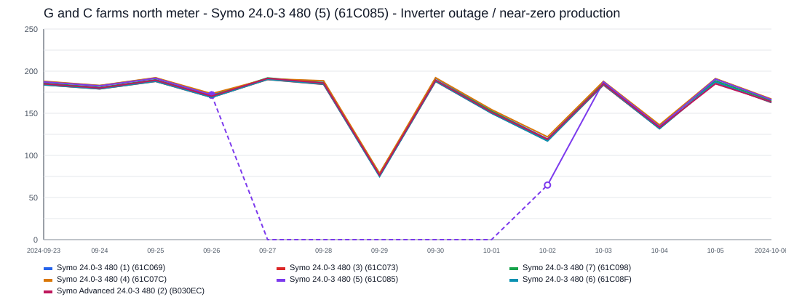

This incident lasted about `5` day(s) and affected `1` inverter(s).
Symo 24.0-3 480 (5) (61C085) was the main affected inverter, with about `5` day(s) of severe underproduction and up to `191.2 kWh/day` expected output.

### 2024-10-12 - 642.6 kWh - Symo 24.0-3 480 (5) (61C085) - Inverter outage / near-zero production

- Time range: `2024-10-12` to `2024-10-15`
- Affected inverters: Symo 24.0-3 480 (5) (61C085)
- Confidence: `high` (`100`)
- Estimated lost production: `642.6 kWh`
- Estimated energy value lost: `$77.18 CAD`
- Estimated missed avoided emissions: `0.37 tCO2e`
- Estimated carbon-credit-equivalent value: `$29.30 CAD`

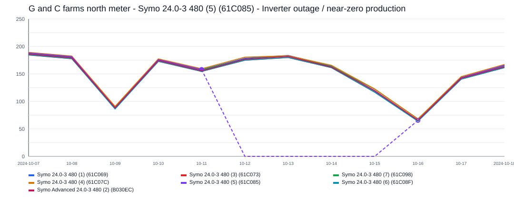

This incident lasted about `4` day(s) and affected `1` inverter(s).
Symo 24.0-3 480 (5) (61C085) was the main affected inverter, with about `4` day(s) of severe underproduction and up to `182.2 kWh/day` expected output.

### 2024-06-30 - 627.0 kWh - Symo 24.0-3 480 (5) (61C085) - Inverter outage / near-zero production

- Time range: `2024-06-30` to `2024-07-03`
- Affected inverters: Symo 24.0-3 480 (5) (61C085)
- Confidence: `high` (`100`)
- Estimated lost production: `627.0 kWh`
- Estimated energy value lost: `$75.30 CAD`
- Estimated missed avoided emissions: `0.36 tCO2e`
- Estimated carbon-credit-equivalent value: `$28.59 CAD`

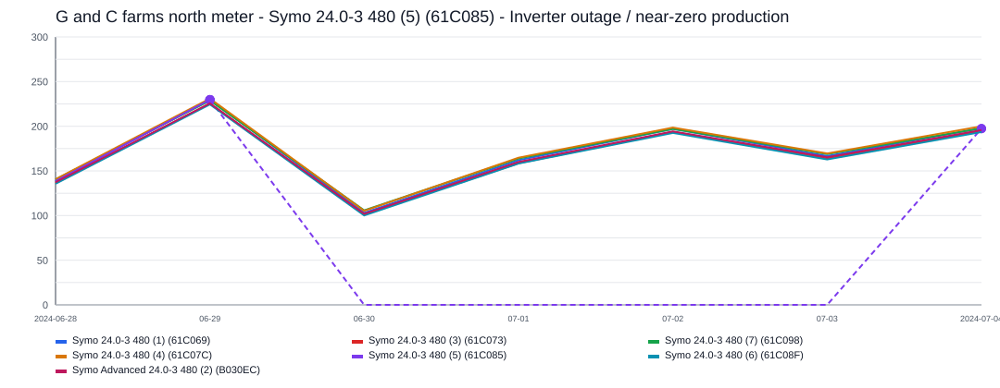

This incident lasted about `4` day(s) and affected `1` inverter(s).
Symo 24.0-3 480 (5) (61C085) was the main affected inverter, with about `4` day(s) of severe underproduction and up to `195.9 kWh/day` expected output.

### 2022-12-02 - 444.5 kWh - ALL_INVERTERS - All inverters offline

- Time range: `2022-12-02` to `2022-12-03`
- Affected inverters: ALL_INVERTERS
- Confidence: `high` (`97`)
- Estimated lost production: `444.5 kWh`
- Estimated energy value lost: `$53.39 CAD`
- Estimated missed avoided emissions: `0.25 tCO2e`
- Estimated carbon-credit-equivalent value: `$27.87 CAD`

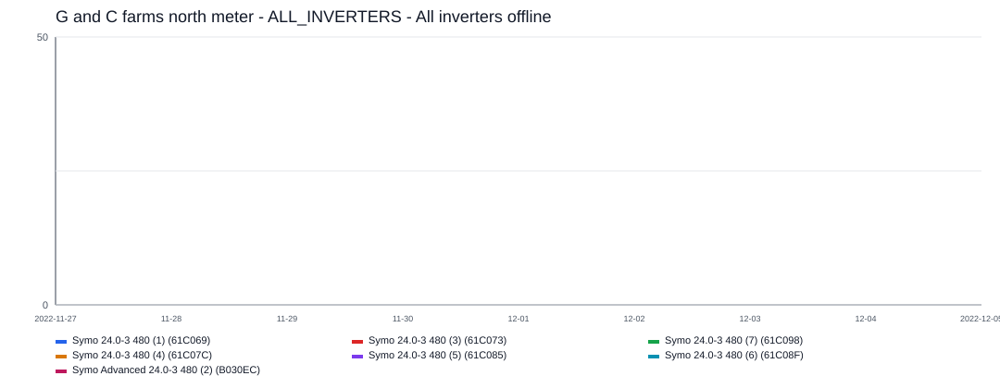

The site appears to have gone fully offline for about `2` day(s), affecting `1` inverter(s).
ALL_INVERTERS was the main affected inverter, with about `2` day(s) of severe underproduction and up to `260.2 kWh/day` expected output.

### 2026-05-12 - 342.2 kWh - Symo 24.0-3 480 (6) (61C08F) - Inverter outage / near-zero production

- Time range: `2026-05-12` to `2026-05-14`
- Affected inverters: Symo 24.0-3 480 (6) (61C08F)
- Confidence: `high` (`100`)
- Estimated lost production: `342.2 kWh`
- Estimated energy value lost: `$41.10 CAD`
- Estimated missed avoided emissions: `0.20 tCO2e`
- Estimated carbon-credit-equivalent value: `$21.46 CAD`

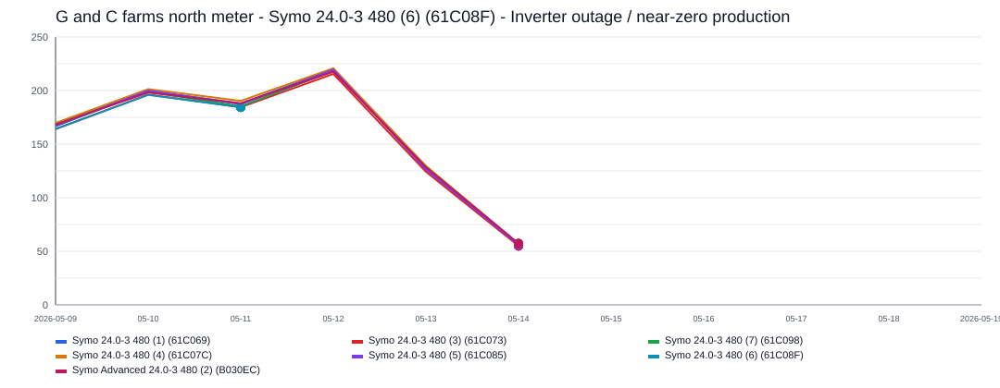

This incident lasted about `3` day(s) and affected `1` inverter(s).
Symo 24.0-3 480 (6) (61C08F) was the main affected inverter, with about `3` day(s) of severe underproduction and up to `185.9 kWh/day` expected output.

### 2024-03-03 - 336.9 kWh - Symo  24.0-3 480 (3) (61C073) and Symo 24.0-3 480 (4) (61C07C) - Sustained underperformance

- Time range: `2024-03-03` to `2024-03-08`
- Affected inverters: Symo  24.0-3 480 (3) (61C073), Symo 24.0-3 480 (4) (61C07C)
- Confidence: `medium` (`73`)
- Estimated lost production: `336.9 kWh`
- Estimated energy value lost: `$40.46 CAD`
- Estimated missed avoided emissions: `0.19 tCO2e`
- Estimated carbon-credit-equivalent value: `$15.36 CAD`

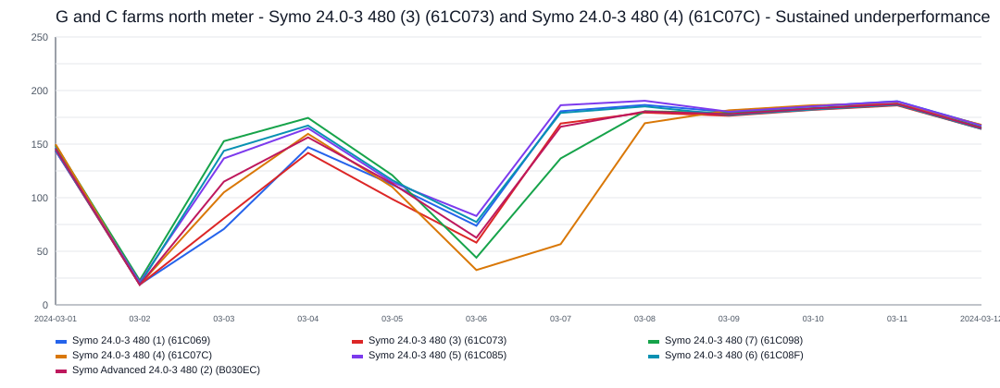

This incident lasted about `6` day(s) and affected `2` inverter(s).
Affected inverter summary:
- Symo  24.0-3 480 (3) (61C073): `3` total affected day(s), longest contiguous run `3` day(s), expected up to `183.2 kWh/day`.
- Symo 24.0-3 480 (4) (61C07C): `3` total affected day(s), longest contiguous run `3` day(s), expected up to `215.8 kWh/day`.

### 2022-12-09 - 334.9 kWh - 4 inverters - Inverter outage / near-zero production

- Time range: `2022-12-09` to `2022-12-10`
- Affected inverters: Symo  24.0-3 480 (1) (61C069), Symo  24.0-3 480 (7) (61C098), Symo 24.0-3 480 (6) (61C08F), Symo Advanced 24.0-3 480 (2) (B030EC)
- Confidence: `high` (`90`)
- Estimated lost production: `334.9 kWh`
- Estimated energy value lost: `$40.22 CAD`
- Estimated missed avoided emissions: `0.19 tCO2e`
- Estimated carbon-credit-equivalent value: `$21.00 CAD`

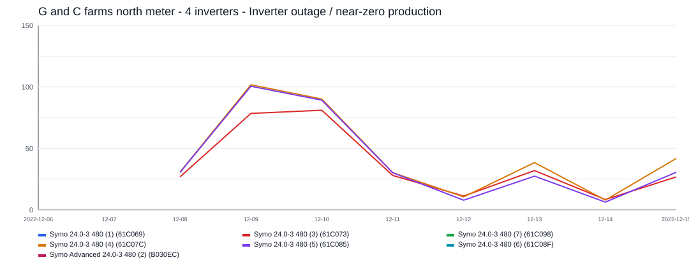

This incident lasted about `2` day(s) and affected `4` inverter(s).
Affected inverter summary:
- Symo  24.0-3 480 (1) (61C069): `2` total affected day(s), longest contiguous run `2` day(s), expected up to `46.9 kWh/day`.
- Symo  24.0-3 480 (7) (61C098): `2` total affected day(s), longest contiguous run `2` day(s), expected up to `47.0 kWh/day`.
- Symo 24.0-3 480 (6) (61C08F): `2` total affected day(s), longest contiguous run `2` day(s), expected up to `39.8 kWh/day`.
- Symo Advanced 24.0-3 480 (2) (B030EC): `2` total affected day(s), longest contiguous run `2` day(s), expected up to `40.0 kWh/day`.

### 2022-12-24 - 304.4 kWh - 4 inverters - Inverter outage / near-zero production

- Time range: `2022-12-24` to `2022-12-25`
- Affected inverters: Symo  24.0-3 480 (1) (61C069), Symo  24.0-3 480 (7) (61C098), Symo 24.0-3 480 (6) (61C08F), Symo Advanced 24.0-3 480 (2) (B030EC)
- Confidence: `high` (`90`)
- Estimated lost production: `304.4 kWh`
- Estimated energy value lost: `$36.56 CAD`
- Estimated missed avoided emissions: `0.17 tCO2e`
- Estimated carbon-credit-equivalent value: `$19.09 CAD`

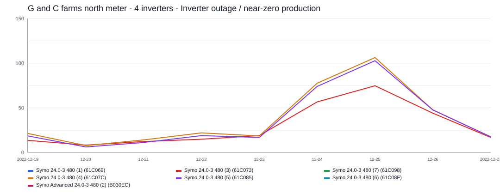

This incident lasted about `2` day(s) and affected `4` inverter(s).
Affected inverter summary:
- Symo  24.0-3 480 (1) (61C069): `2` total affected day(s), longest contiguous run `2` day(s), expected up to `47.4 kWh/day`.
- Symo  24.0-3 480 (7) (61C098): `2` total affected day(s), longest contiguous run `2` day(s), expected up to `47.5 kWh/day`.
- Symo 24.0-3 480 (6) (61C08F): `2` total affected day(s), longest contiguous run `2` day(s), expected up to `40.2 kWh/day`.
- Symo Advanced 24.0-3 480 (2) (B030EC): `2` total affected day(s), longest contiguous run `2` day(s), expected up to `40.5 kWh/day`.

### 2025-01-04 - 179.5 kWh - Symo 24.0-3 480 (6) (61C08F) and Symo Advanced 24.0-3 480 (2) (B030EC) - Sustained underperformance

- Time range: `2025-01-04` to `2025-01-09`
- Affected inverters: Symo 24.0-3 480 (6) (61C08F), Symo Advanced 24.0-3 480 (2) (B030EC)
- Confidence: `low` (`60`)
- Estimated lost production: `179.5 kWh`
- Estimated energy value lost: `$21.56 CAD`
- Estimated missed avoided emissions: `0.10 tCO2e`
- Estimated carbon-credit-equivalent value: `$9.72 CAD`

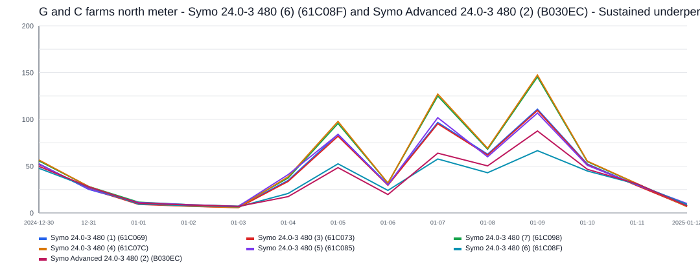

This incident lasted about `6` day(s) and affected `2` inverter(s).
Affected inverter summary:
- Symo 24.0-3 480 (6) (61C08F): `3` total affected day(s), longest contiguous run `3` day(s), expected up to `109.7 kWh/day`.
- Symo Advanced 24.0-3 480 (2) (B030EC): `4` total affected day(s), longest contiguous run `4` day(s), expected up to `95.2 kWh/day`.

### 2024-02-26 - 137.7 kWh - Symo  24.0-3 480 (1) (61C069) - Sustained underperformance

- Time range: `2024-02-26` to `2024-02-28`
- Affected inverters: Symo  24.0-3 480 (1) (61C069)
- Confidence: `low` (`57`)
- Estimated lost production: `137.7 kWh`
- Estimated energy value lost: `$16.53 CAD`
- Estimated missed avoided emissions: `0.08 tCO2e`
- Estimated carbon-credit-equivalent value: `$6.28 CAD`

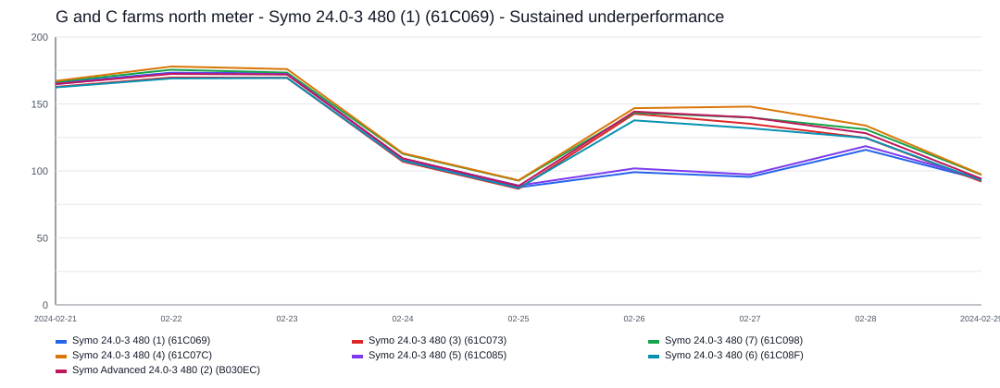

This incident lasted about `3` day(s) and affected `1` inverter(s).
Symo  24.0-3 480 (1) (61C069) was the main affected inverter, with about `3` day(s) of severe underproduction and up to `153.0 kWh/day` expected output.

### 2024-02-08 - 135.8 kWh - Symo  24.0-3 480 (3) (61C073) - Sustained underperformance

- Time range: `2024-02-08` to `2024-02-13`
- Affected inverters: Symo  24.0-3 480 (3) (61C073)
- Confidence: `low` (`64`)
- Estimated lost production: `135.8 kWh`
- Estimated energy value lost: `$16.31 CAD`
- Estimated missed avoided emissions: `0.08 tCO2e`
- Estimated carbon-credit-equivalent value: `$6.19 CAD`

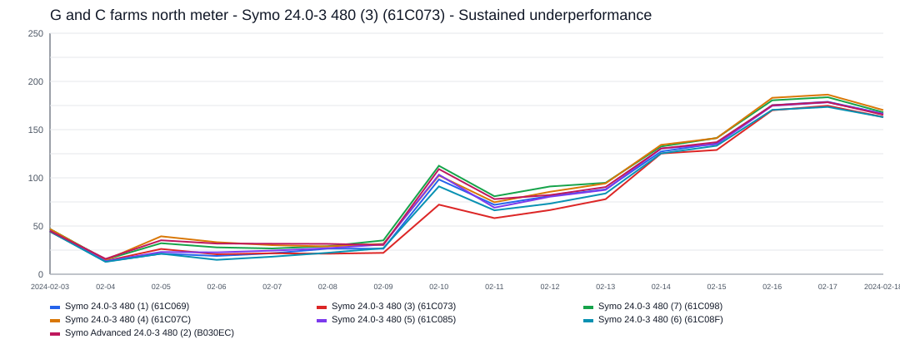

This incident lasted about `6` day(s) and affected `1` inverter(s).
Symo  24.0-3 480 (3) (61C073) was the main affected inverter, with about `6` day(s) of severe underproduction and up to `113.5 kWh/day` expected output.

### 2023-12-02 - 124.7 kWh - Symo  24.0-3 480 (1) (61C069) and Symo 24.0-3 480 (5) (61C085) - Sustained underperformance

- Time range: `2023-12-02` to `2023-12-04`
- Affected inverters: Symo  24.0-3 480 (1) (61C069), Symo 24.0-3 480 (5) (61C085)
- Confidence: `low` (`50`)
- Estimated lost production: `124.7 kWh`
- Estimated energy value lost: `$14.98 CAD`
- Estimated missed avoided emissions: `0.07 tCO2e`
- Estimated carbon-credit-equivalent value: `$7.82 CAD`

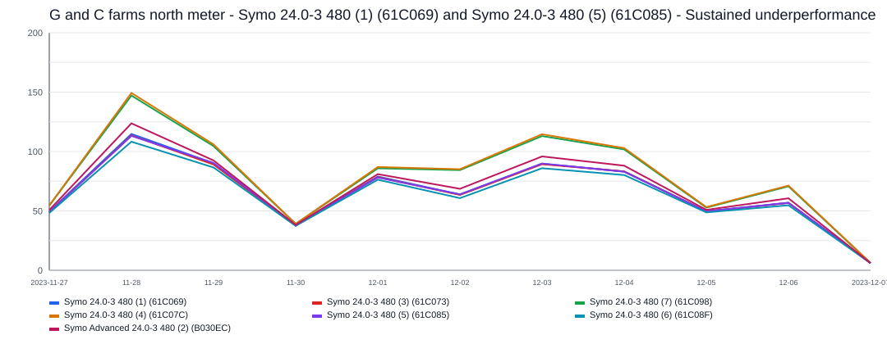

This incident lasted about `3` day(s) and affected `2` inverter(s).
Affected inverter summary:
- Symo  24.0-3 480 (1) (61C069): `3` total affected day(s), longest contiguous run `3` day(s), expected up to `113.4 kWh/day`.
- Symo 24.0-3 480 (5) (61C085): `3` total affected day(s), longest contiguous run `3` day(s), expected up to `113.3 kWh/day`.

### 2024-12-19 - 117.9 kWh - Symo 24.0-3 480 (5) (61C085) - Sustained underperformance

- Time range: `2024-12-19` to `2024-12-23`
- Affected inverters: Symo 24.0-3 480 (5) (61C085)
- Confidence: `low` (`60`)
- Estimated lost production: `117.9 kWh`
- Estimated energy value lost: `$14.15 CAD`
- Estimated missed avoided emissions: `0.07 tCO2e`
- Estimated carbon-credit-equivalent value: `$5.37 CAD`

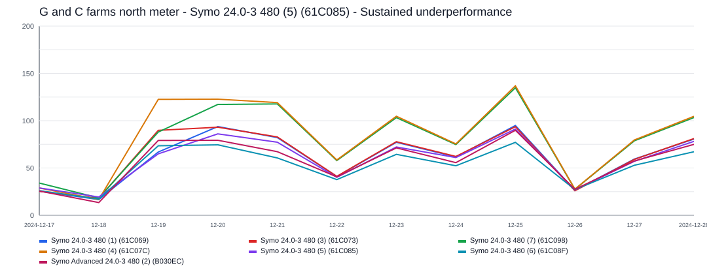

This incident lasted about `5` day(s) and affected `1` inverter(s).
Symo 24.0-3 480 (5) (61C085) was the main affected inverter, with about `5` day(s) of severe underproduction and up to `111.3 kWh/day` expected output.

### 2024-10-22 - 85.5 kWh - Symo 24.0-3 480 (5) (61C085) - Inverter outage / near-zero production

- Time range: `2024-10-22` to `2024-10-22`
- Affected inverters: Symo 24.0-3 480 (5) (61C085)
- Confidence: `high` (`89`)
- Estimated lost production: `85.5 kWh`
- Estimated energy value lost: `$10.26 CAD`
- Estimated missed avoided emissions: `0.05 tCO2e`
- Estimated carbon-credit-equivalent value: `$3.90 CAD`

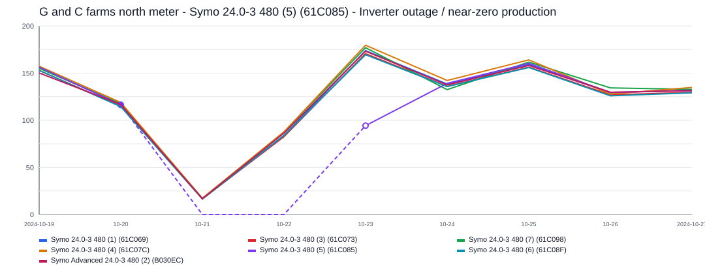

This incident lasted about `1` day(s) and affected `1` inverter(s).
Symo 24.0-3 480 (5) (61C085) was the main affected inverter, with about `1` day(s) of severe underproduction and up to `85.5 kWh/day` expected output.

### 2023-10-24 - 76.2 kWh - Symo  24.0-3 480 (3) (61C073) - Sustained underperformance

- Time range: `2023-10-24` to `2023-10-26`
- Affected inverters: Symo  24.0-3 480 (3) (61C073)
- Confidence: `low` (`63`)
- Estimated lost production: `76.2 kWh`
- Estimated energy value lost: `$9.16 CAD`
- Estimated missed avoided emissions: `0.04 tCO2e`
- Estimated carbon-credit-equivalent value: `$4.78 CAD`

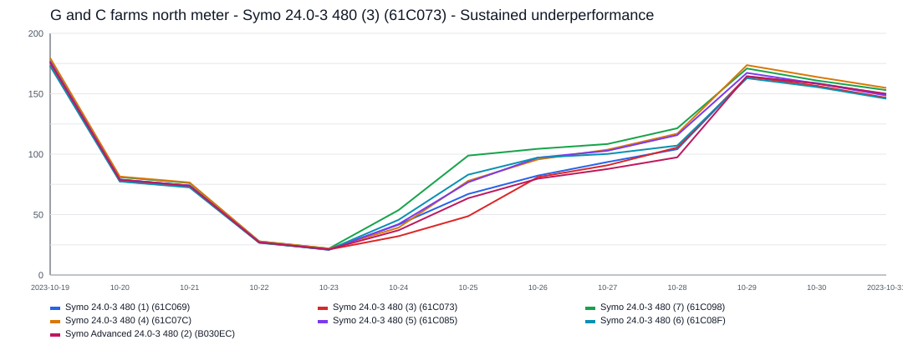

This incident lasted about `3` day(s) and affected `1` inverter(s).
Symo  24.0-3 480 (3) (61C073) was the main affected inverter, with about `3` day(s) of severe underproduction and up to `105.1 kWh/day` expected output.

### 2024-12-12 - 75.4 kWh - Symo 24.0-3 480 (5) (61C085) - Sustained underperformance

- Time range: `2024-12-12` to `2024-12-15`
- Affected inverters: Symo 24.0-3 480 (5) (61C085)
- Confidence: `low` (`58`)
- Estimated lost production: `75.4 kWh`
- Estimated energy value lost: `$9.06 CAD`
- Estimated missed avoided emissions: `0.04 tCO2e`
- Estimated carbon-credit-equivalent value: `$3.44 CAD`

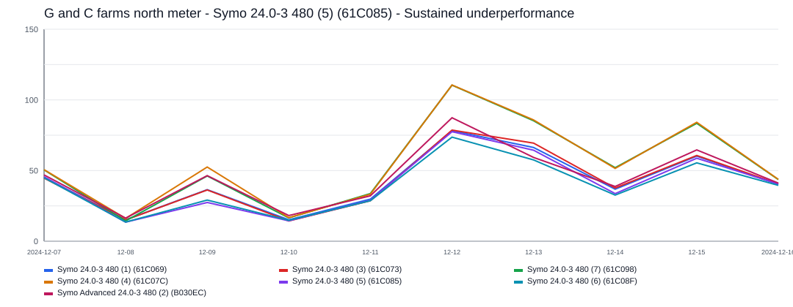

This incident lasted about `4` day(s) and affected `1` inverter(s).
Symo 24.0-3 480 (5) (61C085) was the main affected inverter, with about `4` day(s) of severe underproduction and up to `102.9 kWh/day` expected output.
